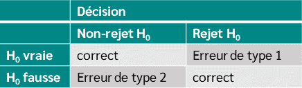

layout: true

<div class="my-footer"></div> 

---

```{r setup, include=FALSE,warning=FALSE,message=FALSE}
options(htmltools.dir.version = FALSE)
knitr::opts_chunk$set(
  message = FALSE,
  warning = FALSE,
  dev = "svg",
  cache = TRUE,
  fig.align = "center"
  #fig.width = 11,
  #fig.height = 5
)

# define vars
om = par("mar")
lowtop = c(om[1],om[2],0.1,om[4])

library(magrittr)
library(moderndive)
library(dplyr)
library(tidyverse)
library(infer)

overwrite = FALSE

```


# Ajourd'hui - Plonger dans l'***inférence statistique*** <sup>1</sup>

.footnote[
[1]: Ce cours est en partie basé sur les chapitres sur les [intervalles de confiance](https://moderndive.com/8-confidence-intervals.html) et [test d'hypothèses](https://moderndive.com/9-hypothesis-testing.html) de [ModernDive](https://moderndive.com/)]

* *Intervalles de Confiance* : fournissent un ***intervalle*** de valeurs dans lequel notre estimation est sûrement contenue.  

* *Test d'Hypothèse* : compare des statistiques entre des groupes

---


# Retour à la vie réelle


* Dans la vie réelle, on obtient uniquement ***1*** échantillon de la population (pas ***1000*** !).

* De plus, on ne connait pas la valeur réelle du paramètre de la population qui nou intéresse, c'est notre intérêt principal. 

* Quel était l'intérêt de nos précédents cours ?


--

<br>
<br>

* Même non obsevré, on ***sait*** que la distribution d'échantillonnage existe, et même mieux on sait comment elle se comporte !


---

layout: false
class: title-slide-section-red, middle

# Intervalles de Confiance

---

layout: true

<div class="my-footer"></div> 

---

# Des estimations ponctuelles aux intervalles de confiance

* Jusqu'à présent, nous n'avons estimé que des ***estimations ponctuelles*** à partir de nos échantillons : *moyennes d'échantillon*, *proportions d'échantillon*, *coefficients de régression*, etc.

--

* Nous savons que cette ***statistique d'échantillon*** diffère du ***véritable paramètre de population*** en raison de la ***variation d'échantillonnage***. 

--

* Plutôt qu'une estimation ponctuelle, nous pourrions fournir un ***intervalle de valeurs plausibles*** pour le paramètre de population.

--

* C'est précisément ce que fournit un ***intervalle de confiance*** (IC).

---

# Construction d'intervalles de confiance 
Il existe plusieurs approches pour construire des intervalles de confiance :
    
  1. *Théorie* : utiliser des formules mathématiques (***théorème central limite***) pour dériver la distribution d'échantillonnage de notre estimation ponctuelle sous certaines conditions $\rightarrow$ ***ce que `R` fait en coulisses !***
  
--
  
  1. *Simulation* : utiliser la méthode du ***bootstrap*** pour *reconstruire* la distribution d'échantillonnage de notre estimation ponctuelle
    
--
    
Nous nous concentrerons sur la simulation pour vous donner l'intuition et reviendrons à l'approche mathématique au prochain cours.

--

En pratique, vous n'avez ***pas besoin*** de calculer vos intervalles de confiance à l'aide du *bootstrap*, `R` utilise la théorie statistique pour le faire à votre place.

---

# Retour aux pâtes

* Comme dans la vraie vie, imaginons que nous n'ayons accès qu'à *un seul échantillon aléatoire* de notre bol de pâtes.

--

* Comment pourrions-nous étudier l'effet de la variation d'échantillonnage avec un seul échantillon ? `r emo::ji("point_right")` ***rééchantillonnage bootstrap avec remise*** !

--

* Commençons par tirer un échantillon aléatoire de taille $n = 50$ de notre bol.

```{r, echo = FALSE}
bowl <- read.csv("https://www.dropbox.com/s/qpjsk0rfgc0gx80/pasta.csv?dl=1")

set.seed(1234)

sample_size = 50

my_sample = bowl %>%
  mutate(color = as.factor(ifelse(color == "green","green","non-green"))) %>%
  rep_sample_n(size = sample_size) %>%
  ungroup() %>%
  select(pasta_ID, color) %>%
  arrange(pasta_ID)
```

```{r, eval = FALSE}
library(tidyverse)
bowl <- read.csv("https://www.dropbox.com/s/qpjsk0rfgc0gx80/pasta.csv?dl=1")

my_sample = bowl %>%
  mutate(color = ifelse(color == "green","green","non-green")) %>%
  rep_sample_n(size = 50) %>%
  ungroup() %>%
  select(pasta_ID, color)
```

.pull-left[
```{r}
head(my_sample,3)
```
]

--

.pull-right[
```{r}
p_hat = mean(my_sample$color == "green")
p_hat
```

La proportion de pâtes vertes dans l'échantillon est simplement : $\hat{p} = `r p_hat`$.
]

---
# Rééchantillonnage de notre échantillon de pâtes

Comment obtenons-nous un ***échantillon bootstrap*** ?

--
  
  1. Tirer au hasard ***une*** pâte de l'échantillon et noter la couleur associée.
  
--
  
  1. Remettre cette pâte dans l'échantillon.
  
--
  
  1. Répéter les étapes 1 et 2 49 fois, c.-à-d. ***jusqu'à ce que le nouvel échantillon ait la même taille que l'échantillon d'origine***.

--

  1. Calculer la proportion de pâtes vertes dans l'échantillon bootstrap.
  
--

Cette procédure est appelée ***rééchantillonnage avec remise*** :
  * *rééchantillonnage* : tirage d'échantillons répétés à partir d'un échantillon.
  * *avec remise* : à chaque fois, la pâte tirée est remise dans l'échantillon.
  
---

# Réechantillonage de notre échantillon de pâtes

.pull-left[

Here is one bootstrap sample: 

```{r}
one_bootstrap = my_sample %>%
  rep_sample_n(size = 50, replace = TRUE) %>%
  arrange(pasta_ID)

head(one_bootstrap, 8)

nrow(one_bootstrap)
```
]

--

.pull-right[

Plusieurs pâtes ont été tirées à plusieurs reprises. Comment cela se fait-il ?

Quelle est la proportion de pâtes vertes dans cet échantillon bootstrap ?

```{r}
mean(one_bootstrap$color == "green")
```

La proportion est différente de celle de notre échantillon ! Cela est dû au rééchantillonnage ***avec remise***.

Que se passerait-il si nous répétions cette procédure de rééchantillonnage plusieurs fois ? La proportion serait-elle la même à chaque fois ?
]

  
---

# Obtenir la distribution Bootstrap 

* Répétons cette procédure 1000 fois : il y aura 1000 échantillons bootstrap et autant d'estimations.

--

.pull-left[
Nous utilisons le package `infer` pour faciliter la procédure.

```{r, echo=FALSE}
bootstrap_distrib = my_sample %>% # Prend un échantillon aléatoire
  specify(response = color, success = "green") %>%
  generate(reps = 1000, type = "bootstrap") %>%
  calculate(stat = "prop")

percentile_95ci = get_confidence_interval(bootstrap_distrib, level = 0.95, type = "percentile")
percentile_95lb = percentile_95ci[[1]]
percentile_95ub = percentile_95ci[[2]]

```


```{r, eval = FALSE}
library(infer)

bootstrap_distrib = my_sample %>%
  # specifier la variable et niveau d'intérêt 
  specify(response = color, success = "green") %>% 
  # génère 1000 échantillons bootstrap
  generate(reps = 1000, type = "bootstrap") %>% 
  # calcule la proportion de pâtes vertes pour chaque
  calculate(stat = "prop") 
```
]

--

.pull-right[
Voici les 6ères lignes : 

```{r}
head(bootstrap_distrib)

nrow(bootstrap_distrib)
```

Jettons un oeil graphiquement
]

---

#  Distribution Bootstrap

```{r,echo = FALSE,fig.height = 4.75, fig.width = 8}
boot_distrib_plot = bootstrap_distrib %>%
  ggplot(aes(x = stat)) +
  geom_histogram(boundary = 0.39, binwidth = 0.02, col = "white", fill = "darkgreen") +
  labs(x = "Proportion of green pasta",
       y = "Frequency") +
  theme_bw(base_size = 14)
boot_distrib_plot
```

--

La ***distribution bootstrap*** est une estimation de la ***distribution de l'échantillon***.

---

# Distribution Bootstrap avec la moyenne

```{r,echo = FALSE,fig.height = 4.75, fig.width = 8}
boot_distrib_plot +
  geom_vline(xintercept = mean(bootstrap_distrib$stat), linetype = "dashed", size = 1) +
  annotate("text", x = 0.375, y = 127, label = "Distribution bootstrap avec la moyenne", size = 4)
```

--

La moyenne de la ***distribution bootstrap*** est très proche de celle de l'échantillon d'origine.

---

# Distribution Bootstrap avec la moyenne

```{r,echo = FALSE,fig.height = 4.75, fig.width = 8}
boot_distrib_plot +
  geom_vline(xintercept = mean(bootstrap_distrib$stat), linetype = "dashed", size = 1) +
  annotate("text", x = 0.375, y = 127, label = "Distribution bootstrap avec la moyenne", size = 4)
```

En partant de la ***distribution bootstrap*** nous pouvons construire nos intervalles de confiance !

---

# Comprendre les Intervalles de Confiance

* Analogie avec la pêche :
  * *estimation ponctuelle* : pêcher au harpon.
 
--
  
  * *intervalle de confiance* : pêcher au filet.

--

* Dans notre cas, le poisson est la véritable proportion de pâtes vertes dans le bol $(p)$.

--

* L'*estimation ponctuelle* serait la proportion de pâtes vertes obtenue à partir d'un échantillon aléatoire $(\hat{p})$.

--

* L'*intervalle de confiance* $(\underline{\beta_j} ; \overline{\beta_j})$ : à partir de la distribution bootstrap précédente, ***où se situent la plupart des proportions ?***

--

* Méthode de construction de l'intervalle de confiance : ***méthode des percentiles***.

--

* Nécessite de spécifier un ***niveau de confiance*** ($\alpha_c$) : 90 %, 95 % et 99 % sont les plus courants.

---

# Méthode des percentiles : Intervalle de Confiance à 95% 

* Construire un IC qui comprend le milieu de 95% des valeurs de la distribution bootstrapConstruct a confidence interval as the middle 95% of values of the bootstrap distribution.

--

* Pour cela, il faut calcule les 2.5% et 97.5% percentiles :

.pull-left[
```{r}
quantile(bootstrap_distrib$stat,0.025)
```
]
.pull-right[
```{r}
quantile(bootstrap_distrib$stat,0.975)
```
]

* Par conséquent l'intervalle de confiance à 95% est $[`r round(percentile_95lb,2)` ; `r  round(percentile_95ub,2)`]$.

* C'est une ***plage*** de valeurs.

--

* Regardons l'IC sur la distribution de l'échantillon.

---

# Méthode des percentiles : Intervalle de Confiance à 95% visuellement

```{r,echo = FALSE,fig.height = 4.75, fig.width = 8}
percentile_95lb = quantile(bootstrap_distrib$stat,0.025)
percentile_95ub = quantile(bootstrap_distrib$stat,0.975)

boot_distrib_plot_ci = boot_distrib_plot +
  geom_vline(xintercept = percentile_95lb, linetype = "dashed", size = 1.5) +
  geom_vline(xintercept = percentile_95ub, linetype = "dashed", size = 1.5) +
  annotate("rect", xmin=percentile_95lb, xmax=percentile_95ub, ymin=0, ymax=Inf, fill = "#d90502", alpha=0.4)
boot_distrib_plot_ci
```

--

Est-ce que l'intervalle contient la vraie valeure de la proportion de la population ? 

---

# Méthode des percentiles : Intervalle de Confiance à 95% visuellement

```{r,echo = FALSE,fig.height = 4.75, fig.width = 8}
p = mean(bowl$color == "green")

boot_distrib_plot_ci +
  geom_vline(xintercept = p, col = "black", size = 1.25) +
  annotate("text", x = 0.56, y = 125, label = "proportion de la population", size = 4)
```

--

Le vrai paramètre de la population est en effet dans notre intervalle de 95%  ! Est-ce que cera toujours le cas ?

---

# Interpréter un IC à 95% 

Tirons de façon répétée 100 échantillons différents de notre `bowl` et pour chaque échantillon, calculons l'IC à 95 % associé en utilisant la méthode des percentiles.
--

```{r, echo=FALSE, fig.width=10, fig.height = 4}
library(purrr)
library(tidyr)
if(!file.exists("../rds/pasta_percentile_cis.rds")){
    set.seed(5)
    
    # Function to run infer pipeline
    bootstrap_pipeline <- function(sample_data){
        sample_data %>% 
            specify(formula = color ~ NULL, success = "green") %>% 
            generate(reps = 1000, type = "bootstrap") %>% 
            calculate(stat = "prop")
    }
    
    # Compute nested data frame with sampled data, sample proportions, all 
    # bootstrap replicates, and percentile_ci
    pasta_percentile_cis <- bowl %>% 
        mutate(color = as.factor(ifelse(color == "green","green","non-green"))) %>%
        rep_sample_n(size = 40, reps = 100, replace = FALSE) %>% 
        group_by(replicate) %>% 
        nest() %>% 
        mutate(sample_prop = map_dbl(data, ~mean(.x$color == "green"))) %>%
        # run infer pipeline on each nested tibble to generated bootstrap replicates
        mutate(bootstraps = map(data, bootstrap_pipeline)) %>% 
        group_by(replicate) %>% 
        # Compute 95% percentile CI's for each nested element
        mutate(percentile_ci = map(bootstraps, get_ci, type = "percentile", level = 0.95))
    
    # Save output to rds object
    saveRDS(object = pasta_percentile_cis, "../rds/pasta_percentile_cis.rds")
} else {
    pasta_percentile_cis <- readRDS("../rds/pasta_percentile_cis.rds")
}

# Identify if confidence interval captured true p
percentile_cis <- pasta_percentile_cis %>% 
    unnest(percentile_ci) %>% 
    mutate(captured = `2.5%` <= p & p <= `97.5%`)

# Plot them!
ggplot(percentile_cis) +
    geom_segment(aes(
        y = replicate, yend = replicate, x = `2.5%`, xend = `97.5%`, 
        alpha = factor(captured, levels = c("TRUE", "FALSE"))
    )) +
    # Removed point estimates since it doesn't necessarily act as center for 
    # percentile-based CI's
    # geom_point(aes(x = sample_prop, y = replicate, color = captured)) +
    labs(x = expression("Proportion de pâtes vertes"), y = "Nombre d'Intervalles de Confiance", 
         alpha = "Contains Truth") +
    geom_vline(xintercept = p, color = "#d90502", size = 1, linetype = "dashed") +
  annotate("text", x = 0.47, y = 5, label = "proportion de la population", col = "#d90502") +
    geom_point(aes(y = replicate, x = sample_prop ,alpha = factor(captured, levels = c("TRUE", "FALSE")))) +
    coord_cartesian(xlim = c(0.2, 0.8)) + 
  coord_flip() +
    theme_bw(base_size = 14) +
    theme(panel.grid.major.y = element_blank(), panel.grid.minor.y = element_blank(),
          panel.grid.minor.x = element_blank()) +
  theme(legend.position = "top")
```

Combien d'IC contiennent la valeur de la population ? Pourquoi ?
---

# Interpréter un IC à 95 %

> *Interprétation précise :* Si nous répétions notre procédure d'échantillonnage ***un grand nombre de fois***, nous ***nous attendons à ce qu'environ 95 %*** des IC résultants capturent la valeur du paramètre de population. 

En d'autres termes, 95 % du temps, l'IC à 95 % contiendra le véritable paramètre de population.

--

> *Interprétation simplifiée :* Nous sommes ***« confiants » à 95 %*** qu'un IC à 95 % capture la valeur du paramètre de population.

--

***Questions :*** 

  * Comment la largeur de l'intervalle de confiance change-t-elle lorsque le ***niveau de confiance*** augmente ?
  
  * Comment la largeur de l'intervalle de confiance change-t-elle lorsque la ***taille de l'échantillon*** augmente ?
  
---

# Interpréter un IC à 95 %

> *Interprétation précise :* Si nous répétions notre procédure d'échantillonnage ***un grand nombre de fois***, nous ***nous attendons à ce qu'environ 95 %*** des IC résultants capturent la valeur du paramètre de population.

En d'autres termes, 95 % du temps, l'IC à 95 % contiendra le véritable paramètre de population.

> *Interprétation simplifiée :* Nous sommes ***« confiants » à 95 %*** qu'un IC à 95 % capture la valeur du paramètre de population.

***Impact du niveau de confiance :*** plus le niveau de confiance est élevé, plus les IC sont larges.
  * *Intuition* : un niveau de confiance plus élevé signifie que l'IC doit contenir le véritable paramètre de population plus souvent, et doit donc être plus large pour garantir cela.
  
--

***Impact de la taille de l'échantillon :*** plus la taille de l'échantillon est grande, plus les IC sont étroits.

  * *Intuition* : une taille d'échantillon plus grande entraîne moins de variation d'échantillonnage et donc une distribution bootstrap plus étroite, ce qui conduit à son tour à des IC plus fins.
  
---

# Des intervalles de confiance aux tests d'hypothèses

* Les *intervalles de confiance* peuvent être considérés comme une extension de l'*estimation ponctuelle*.

--

* Que faire si nous voulons ***comparer*** une statistique d'échantillon pour deux groupes ?
  
  * *Exemple* : différences de salaire moyen entre hommes et femmes. Les différences observées sont-elles ***significatives*** ?
  
--

* Ces comparaisons relèvent du domaine des ***tests d'hypothèses***.

--

* Tout comme les intervalles de confiance, les tests d'hypothèses sont utilisés pour formuler des affirmations sur une population à partir d'informations issues d'un échantillon.

* Cependant, nous verrons que le cadre pour effectuer de telles inférences est légèrement différent.

---

layout: false
class: title-slide-section-red, middle

# Test d'Hypothèse

---
layout: true

<div class="my-footer"></div> 

---

# Y a-t-il une discrimination de genre dans les promotions ?
  * Nous utiliserons les données d'un [article](https://pdfs.semanticscholar.org/39f6/d40e907ff08af4ddd3280c2ceee55ee1ddb6.pdf) publié dans le *Journal of Applied Psychology* en 1974, qui a étudié si les employées de banque étaient victimes de discrimination.

  * 48 superviseurs (hommes) ont reçu des CV de candidats *identiques*, ne différant que par le prénom, qui était masculin ou féminin.

  * Chaque CV se présentait « *sous la forme d'un mémorandum demandant une décision concernant la promotion d'un employé au poste de directeur d'agence.* »

--

* ***Hypothèse*** que nous voulons tester : *Y a-t-il une discrimination de genre ?*

--

.pull-left[
* Les données de l'expérience sont fournies dans le jeu de données `promotions` du package `moderndive`.
]

--

.pull-right[
```{r}
library(moderndive)
head(promotions)
```
]

---

# Preuves de Discrimination?

.pull-left[
Combien hommes et femmes ont (pas) obtenu une promotion ? 

```{r}
promotions %>% 
  group_by(gender, decision) %>% 
  tally() %>%
  mutate(percentage = 100 * n / sum(n))
```

Il y a une différence de  ***29.2 points de pourcentage*** dans les promotions entre hommes et femmes. 
]

--

.pull-right[
```{r,echo= FALSE, fig.height=6}
ggplot(promotions, aes(x = gender, fill = decision)) +
  geom_bar(width = 0.75) +
  labs(x = "Gender of name on resume",
       y = "Frequency") +
  labs(title = "Promotion decision") +
  theme_bw(base_size = 20) +
  theme(legend.position = "top")
```
]

--

***Question***: Est-ce que ce résultat fournit ***des preuves*** sur les différences entre hommes et femmes ? Est-ce que l'on aurait pu observer ces résultats **par chance** ?

---

# Imaginos un monde Hypothétique : pas de discimination 

* Immaginons que nous vivons dans un monde sans discrimination de genre : les décisions de promotion devraient être totalement  ***indépendente*** du genre.

* Pour cela, nous réassignons **aléatoirement** le genre (`gender`) de chaque ligne et regardons comment cela affecte les résultats. 

--

.pull-left[

```{r, echo = TRUE}
promotions %>%
       left_join(promotions_shuffled %>%
                   rename(shuffled_gender = gender)) %>%
  head()
```

A quoi ressemble  le taux de promotion dans ce nouvel échantillon permuté ?
]

--

.pull-right[

```{r}
promotions_shuffled %>% 
  group_by(gender, decision) %>% 
  tally() %>%
  mutate(percentage = 100 * n / sum(n))
```

La différence est bien plus faible : ***4.2 points de pourcentage***!
]

---

# Imaginos un monde Hypothétique : pas de discimination 

* Immaginons que nous vivons dans un monde sans discrimination de genre : les décisions de promotion devraient être totalement  ***indépendente*** du genre.

* Pour cela, nous réassignons **aléatoirement** le genre (`gender`) de chaque ligne et regardons comment cela affecte les résultats. 

.pull-left[

```{r, echo = TRUE}
promotions %>%
       left_join(promotions_shuffled %>%
                   rename(shuffled_gender = gender)) %>%
  head()
```

A quoi ressemble  le taux de promotion dans ce nouvel échantillon permuté ?
]

.pull-right[

```{r,echo=FALSE,fig.height = 5.5}
p1 = ggplot(promotions, aes(x = gender, fill = decision)) +
  geom_bar(width = 0.75) +
  theme_bw(base_size = 15) +
  theme(legend.position = "top") +
  labs(x = "Gender of resume name", y = "Frequency", title = "Original")
p2 = ggplot(promotions_shuffled, aes(x = gender, fill = decision)) +
  geom_bar(width = 0.75) +
  theme_bw(base_size = 15) +
  labs(x = "Gender of resume name", y = "Frequency", title = "Reshuffled") +
  theme(legend.position = "top")
cowplot::plot_grid(p1,p2,rel_widths = c(1.3,1.3))
```

]

---

# Variation d'échantillonnage

* Dans notre monde hypothétique, la différence de taux de promotion n'était que de 4,2 points de pourcentage.

* Pouvons-nous répondre maintenant à notre question initiale sur l'existence d'une discrimination de genre ?

--

* Non, nous devons étudier le rôle de la ***variation d'échantillonnage*** !

* Si nous remélangions une nouvelle fois, à quel point la différence serait-elle différente de 4,2 pp (*points de pourcentage*) ?

--
  
* En d'autres termes, dans quelle mesure 4,2 pp est-il représentatif de ce monde hypothétique ?
  
--
  
* Quelle est la probabilité qu'une différence de 29 pp se produise dans un tel monde ?
  
--

* Nous devons connaître l'ensemble de la distribution d'échantillonnage sous l'hypothèse d'***absence de discrimination***.

--

* Comment ? En refaisant simplement le remélange un grand nombre de fois, et en calculant la différence à chaque fois.

---

# Distribution de l'échantillon avec 1000 permutations

```{r,echo = FALSE, fig.height = 4.75, fig.width = 8}
set.seed(2)
null_distribution <- promotions %>% 
  # takes formula, defines success
  specify(formula = decision ~ gender,
          success = "promoted") %>% 
  # decisions are independent of gender
  hypothesize(null = "independence") %>% 
  # generate 1000 reshufflings of data
  generate(reps = 1000, type = "permute") %>% 
  # compute p_m - p_f from each reshuffle
  calculate(stat = "diff in props",
            order = c("male", "female"))

visualize(null_distribution, bins = 10, fill = "darkred") + 
  labs(title = "Distribution d'échantillonnage", x = "Différence dans le taux de promotion (homme - femme)", y = "Effectif") +
  xlim(-0.4, 0.4)+
  theme_bw(base_size = 14)
```

---

# Sampling Distribution with 1000 Reshufflings

```{r,echo = FALSE, fig.height = 4.75, fig.width = 8}
visualize(null_distribution, bins = 10, fill = "darkred") + 
  geom_vline(xintercept = 0.292, size =1.25) +
  labs(title = "Distribution d'échantillonnage", x = "Différence dans le taux de promotion (homme - femme)", y = "Effectif") +
  xlim(-0.4, 0.4)+
  theme_bw(base_size = 14) +
  annotate("text", x = 0.17, y = 485, label = "Différence observée", size = 4)
```

Quelle est la **probabilité** d'observer une différence de 0,292 dans un monde sans discrimination ?
---

# Qu'avons-nous fait ?

* Nous venons de démontrer la procédure statistique connue sous le nom de ***test d'hypothèse*** en utilisant un ***test de permutation***.

--

* La question est de savoir quelle est la probabilité que la différence observée dans les taux de promotion se produise dans un univers hypothétique sans discrimination.

--

* Nous avons conclu ***plutôt que non***, c.-à-d. que nous avions tendance à ***rejeter*** l'hypothèse d'absence de discrimination.

--

* Introduisons maintenant le cadre formel des tests d'hypothèses.

---

# Notation et définitions des tests d'hypothèses

* Un ***test d'hypothèse*** consiste en un test entre ***deux hypothèses concurrentes*** concernant le paramètre de population :

--

  * L'***hypothèse nulle*** $(H_0)$ : généralement l'hypothèse d'absence de différence ;

--
  
  * L'***hypothèse alternative*** $(H_A \textrm{ ou }H_1)$ : l'hypothèse de recherche.

--

* Dans l'exemple précédent :

$$\begin{align}H_0&: p_m - p_f = 0\\H_A&: p_m - p_f > 0,\end{align}$$ où $p_h=$ taux de promotion des hommes, et $p_f =$ taux de promotion des femmes.

--

  * Ici, nous avons considéré une alternative *unilatérale*, affirmant que $p_h > p_f$, c.-à-d. que les femmes sont victimes de discrimination.
  
  * La formulation *bilatérale* est simplement $H_A: p_h - p_f \neq 0$.
  
---

# Notation et définitions des tests d'hypothèses

* ***Statistique de test*** : formule d'*estimation ponctuelle/statistique d'échantillon* utilisée pour le test d'hypothèse. 

--

  * *Dans notre cas précédent* : différence des proportions d'échantillon $\hat{p}_m - \hat{p}_f$.

--

* ***Statistique de test observée*** : valeur de la statistique de test que nous avons observée dans la réalité.

--

  * *Dans notre cas précédent* : différence observée $\hat{p}_m - \hat{p}_f = 0,292 = 29,2$ points de pourcentage.
  
--

* ***Distribution nulle*** : distribution d'échantillonnage de la statistique de test *en supposant que l'hypothèse nulle $H_0$ est vraie*.

--

  *  *Dans notre cas précédent* : toutes les valeurs possibles que $\hat{p}_m - \hat{p}_f$ peut prendre en supposant qu'il n'y a pas de discrimination.
  * C'est la distribution que nous avons vue juste avant.
 

 
---

# Distribution Nulle

```{r,echo = FALSE, fig.height = 4.75, fig.width = 8}
visualize(null_distribution, bins = 10, fill = "red") + 
  geom_vline(xintercept = 0.292, size =1.25) +
  labs(x = "Différence dans le taux de promotion (homme - femme)", y = "Effectif") +
  xlim(-0.4, 0.4)+
  theme_bw(base_size = 14) +
  annotate("text", x = 0.19, y = 485, label = "Test stat. observé", size = 4)
```

---

# Notation et définitions des tests d'hypothèses

> ### ***Valeur-p (p-value) :*** probabilité d'observer une statistique de test *aussi ou plus extrême* que celle que nous avons obtenue, en supposant que l'hypothèse nulle $H_0$ est vraie. `r emo::ji("thinking")`

--

* À quel point sommes-nous *surpris* d'avoir observé une différence de taux de promotion de 0,292 dans notre échantillon en supposant que $H_0$ est vraie, c.-à-d. un monde sans discrimination ? Très surpris ? Plutôt surpris ?

--

* Qu'entend-on par ***plus extrême*** ?

  * Défini en fonction de l'hypothèse alternative : dans ce cas, les hommes sont ***plus susceptibles*** d'être promus que les femmes. Par conséquent, ***plus extrême*** signifie ici observer une différence de taux de promotion ***supérieure à 0,292***.

--

* ***Interprétation*** : plus la valeur-p est faible, *moins notre hypothèse nulle est cohérente avec la statistique observée*.

--

* Quand décidons-nous de ***rejeter*** $H_0$ ou non ?

---

# Notation et définitions des tests d'hypothèses

* Pour décider si nous rejetons $H_0$ ou non, nous fixons un ***niveau de signification*** pour le test.

--

* ***Niveau de signification $\alpha$ :*** agit comme un *seuil* sur la valeur-p.
  * Probabilité de rejeter $H_0$ alors que c'est vrai
  * Les valeurs les plus utilisées en économie sont $\alpha = 0,01$, $0,05$, ou $0,1$.

--

* ***Décision*** :

  * Si la valeur-p est ***inférieure au seuil $\alpha$ ***, nous "***rejetons l'hypothèse nulle au niveau de signification $\alpha$*** ".

--

  * À l'inverse, si la valeur-p est ***supérieure à $\alpha$ ***, nous disons que nous "***ne parvenons pas à rejeter l'hypothèse nulle $H_0$ au niveau de signification $\alpha$***".
  
--

* ***Interprétation*** : Si ce que nous observons *est trop peu probable pour se produire* sous l'hypothèse nulle, cela signifie que cette hypothèse est ***probablement fausse***.

--

`r emo::ji("warning")` On n'accepte jamais $H_0$ ou $H_A$ mais on peut (pas) rejeter l'hypothèse nulle.  

--

* Illustrons comment cela fonctionne dans notre exemple.

---

# Visualisation de la valeur-p

```{r,fig.height = 4.75, fig.width = 8, echo = FALSE}
obs_diff_prop <- promotions %>%
  specify(decision ~ gender, success = "promoted") %>%
  calculate(stat = "diff in props", order = c("male", "female"))

visualize(null_distribution, bins = 10, fill = "#d90502") + 
  shade_p_value(obs_stat = obs_diff_prop,
                size = 0.5,
                direction = "right", 
                fill = "black") +
  labs(x = "Différence dans le taux de promotion (homme - femme)", y = "Effectif") +
  xlim(-0.4, 0.4)+
  theme_bw(base_size = 14) +
  geom_vline(xintercept = 0.292, size = 1.25) +
  annotate("text", x = 0.19, y = 485, label = "Test stat. observé", size = 4)
```

--
L'aire hachurée correspond à la valeur-p !

---

# Et maintenant ? Décision avec la valeur-p 

* Rappel qu'une valeur-p est la : ***probabilité d'observe une statistique de test *au moins aussi extrême* que celle obtenue, en supposant que l'hypothèse nulle $H_0$ est vraie.***

--

```{r}
p_value <- mean(null_distribution$stat >= 0.292)
p_value
```

* Dans un monde sans discrimination, nous aurons obtenu  $\hat{p_m} - \hat{p_f}$ supérieur (ou égal) à 0.292 seulement `r 100*p_value`% du temps. 
--

* Par conséquent, on peut rejeter  $H_0$, cad l'absence de discrimination, au seuil de 5%. 

  * On peut aussi dire que $\hat{p_m} - \hat{p_f} = 0.292$ est ***statistiquement différent de zéro 0*** au seuil de 5%. 
 
--

* ***Question***: Immaginons que l'on aurait définit  $\alpha = 0.01 = 1\%$, aurions nous rejeter l'absence de discrimination à ce seuil ? 

---


# Comprendre la région de rejet
* Sous $H_0$, la statistique de test suit une ***distribution normale*** centrée en 0.

--

* La ***région de rejet*** (zone grisée) correspond aux valeurs de la statistique de test jugées ***trop extrêmes*** pour être compatibles avec $H_0$.

--

* Sa taille est déterminée par le ***niveau de signification $\alpha$*** : plus $\alpha$ est grand, plus la région de rejet est large.

--

---

# Comprendre la région de rejet


* Si notre ***statistique observée*** tombe dans cette région grisée, on ***rejette $H_0$***.

<div style="display: flex; align-items: center; gap: 12px; margin: 12px 0 6px;">
  <label for="alpha" style="font-size: 15px; min-width: 170px;">Niveau de signification (&alpha;)</label>
  <input type="range" min="0.01" max="0.20" step="0.01" value="0.05" id="alpha" style="flex: 1;" />
  <span style="font-size: 16px; font-weight: bold; min-width: 44px; text-align: right;" id="alpha-out">0.05</span>
</div>

<div style="display: flex; align-items: center; gap: 12px; margin: 0 0 12px;">
  <label style="font-size: 15px; min-width: 170px;">Type de test</label>
  <select id="side">
    <option value="right">Unilatéral (droite)</option>
    <option value="left">Unilatéral (gauche)</option>
    <option value="two">Bilatéral</option>
  </select>
</div>

<svg id="svgchart" viewBox="0 0 700 240" style="width:100%; height:240px; display:block;">
  <line x1="40" y1="200" x2="660" y2="200" stroke="#999" stroke-width="1"/>
  <polygon id="reject-fill" points="" fill="forestgreen" fill-opacity="0.35"/>
  <path id="curve-path" d="" fill="none" stroke="forestgreen" stroke-width="2.5"/>
  <line id="crit-line-1" x1="0" y1="0" x2="0" y2="0" stroke="#333" stroke-width="1.5" stroke-dasharray="5,4"/>
  <line id="crit-line-2" x1="0" y1="0" x2="0" y2="0" stroke="#333" stroke-width="1.5" stroke-dasharray="5,4" visibility="hidden"/>
  <text x="350" y="225" text-anchor="middle" font-size="14" fill="#666">Statistique de test</text>
</svg>

<div style="text-align:center; margin-top: 8px; font-size: 15px;">
  Valeur(s) critique(s) : <b id="crit-out">1.64</b>
</div>

<script>
(function(){
  function normPdf(x) { return Math.exp(-0.5 * x * x) / Math.sqrt(2 * Math.PI); }
  function erf(x) {
    var sign = x < 0 ? -1 : 1;
    x = Math.abs(x);
    var a1=0.254829592,a2=-0.284496736,a3=1.421413741,a4=-1.453152027,a5=1.061405429,p=0.3275911;
    var t = 1/(1+p*x);
    var y = 1-(((((a5*t+a4)*t)+a3)*t+a2)*t+a1)*t*Math.exp(-x*x);
    return sign*y;
  }
  function invNorm(p) {
    var lo=-6, hi=6, mid;
    for (var i=0;i<60;i++){
      mid=(lo+hi)/2;
      var cdf = 0.5*(1+erf(mid/Math.SQRT2));
      if (cdf<p) lo=mid; else hi=mid;
    }
    return mid;
  }

  var W = 700, H = 240;
  var padL = 40, padR = 40, padT = 20, padB = 40;
  var plotW = W - padL - padR;
  var plotH = H - padT - padB;
  var xMin = -4, xMax = 4;
  var yMax = normPdf(0) * 1.1;

  function xToPx(x){ return padL + (x - xMin) / (xMax - xMin) * plotW; }
  function yToPx(y){ return padT + plotH - (y / yMax) * plotH; }

  var N = 160;
  var xs = [];
  for (var i=0;i<=N;i++){ xs.push(xMin + (xMax-xMin)*i/N); }

  var curvePts = xs.map(function(x){ return [xToPx(x), yToPx(normPdf(x))]; });
  var curveD = "M " + curvePts.map(function(p){ return p[0]+","+p[1]; }).join(" L ");
  document.getElementById("curve-path").setAttribute("d", curveD);

  var baseline = yToPx(0);

  function update(){
    var alpha = parseFloat(document.getElementById('alpha').value);
    var side = document.getElementById('side').value;
    document.getElementById('alpha-out').textContent = alpha.toFixed(2);

    var critLabel = "";
    var fillXs = [];
    var line1 = document.getElementById('crit-line-1');
    var line2 = document.getElementById('crit-line-2');

    if (side === 'right') {
      var zc = invNorm(1 - alpha);
      fillXs = xs.filter(function(x){ return x >= zc; });
      critLabel = zc.toFixed(2);
      var px = xToPx(zc);
      line1.setAttribute("x1", px); line1.setAttribute("x2", px);
      line1.setAttribute("y1", padT); line1.setAttribute("y2", baseline);
      line1.setAttribute("visibility", "visible");
      line2.setAttribute("visibility", "hidden");
    } else if (side === 'left') {
      var zc2 = invNorm(alpha);
      fillXs = xs.filter(function(x){ return x <= zc2; });
      critLabel = zc2.toFixed(2);
      var px2 = xToPx(zc2);
      line1.setAttribute("x1", px2); line1.setAttribute("x2", px2);
      line1.setAttribute("y1", padT); line1.setAttribute("y2", baseline);
      line1.setAttribute("visibility", "visible");
      line2.setAttribute("visibility", "hidden");
    } else {
      var zc3 = invNorm(1 - alpha/2);
      fillXs = xs.filter(function(x){ return x >= zc3 || x <= -zc3; });
      critLabel = "±" + zc3.toFixed(2);
      var pxr = xToPx(zc3), pxl = xToPx(-zc3);
      line1.setAttribute("x1", pxr); line1.setAttribute("x2", pxr);
      line1.setAttribute("y1", padT); line1.setAttribute("y2", baseline);
      line1.setAttribute("visibility", "visible");
      line2.setAttribute("x1", pxl); line2.setAttribute("x2", pxl);
      line2.setAttribute("y1", padT); line2.setAttribute("y2", baseline);
      line2.setAttribute("visibility", "visible");
    }

    var runs = [];
    var current = [];
    var prevX = null;
    fillXs.forEach(function(x){
      if (prevX !== null && Math.abs(x - prevX) > (xMax-xMin)/N*1.5) {
        runs.push(current);
        current = [];
      }
      current.push(x);
      prevX = x;
    });
    if (current.length) runs.push(current);

    var fillPathD = "";
    runs.forEach(function(run){
      if (run.length < 2) return;
      var pts = run.map(function(x){ return [xToPx(x), yToPx(normPdf(x))]; });
      fillPathD += "M " + pts[0][0] + "," + baseline + " L " + pts.map(function(p){ return p[0]+","+p[1]; }).join(" L ") + " L " + pts[pts.length-1][0] + "," + baseline + " Z ";
    });

    var poly = document.getElementById('reject-fill');
    poly.setAttribute("points", "");
    var existingPath = document.getElementById('reject-fill-path');
    if (!existingPath) {
      existingPath = document.createElementNS("http://www.w3.org/2000/svg", "path");
      existingPath.setAttribute("id", "reject-fill-path");
      existingPath.setAttribute("fill", "forestgreen");
      existingPath.setAttribute("fill-opacity", "0.35");
      poly.parentNode.insertBefore(existingPath, poly);
    }
    existingPath.setAttribute("d", fillPathD);

    document.getElementById('crit-out').textContent = critLabel;
  }

  document.getElementById('alpha').addEventListener('input', update);
  document.getElementById('side').addEventListener('change', update);
  update();
})();
</script>


---


# Erreurs de test

Travailler avec des probabilités impliquent que l'on peut faire des **erreurs**.

--

* Une différence de 29p% est *improbable* sous $H_0$, mais cela **ne signifie pas que c'est *impossible* **.

  * Une telle différence (ou plus grande) ne peut arriver (environ) que dans 0.007% des cas.
  
--

* Donc, il se peut que parfois on rejette $H_0$, alors qu'en fait c'était vrai.

  * En définissant un seuil de 5%, on s'assure que cela n'arrive pas plus de 5% du temps. 

---

# Erreurs de test

Lorsque l'on teste des hypothèses, il y a deux  ***types d'erreurs***:

.pull-left[



]

.pull-right[

***Type I***: rejet de l'hypothèse nulle alors qu'elle est vraie. ***faux positif***
  
***Type II***: rejette pas l'hypothèse nulloe alors qu'elle est en vérité fausse. ***faux négatif***

]

* En pratique, on choisi la fréquence d'une errueur de Type 1 en définissant $\alpha$ et en essayant de minimiser les erreurs de type II.


---
# Comprendre les erreurs de Type I et de Type II

* Reprenons notre exemple de ***discrimination dans les promotions*** :

  * $H_0$ : $p_m - p_f = 0$ (***pas de discrimination***).
  * $H_A$ : $p_m - p_f > 0$ (***discrimination*** envers les femmes).

--

* Deux types d'erreurs sont possibles lors de notre décision :

--

  * ***Erreur de Type I*** $(\alpha)$ : on ***rejette $H_0$ alors qu'elle est vraie***.  
  $\rightarrow$ on conclut qu'il y a ***discrimination*** alors qu'en réalité il n'y en a ***pas***. *(faux positif)*

--
  
  * ***Erreur de Type II*** $(\beta)$ : on ***ne rejette pas $H_0$ alors qu'elle est fausse***.  
  $\rightarrow$ on conclut qu'il ***n'y a pas de discrimination*** alors qu'en réalité il y en a. *(faux négatif)*

---

# Comprendre les erreurs de Type I et de Type II

* Tableau récapitulatif :

Réalité \ Décision | On ne rejette pas $H_0$ | On rejette $H_0$
:--: | :--: | :--:
$H_0$ vraie (pas de discrimination) | Bonne décision `r emo::ji("white_check_mark")` | Erreur de Type I `r emo::ji("x")`
$H_0$ fausse (discrimination) | Erreur de Type II `r emo::ji("x")` | Bonne décision `r emo::ji("white_check_mark")`

--

* Dans notre exemple :
  * ***Erreur de Type I*** : conclure, à partir de notre échantillon de 48 superviseurs, qu'il y a discrimination alors qu'en réalité les hommes et les femmes ont les ***mêmes chances*** d'être promus dans la population générale.
  * ***Erreur de Type II*** : conclure qu'il n'y a ***pas*** de discrimination alors que, dans la population générale, les femmes sont ***réellement défavorisées*** en matière de promotion.
  
--

* Il existe un ***compromis*** entre les deux erreurs : diminuer $\alpha$ (par exemple passer de $0.05$ à $0.01$) réduit le risque de ***conclure à tort à une discrimination***, mais augmente le risque de ***passer à côté d'une discrimination réelle***.


---


# Quel est le lien de tout ça avec l'analyse économétrique ? 

* Maintenant nous avons tous les outils pour implémenter les outils de la ***statistique inférentielle*** !

--

* L'analyse de régression est basée sur un **échantillon** de données.

--

* Par conséquent, les ***coefficient de régression*** sont soumis à la ***variation d'échantillonnage***, ce qui n'est pas le cas avec le vrai coefficient de la population.

--

* ***Question pour le prochain cours*** : Est-ce que l'effet estimé est statistiquement différent d'une valeur $z$?


---
class: title-slide-final, middle
background-image: url(../img/logo/namur-logo.png)
background-size: 250px
background-position: 9% 19%

# BONNE JOURNÉE !


|                                                                                                            |                                   |
| :--------------------------------------------------------------------------------------------------------- | :-------------------------------- |
| <a href="mailto:jeremy.donascimento@unamur.be">.ScPored[<i class="fa fa-paper-plane fa-fw"></i>]               | jeremy.donascimento@unamur.be       |
| <a href="https://discord.gg/RcdCRFBcc">.ScPored[<i class="fab fa-link fa-fw"></i>] | Discord |
| <a href="https://github.com/ScPoEcon/ScPoEconometrics-Slides">.ScPored[<i class="fa fa-link fa-fw"></i>] | Slides |
| <a href="http://github.com/ScPoEcon">.ScPored[<i class="fa fa-github fa-fw"></i>]                          | @ScPoEcon                       |

---          
