layout: true

<div class="my-footer"></div>

---

```{r setup, include=FALSE, warning=FALSE, message=FALSE}
options(htmltools.dir.version = FALSE)

def.chunk.hook <- knitr::knit_hooks$get("chunk")

knitr::opts_chunk$set(
  error = TRUE,   # commenter pour voir erreur
  message = FALSE,
  warning = FALSE,
  dev = "svg",
  cache = TRUE,
  fig.align = "center"
)

knitr::knit_hooks$set(chunk = function(x, options) {
  x <- def.chunk.hook(x, options)
  ifelse(options$size != "normalsize", paste0("\n \\", options$size, "\n\n", x, "\n\n \\normalsize"), x)
})

library(countdown)
countdown(
  color_border              = "forestgreen",
  color_text                = "black",
  color_running_background  = "forestgreen",
  color_running_text        = "white",
  color_finished_background = "white",
  color_finished_text       = "forestgreen",
  color_finished_border     = "forestgreen"
)
```

layout: true

<div class="my-footer"></div>

---

# Ce cours

* Introduction à R

* Bases de la programmation

* Statistiques descriptives et régressions

* Gestion des données dans R

* Communiquer ses résultats dans R (visualisations, tableaux)

---

# IA & Programmation

* Votre cerveau est un muscle : il a besoin d'efforts pour progresser et se maintenir

--

* Les LLM sont plus performants avec des langages populaires comme Python ou JavaScript, mais R est moins répandu : l'IA fait davantage d'erreurs de syntaxe et invente des fonctions. Ne lui faites pas une confiance aveugle

--

* Globalement, l'IA est surtout utile sur le long terme pour les personnes qui savent déjà ce qu'elles font, mais c'est un piège pour les apprenants

--

$\rightarrow$ La meilleure pratique consiste à rédiger vous-même une ébauche de code, et à solliciter l'IA seulement si vous êtes bloqué·e ou que vous ne savez pas comment implémenter ce que vous avez en tête

---

# Matériel du cours

Déposé sur un [dépôt Github](https://github.com/jdnmiguel/Applied-ML) contenant :

* Les fichiers d'installation de R

* Les fichiers de données pour chaque séance

* Des antisèches (*cheat sheets*)

* Les slides de cours

* Les exercices et leurs corrections

---

# Cette séance

* Qu'est-ce que R ?

* Démarrer R et RStudio

* R comme calculatrice : opérations de base

* Organiser un projet

* Types de données

* Opérateurs logiques

* Objets

* Structures de données : vecteurs, matrices, data frames

* Installer des packages

* Sous-ensembles (*subsetting*) de data frames

---

layout: false
class: title-slide-section-red, middle

# R & RStudio

---

layout: true

<div class="my-footer"></div>

---

# R

Qu'est-ce que R ?

* Un langage de programmation et un environnement logiciel pour le calcul statistique

* Il est **gratuit** et **open-source**

* Vous pouvez le télécharger sur : [http://www.r-project.org/](http://www.r-project.org/)

  1. téléchargez R
  1. choisissez le miroir de téléchargement (peu importe lequel)
  1. choisissez votre système d'exploitation
  1. sélectionnez la version dont vous avez besoin

--

* Ou directement les liens pour R 4.5.1 (vous pouvez télécharger une version plus récente, mais nous utiliserons celle-ci) :

  * [Windows](https://cran.asnr.fr/bin/windows/base/R-4.5.1-win.exe)
  * Apple [Silicon (M1, M2, ...)](https://cran.asnr.fr/bin/macosx/big-sur-arm64/base/R-4.5.1-arm64.pkg) / [Intel Mac](https://cran.asnr.fr/bin/macosx/big-sur-x86_64/base/R-4.5.1-x86_64.pkg)
  * Linux [Debian](https://cran.asnr.fr/bin/linux/debian/) / [Fedora](https://cran.asnr.fr/bin/linux/fedora/) / [Redhat](https://cran.asnr.fr/bin/linux/fedora/) / [Ubuntu](https://cran.asnr.fr/bin/linux/ubuntu/)

--

* Pour Windows, installez également Rtools : [Rtools 4.5](https://cran.r-project.org/bin/windows/Rtools/rtools45/rtools.html)

---

# R - Interface graphique

.center[
```{r, echo = FALSE, out.width = "650px"}
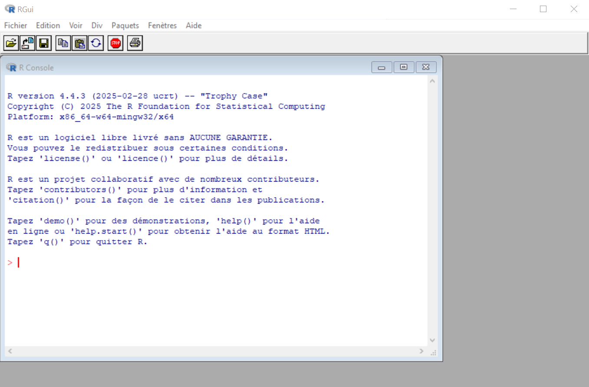
```
]

---

# RStudio

* RStudio, un IDE (environnement de développement intégré)

  * on peut écrire du code R sans RStudio
  * on pourrait même écrire du R dans Notepad, Word ou PowerPoint
  * mais vous devriez écrire votre code R dans RStudio

--

* L'entreprise qui maintient RStudio s'est rebaptisée Posit

--

* Vous pouvez télécharger RStudio ici : [https://posit.co/downloads/](https://posit.co/downloads/)

---

# RStudio

.center[
```{r, echo = FALSE, out.width = "650px"}
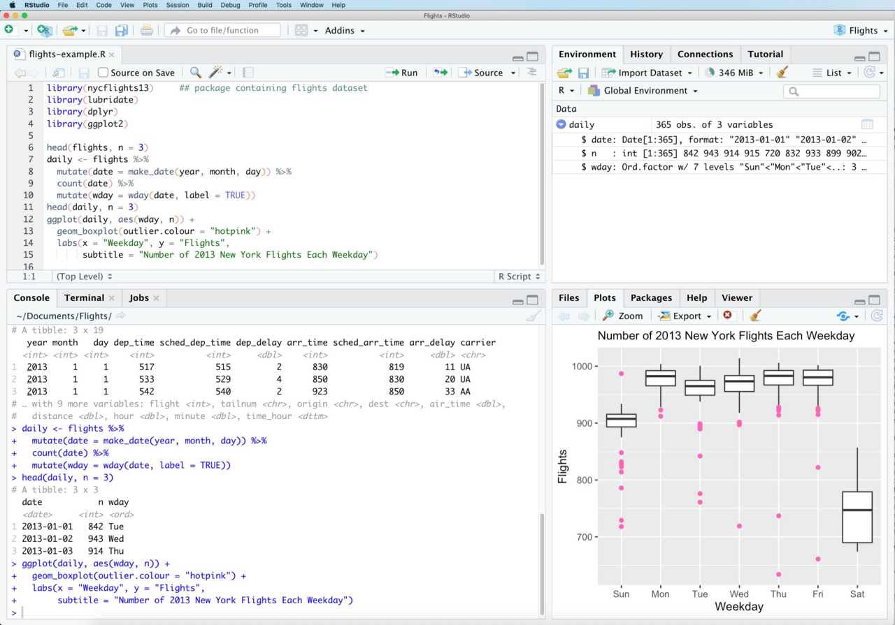
```
]

---

# RStudio - Console

.center[
```{r, echo = FALSE, out.width = "650px"}
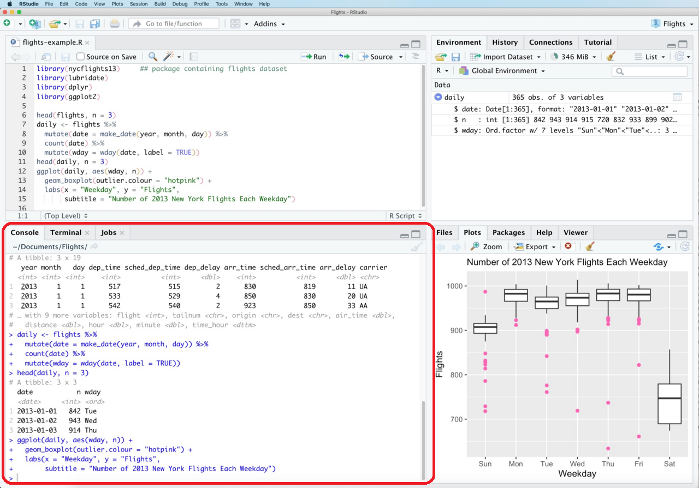
```
]

---

# La console R

Vous pouvez rapidement tester R comme une calculatrice

```{r, eval = FALSE, echo = TRUE}
# Addition
5 + 5

# Soustraction
5 - 5

# Multiplication
3 * 5

# Division
10 / 2

# Exposant
5^3
```

---

# Les scripts R

Pour sauvegarder toutes vos commandes, vous devez utiliser des scripts R

* des fichiers texte avec l'extension `.R`

* similaires aux do-files Stata (.do) ou aux scripts Python (.py)

* nouveau fichier via le bouton en haut à gauche

--

Pour exécuter votre code

* Exécutez la ligne courante ou la sélection avec le bouton *Run*

* Ou utilisez ctrl/cmd + enter

--

Vous pouvez ajouter des commentaires avec $\#$, comme $//$ et $*$ dans Stata

---

# RStudio - Scripts

.center[
```{r, echo = FALSE, out.width = "650px"}
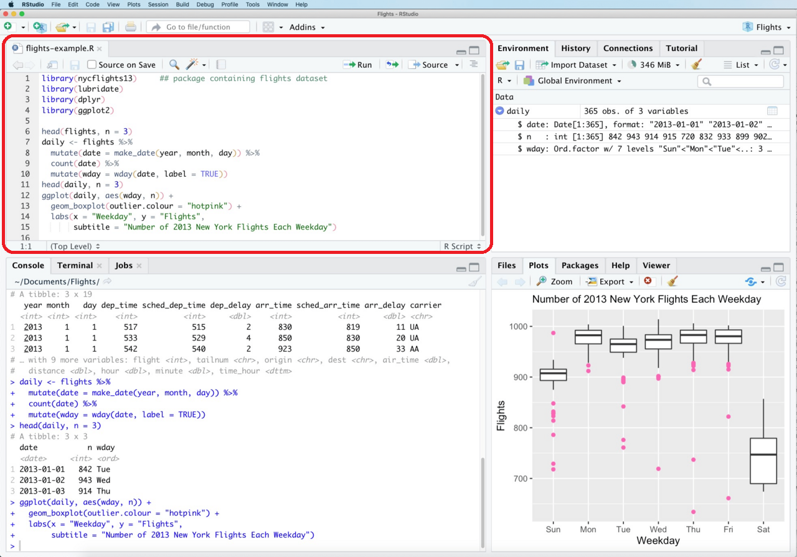
```
]

---

# RStudio - Exécution

.center[
```{r, echo = FALSE, out.width = "650px"}
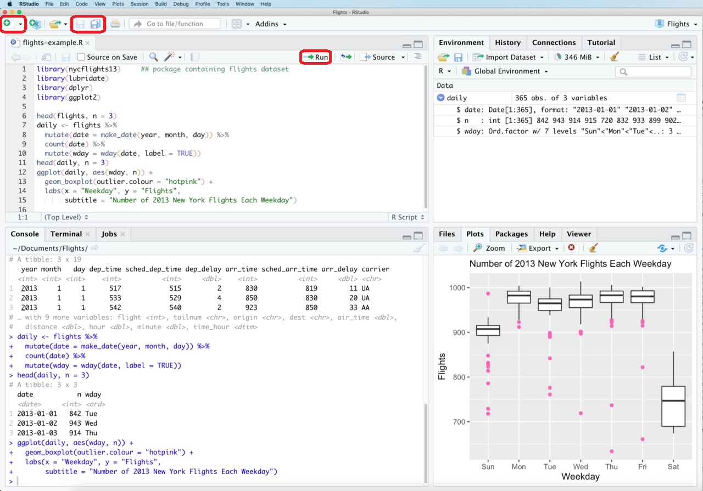
```
]

---

# RStudio - Graphiques, aide et plus

.center[
```{r, echo = FALSE, out.width = "650px"}
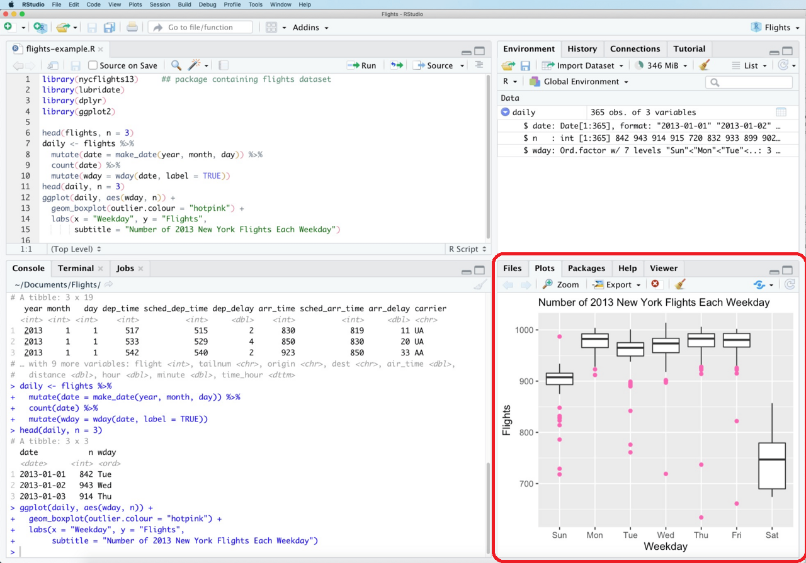
```
]

---

# RStudio - Environnement, historique et plus

.center[
```{r, echo = FALSE, out.width = "650px"}
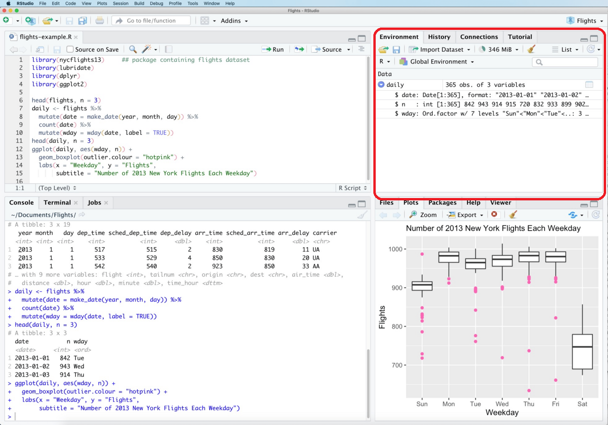
```
]

---

layout: false
class: title-slide-section-red, middle

# Organisation d'un projet

---

layout: true

<div class="my-footer"></div>

---

# Organisation d'un projet

Pour de plus gros projets, comme votre mémoire/thèse :

* votre répertoire de projet
  * data/
    * 1_raw/
    * 2_clean/
  * code/
    * 1_clean.R
    * 2_analyze.R
    * requirements.R
    * main.R
  * docs/
    * sources.md
  * results/
    * figures/
    * tables/
  * README.md

---

# Quelques conseils

* Vos données, votre code et tout le reste doivent être stockés dans le même dossier

--

* Gardez une trace de toutes vos sources de données (+ codebooks) dans un fichier

--

* Ne modifiez **jamais** les données brutes

--

* Découpez votre code en plusieurs fichiers

--

* Exécuter l'intégralité du fichier doit toujours produire le même résultat

--

* Le fichier README résume le fonctionnement de votre projet
  * [Template](https://social-science-data-editors.github.io/template_README/) pour les packages de réplication en sciences sociales

--

* Vous pouvez créer des sections dans votre code avec $\#$ et au moins 4 $-$ ou `=` (comme les sections $**\#$ dans Stata)

```{r, eval = FALSE, echo = TRUE}
# Section 1 ----
## Sous-section 1.1 ----
## Sous-section 1.2 ----

# Section 2 ----
## Sous-section 2.1 ----
```

---

# Chemins d'accès (*paths*)

* Répertoire de travail (*working directory*)
  * là où vous travaillez
  * là où R va chercher les fichiers et sauvegarder vos éléments

```{r, eval = FALSE, echo = TRUE}
# Obtenir le répertoire de travail
getwd()
setwd("chemin_vers_le_dossier") # Changer le répertoire de travail
```

--

* Chemin absolu
  * "C:/Users/nom_utilisateur/documents/session_1/code.R"

--

* Chemin relatif, si vous êtes déjà dans le répertoire *document*
  * "session_1/code.R"

```{r, eval = FALSE, echo = TRUE}
# Changer le répertoire de travail
setwd("chemin_vers_le_dossier")
```

--

* À partir de là, vous pouvez utiliser des chemins relatifs

---

# Projet R (*R project*)

* Les R-projects définissent automatiquement le répertoire de travail

* Fichier $\rightarrow$ New Project

.center[
```{r, echo = FALSE, out.width = "400px"}
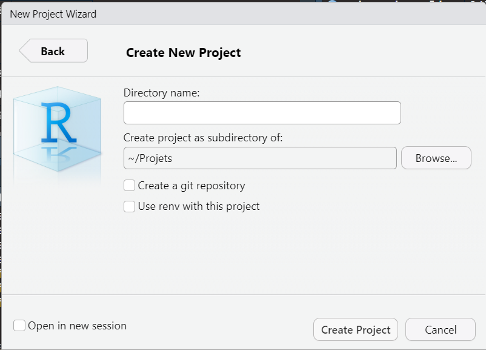
```
]

* Crée un fichier `.Rproj` dans le dossier, avec le nom du dossier

---

# Organisation d'un projet

Pour de plus gros projets, comme votre mémoire de master :

* **nom_du_projet**
  * data/
    * 1_raw/
    * 2_clean/
  * code/
    * 1_clean.R
    * 2_analyze.R
    * requirements.R
    * main.R
  * docs/
    * sources.md
  * results/
    * figures/
    * tables/
  * README.md
  * `nom_du_projet.Rproj`

---

class:inverse

# Exercice 0

`r countdown(minutes = 5, top = 0)`

1. Créez un répertoire pour stocker tous vos fichiers relatifs à ce cours

1. Créez un sous-répertoire en tant que R-project pour la séance 1

1. Ouvrez et sauvegardez un nouveau script R dans le répertoire de la séance 1

1. Vérifiez le répertoire de travail

1. Changez-le vers le répertoire de la séance 1 si nécessaire

---

layout: false
class: title-slide-section-red, middle

# Les objets en R

---

layout: true

<div class="my-footer"></div>

---

# Types de données de base

Similaires à d'autres langages de programmation

* Numeric (ou Double)
  * le type par défaut pour les nombres
  * 2, 2.3, 0, -12.8, -Inf, Inf, NaN

* Integer
  * des nombres entiers : 1, 2, 0, -1, ...
  * notation 1L, 2L, ... pour garantir qu'un nombre est un entier et non un double
  * les entiers sont un sous-ensemble des numeric

* Logical
  * deux valeurs : `TRUE` / `FALSE`

* Character (chaînes de caractères)
  * "Éthiopie", "Addis-Abeba"

--

Il existe aussi la valeur manquante `NA`, pour tous les types de données

Vous pouvez vérifier le type de n'importe quel objet avec la fonction `typeof()`

---

# Opérateurs de comparaison et logiques

.center[
```{r, echo = FALSE, out.width = "700px"}
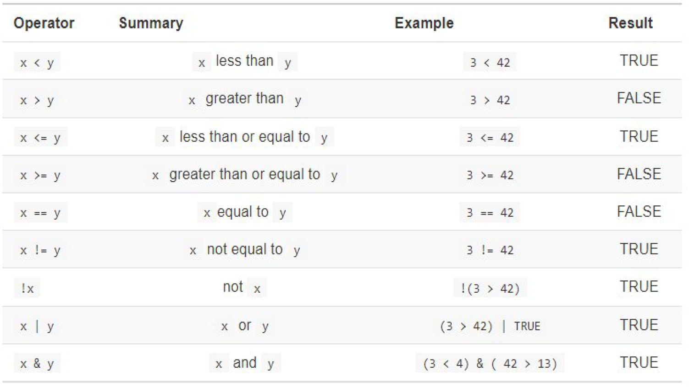
```
]

Attention aux valeurs manquantes, `NA`

---

# Les objets

Des valeurs et des objets peuvent être stockés dans des objets à l'aide des opérateurs d'assignation

* `<-` (Alt + -)
* `=`

```{r, eval = FALSE, echo = TRUE}
# Stocke la valeur 4 dans x
x <- 4
x
# [1] 4
```

--

Ces valeurs peuvent être manipulées

```{r, eval = FALSE, echo = TRUE}
x <- 4
y <- 5
z <- x + y
z
# [1] 9
```

---

# Structures de données : vecteurs et matrices

Utilisez la fonction de combinaison `c()` pour créer un vecteur atomique

```{r, eval = FALSE, echo = TRUE}
vecteur_numerique <- c(-12, 0, 13, NA)
vecteur_numerique
# [1] -12   0  13  NA

vecteur_caractere <- c("France", "Espagne", "Royaume-Uni", "")
vecteur_caractere
# [1] "France"      "Espagne"     "Royaume-Uni" ""
```

--

Utilisez la fonction `matrix()` pour créer une matrice

```{r, eval = FALSE, echo = TRUE}
mat <- matrix(1:9, nrow = 3, byrow = TRUE)
mat
#      [,1] [,2] [,3]
# [1,]    1    2    3
# [2,]    4    5    6
# [3,]    7    8    9
```

---

# Structures de données : data frames

.pull-left[
* La plupart des jeux de données que vous utiliserez seront stockés sous forme de data frames

* Un data frame est un tableau similaire à Excel, avec des variables en colonnes et des observations en lignes

* Contrairement à une matrice, vous pouvez stocker des types de données différents dans chaque colonne
]

.pull-right[
```{r, echo = FALSE, out.width = "400px"}
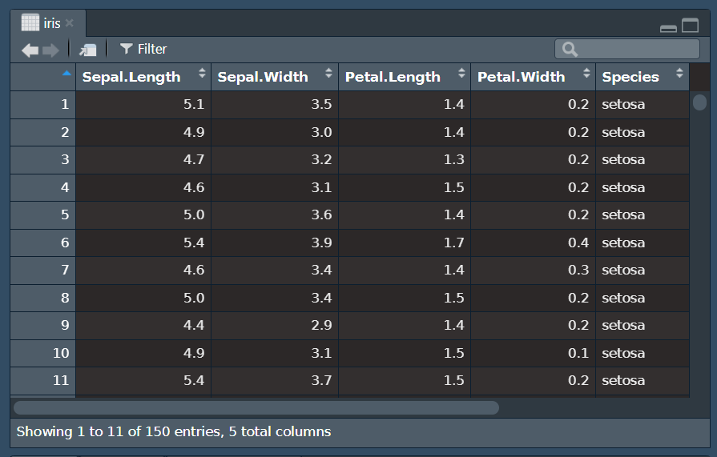
```
]

---

# Structures de données : data frames

* On peut créer un data frame

```{r, eval = FALSE, echo = TRUE}
mon_df <- data.frame(
    x = c(1, 2, 5, 7, 9, 1),
    y = c("a", "b", "c", "d", "e", "f"),
    z = c(TRUE, FALSE, TRUE, FALSE, TRUE, FALSE)
)
```

--

* Des exemples de données sont inclus dans R

```{r, eval = FALSE, echo = TRUE}
data("iris")
iris
```

--

* Mais en général, vous importerez des données existantes depuis un fichier

---

# Importer des données

Exemple avec des données de population urbaine

* Utilisez la fonction `read.csv()` pour lire un fichier CSV

```{r, eval = FALSE, echo = TRUE}
urbanpop <- read.csv("urbanpop_1960_1966.csv", sep = ";")
```

--

* Elle prend différents arguments
  * un nom de fichier : "urbanpop_1960_1966.csv"
  * le séparateur entre les colonnes : ";"

--

* Le résultat de la fonction est un `data.frame`

* Si vous voulez le réutiliser plus tard, il faut le stocker dans un objet

* Ici, on le garde dans l'objet **urbanpop**

--

* Vous pouvez consulter la documentation de n'importe quelle fonction avec la fonction `help()`

```{r, eval = FALSE, echo = TRUE}
help(read.csv)
help(read.csv, package = "utils") # Si le package n'est pas chargé
?read.csv
```

---

# Les packages R

R repose beaucoup sur des packages

* Les packages R sont des collections de fonctions, de données et de code compilé

* En général, si vous devez faire quelque chose qui n'est pas possible par défaut dans R, il existe probablement un package pour ça

* Des milliers de packages sont disponibles au téléchargement sur le Comprehensive R Archive Network (CRAN) : [https://cran.r-project.org](https://cran.r-project.org)

* Certains packages incluent du code venant d'autres langages (C, C++, ...) et peuvent nécessiter Rtools pour être installés

---

# Les packages R : les utiliser

1. Installer le package (le télécharger)
   * Utilisez la fonction `install.packages()` pour télécharger la dernière version du package depuis le CRAN

   ```{r, eval = FALSE, echo = TRUE}
   install.packages("haven") # installe le package haven
   ```

--

1. Charger le package dans R
   * Utilisez la fonction `library()` pour charger le package dans votre session R

   ```{r, eval = FALSE, echo = TRUE}
   library(haven)
   ```

--

* La prochaine fois que vous ouvrez R, vous n'avez pas besoin de réinstaller le package

* En revanche, vous devez le recharger avec la fonction `library()`

---

# Les packages R : dépannage

* Le package est-il installé ? Si non, utilisez `install.packages()` pour l'installer depuis le CRAN

* Vérifiez bien que vous utilisez une chaîne de caractères entre guillemets, sinon R cherchera un objet portant le nom du package

* `install.packages()` ne fonctionne pas, mais le package existe ? Trouvez la source et suivez les instructions

* Message "Packages which are only available in source form, and may need compilation" : vérifiez que Rtools est bien installé

* Le package est-il chargé ? Si non, utilisez `library()`

* Impossible de mettre à jour un package car un autre package chargé en dépend : redémarrez RStudio

---

# Importer des données : packages utiles

* Le package `readr` : de nombreuses fonctions pour les formats CSV, TSV, largeur fixe

* Le package `readxl` : la fonction `read_excel()` pour les formats xls et xlsx

* Le package `haven` : différentes fonctions pour SAS, SPSS, Stata

* Le package `data.table` : la fonction `fread()` pour les formats CSV, Jay, XLSX, et texte brut avec compression (.tar, .gz, .zip, .gz2, .tgz)

---

# Les packages R : le tidyverse

.center[
```{r, echo = FALSE, out.width = "650px"}
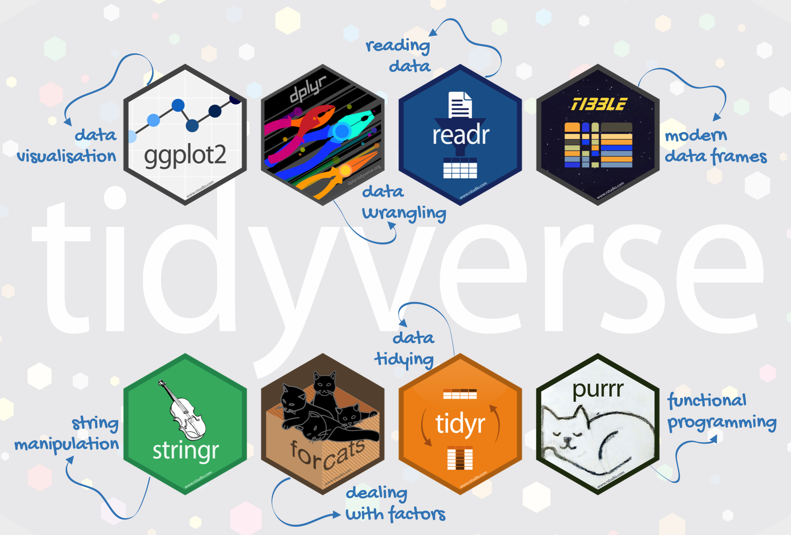
```
]

---

class:inverse

# Exercice 1

`r countdown(minutes = 10, top = 0)`

Nous allons utiliser les données de population par woreda

* Importer les données au format Excel dans R

1. Installez le package `readxl` avec la fonction `install.packages()`

1. Chargez le package dans R avec la fonction `library()`

1. Consultez la documentation de la fonction `read_excel()` avec la fonction `help()`

1. Importez les données "ethiopia_pop.xls" dans un objet nommé **ethio_pop**

---

layout: false
class: title-slide-section-red, middle

# Manipulation de base des données

---

layout: true

<div class="my-footer"></div>

---

# Data frames : caractéristiques de base

Vous pouvez facilement obtenir les informations de base sur un jeu de données avec les commandes suivantes :

```{r, eval = FALSE, echo = TRUE}
urbanpop <- readxl::read_excel("urbanpop.xls", na = "no data")

nrow(urbanpop) # Nombre de lignes
ncol(urbanpop) # Nombre de colonnes

data_1960 <- urbanpop$year1960
data_1960

length(data_1960) # longueur d'un vecteur
```

---

# Data frames : sous-ensembles (*subsetting*)

.pull-left[
* Vous pouvez sélectionner des éléments d'un data frame avec les crochets [ ]

* La syntaxe est

```{r, eval = FALSE, echo = TRUE}
df[lignes, colonnes]
```
]

.pull-right[
```{r, eval = FALSE, echo = TRUE}
nouveau_df <- data.frame(
  id = c("B2CF4", "TSIH6", "973R8",
         "ESCA7", "464FF", "J1019"),
  age = c(9, 15, 84, 80, 75, 73),
  genre = c("H", "F", "F", "H", "F", "H"),
  x = paste0("x", 1:6)
)
```
]

.center[
```{r, echo = FALSE, out.width = "300px"}
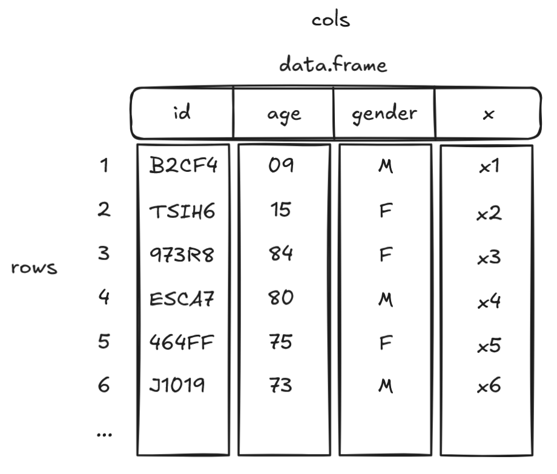
```
]

---

# Data frames : sous-ensembles (*subsetting*)

Quelques exemples

```{r, eval = FALSE, echo = TRUE}
nouveau_df[1, 2]     # valeur de la ligne 1, colonne 2, du data frame nouveau_df
nouveau_df[1:3, 3:4] # valeurs des lignes 1 à 3, colonnes 3 à 4
nouveau_df[1, ]      # valeurs de la ligne 1, toutes les colonnes
nouveau_df[, 1]      # valeurs de toutes les lignes, colonne 1
nouveau_df[, "x"]    # valeurs de toutes les lignes, colonne nommée "x"
```

---

# Packages utiles pour nettoyer/manipuler les données

.pull-left[
.center[
```{r, echo = FALSE, out.width = "150px"}
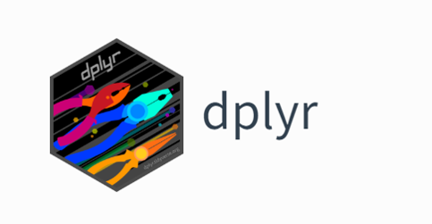
```
]
Objectif : transformer facilement les données
]

.pull-right[
.center[
```{r, echo = FALSE, out.width = "150px"}
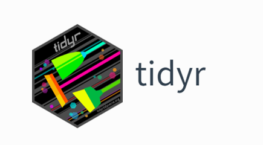
```
]
Objectif : créer des données "tidy"
]

Deux packages du [Tidyverse](https://www.tidyverse.org/packages/)

Des antisèches (*cheat sheets*) sont disponibles sur GitHub

```{r, eval = FALSE, echo = TRUE}
library(dplyr)
library(tidyr)
```

---

# L'opérateur pipe

L'*opérateur pipe* : `%>%` ou `|>` (nouvelle version) - Cmd/Ctrl + Shift + M

1. Prend le résultat situé à gauche

1. Le transmet à la fonction suivante en tant que premier argument

```{r, eval = FALSE, echo = TRUE}
urbanpop %>%
    select(country, year1962) %>%
    filter(year1962 > 0)
```

1. On prend nos données **urbanpop** et on les transmet à la fonction `select()` en tant que premier argument (*.data* selon l'aide)

1. On prend les nouvelles données avec les colonnes sélectionnées, et on les transmet à la fonction `filter()` en tant que premier argument (également *.data* selon l'aide)

1. On obtient les données avec les colonnes sélectionnées et les observations filtrées

---

# L'opérateur pipe et les fonctions du tidyverse

L'opérateur pipe transmet les données au premier argument par défaut, et utilise les fonctions du tidyverse (`filter()`, `group_by()`, `summarise()` ici) pour appliquer des modifications au jeu de données initial, que l'on stocke dans un nouvel objet :

```{r, eval = FALSE, echo = TRUE}
urbanpop_agrege <- urbanpop %>%
    filter(year1962 > 0) %>%
    group_by(region) %>%
    summarise(
        pop_moyenne = mean(year1962, na.rm = TRUE),
        pop_ecart_type = sd(year1962, na.rm = TRUE),
        pop_totale = sum(year1962, na.rm = TRUE)
    )
```

---

# Data frames : sélectionner des variables avec dplyr

Une façon très simple de sélectionner des variables (colonnes) dans un jeu de données est la commande dplyr `select()` :

```{r, eval = FALSE, echo = TRUE}
urbanpop1962 <- urbanpop %>%
    select(country, year1962)
# sélectionne les variables country et year1962
```

--

Si vous voulez sélectionner toutes les variables qui :

* commencent par le préfixe "year", vous pouvez combiner `select()` avec `starts_with()` : `select(starts_with("year"))`

* se terminent par le suffixe "_1962", vous pouvez combiner `select()` avec `ends_with()` : `select(ends_with("_1962"))`

---

# Data frames : sélectionner des observations avec dplyr

Une façon très simple de sélectionner des observations (lignes) dans un jeu de données est la commande dplyr `filter()` :

```{r, eval = FALSE, echo = TRUE}
urbanpop_moins100k <- urbanpop %>%
    filter(year1962 < 100000)
# tous les pays avec une population urbaine 1962 inférieure à 100k
urbanpop_moins_mediane1962 <- urbanpop %>%
    filter(year1962 < median(year1962, na.rm = TRUE))
```

---

class:inverse

# Exercice 2

`r countdown(minutes = 10, top = 0)`

Dans **ethio_pop**, nous voulons comparer la population moyenne dans les woredas pastoraux et Afar, avec la moyenne dans les woredas agricoles et Amhara. Les données incluent les variables indicatrices (0 ou 1) **pastoralist**, **agricultural**, **afar** et **amhara**.

1. Sélectionnez tous les woredas pastoraux et situés en Afar (pastoralist et afar égaux à 1), et stockez les nouvelles données dans un objet nommé **past_afar**

1. Sélectionnez tous les woredas agricoles et situés en Amhara, et stockez les nouvelles données dans un objet nommé **ag_amhara**

1. À partir du data frame **past_afar**, sélectionnez la colonne **t_tl** et stockez-la dans un objet nommé **pop_pa**

1. Faites de même avec le data frame **ag_amhara**, et stockez-la dans un objet nommé **pop_aa**

1. Calculez la moyenne, la médiane, le minimum et le maximum pour les deux vecteurs

1. Comptez le nombre de woredas dans chaque vecteur

---

# Travail à la maison

Si vous voulez vous entraîner, et que vous souhaitez qu'on regarde votre script, merci de faire les exercices 1 à 3, et de les déposer sur le dossier Drive (lien ci-dessous, mais également envoyé par email)

* Ce doit être un fichier `.R`, comme vu en cours

* Nommez-le "NOM_Prenom_seance_1.R", et déposez-le sur ce [dossier Drive](https://drive.google.com/drive/folders/1aXqLCIHHR8tJbHAMWo2veoAptNR8I8P2?usp=sharing)

---

class: title-slide-final, middle
background-image: url(../img/logo/namur-logo.png)
background-size: 250px
background-position: 9% 19%

# Bonne journée !
