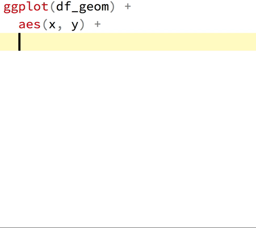

layout: true

<div class="my-footer"></div> 

---

```{r setup, include=FALSE,warning=FALSE,message=FALSE}
options(htmltools.dir.version = FALSE)
knitr::opts_chunk$set(
  message = FALSE,
  warning = FALSE,
  dev = "svg",
  cache = TRUE,
  fig.align = "center"
  #fig.width = 11,
  #fig.height = 5
)

library(dslabs)
library(tidyverse)
library(countdown)
# countdown style
countdown(
  color_border              = "forestgreen",
  color_text                = "black",
  color_running_background  = "forestgreen",
  color_running_text        = "white",
  color_finished_background = "white",
  color_finished_text       = "forestgreen",
  color_finished_border     = "forestgreen"
)

#library(learnr) # this line needs to be run manually I have no idea why but otherwise I get this error message which I can't seem to solve...
# Quitting from lines 27-40 (chapter2.Rmd) 
# Error: package or namespace load failed for 'learnr':
#  .onAttach failed in attachNamespace() for 'learnr', details:
#   call: NULL
#   error: The shiny_prerendered_chunk function can only be called from within runtime: shiny_prerendered
```


# Crédit

Ce cours est basé sur celui de [Grant McDermott's](https://grantmcdermott.com/).

---
layout: false
class: title-slide-section-red, middle

# Visualising Data

---
layout: true

<div class="my-footer"></div> 

---

background-image: url("../img/logo/ggplot2.svg")
background-position: 90% 5%
background-size: 150px

# Base `R` et `ggplot2`

* Bien que l'outil graphique basique de `R` est plutôt bon.

* Il y a une excellente et puissante alternative : `ggplot2`

* Nous allons utiliser la base de données du package `gapminder` pour générer des exemples.

---

# La base de données `gapminder` 

* Chargeons la base `gapminder` comme suivant:
    ```{r, echo = TRUE, eval = FALSE}
    library(dslabs)
    data(gapminder, package = "dslabs")
    ```
    
    ```{r, echo = FALSE, eval = TRUE}
    gapminder <- dslabs::gapminder
    ```

--

* Voici les 3ères et 2 dernières lignes.
    ```{r}
    head(gapminder, n = 3)
    tail(gapminder, n = 2)
    ```

---

class: inverse

# Tâche 1 : Comprendre les données

`r countdown(minutes = 5, top = 0)`

Charger les données avec :

```{r, echo = T, eval = F}
library(dslabs)
data(gapminder, package = "dslabs")
```

1. Calculer la population moyenne par année par continent, `mean_pop`, assigner le résultat à un nouvel objet `gapminder_mean`. (*Indice: vous devez utiliser une observation (ligne) par continent par année. Vous devez utiliser `group_by` et `summarise`.*)

```{r, echo = F}
gapminder_mean <- gapminder %>%
  group_by(continent, year) %>%
  summarise(mean_pop = mean(population))

gapminder_2015 <- gapminder %>%
  filter(year == "2015")
```

---

# gg est pour la grammaire des graphiques <sup>1</sup>

.footnote[
[1]: Les slides suivantes viennent du super [guide de `ggplot2`](https://pkg.garrickadenbuie.com/gentle-ggplot2/#1) de  [Garrick Aden-Buie](https://www.garrickadenbuie.com/)
]

---

# gg est pour la grammaire des graphiques


.left-thin[
### Data

```r
data %>%
  ggplot()
```

ou 

```r
ggplot(data)
```
]

--

.right-wide[

#### Préparons les données 

1. Chaque variable forme une  ***colonne***

2. Chaque observation forme une ***ligne***

]

--

.right-wide[
#### On commence par se demander 

1. Quelles informations je souhaite dans mon graphique ?

1. Est ce que les données sont dans ***une colonne/ligne*** pour une point ?
]

---
layout: true

<div class="my-footer"></div> 

# gg est pour la grammaire des graphiques

.left-thin[
### Données
### Esthétique

```r
+ aes()
```

]
---

.right-wide[
Assigne les données à des éléments visuels

- `year` : année

- population

- `country`: pays
]

---

.right-wide[
Assigne les données à des éléments visuels

- `year` → **x**

- `population` → **y**

- `country` → *shape*, *color*, etc.
]

---

.right-wide[
Assigne les données à des éléments visuels

```r
aes(
  x = year,
  y = population,
  color = country
)
```
]

---
layout: true

<div class="my-footer"></div> 

# gg est pour la grammaire des graphiques

.left-thin[
### Données
### Esthétique
### Geométrie

```r
+ geom_*()
```
]

---

.right-wide[
Les objets géométriques que l'on met dans le graphique 

```{r geom_demo, echo=FALSE, fig.width=6, fig.height=3.5,  out.width="650px"}
minimal_theme <- theme_bw() +
  theme(
    axis.text = element_blank(),
    axis.ticks = element_blank(),
    panel.grid = element_blank(),
    panel.border = element_blank(),
    axis.title = element_blank(),
    plot.title = element_text(hjust = 0.5),
    text = element_text(family = "Fira Mono"),
    plot.background = element_rect(fill = "white", color = NA),
    panel.background = element_rect(fill = "white", color = NA)
  )
set.seed(4242)
df_geom <- data_frame(y = rnorm(10), x = 1:10)
g_geom <- list()
g_geom$point <- ggplot(df_geom, aes(x, y)) + geom_point() + ggtitle("geom_point()")
g_geom$line <- ggplot(df_geom, aes(x, y)) + geom_line() + ggtitle("geom_line()")
g_geom$bar <- ggplot(df_geom, aes(x, y)) + geom_col() + ggtitle("geom_col()")
g_geom$boxplot <- ggplot(df_geom, aes(y = y)) + geom_boxplot() + ggtitle("geom_boxplot()")
g_geom$histogram <- ggplot(df_geom, aes(y)) + geom_histogram(binwidth = 1) + ggtitle("geom_histogram()")
g_geom$density <- ggplot(df_geom, aes(y)) + geom_density(fill = "grey40", alpha = 0.25) + ggtitle("geom_density()") + xlim(-4, 4)
g_geom <- map(g_geom, ~ . + minimal_theme)
cowplot::plot_grid(plotlist = g_geom)
```
]

---

.right-wide[
 [Une liste des formes les plus utilisées](https://eric.netlify.com/2017/08/10/most-popular-ggplot2-geoms/)

.small[
| Type | Function |
|:----:|:--------:|
| Point | `geom_point()` |
| Line | `geom_line()` |
| Bar | `geom_bar()`, `geom_col()` |
| Histogram | `geom_histogram()` |
| Regression | `geom_smooth()` |
| Boxplot | `geom_boxplot()` |
| Text | `geom_text()` |
| Vert./Horiz. Line | `geom_{vh}line()` |
| Count | `geom_count()` |
| Density | `geom_density()` |

<https://eric.netlify.com/2017/08/10/most-popular-ggplot2-geoms/>
]
]


---

.right-wide[
Comme à taper `geom_` dans `RStudio` pour voir toutes les options



]

---

layout: true

<div class="my-footer"></div> 

# (V)Notre premier graphique!
---

.left-thin[
```{r first-plot0a, eval=FALSE}
gapminder_mean
```
]

.right-wide[
```{r first-plot0a-out, ref.label='first-plot0a', echo=FALSE}
```
]

---

.left-thin[
```{r first-plot1a, eval=FALSE}
gapminder_mean %>%
  ggplot() #<<
```
]

.right-wide[
```{r first-plot1a-out, ref.label='first-plot1a', echo=FALSE, fig.height = 3.5, out.width="100%"}
```
]

---

.left-thin[
```{r first-plot1b, eval=FALSE}
gapminder_mean %>%
  ggplot() +
  aes(x = year, #<<
      y = mean_pop) #<<
```
]

.right-wide[
```{r first-plot1b-out, ref.label='first-plot1b', echo=FALSE, fig.height = 3.5, out.width="100%"}
```
]

---

.left-thin[
```{r first-plot1c, eval=FALSE}
gapminder_mean %>%
  ggplot() +
  aes(x = year,
      y = mean_pop) +
  geom_point() #<<
```
]

.right-wide[
```{r first-plot1c-out, ref.label='first-plot1c', echo=FALSE, fig.height = 3.5, out.width="100%"}
```
]

---

.left-thin[
```{r first-plot1, eval=FALSE}
gapminder_mean %>%
  ggplot() +
  aes(x = year,
      y = mean_pop,
      color = continent) + #<<
  geom_point()
```
]

.right-wide[
```{r first-plot1-out, ref.label='first-plot1', echo=FALSE, fig.height = 3.5, out.width="100%"}
```
]

---

.left-thin[
```{r first-plot2-fake, eval=FALSE}
gapminder_mean %>%
  ggplot() +
  aes(x = year,
      y = mean_pop,
      color = continent) +
  geom_point() +
  geom_line() #<<
```
]

.right-wide[
```{r first-plot2-fake-out, ref.label='first-plot2-fake', fig.height = 3.5, echo=FALSE, out.width="100%"}
```
]

---

.left-thin[
```{r first-plot2-line, eval=FALSE}
gapminder_mean %>%
  ggplot() +
  aes(x = year,
      y = mean_pop,
      color = continent) +
  # geom_point() + #<<
  geom_line()
```
]

.right-wide[
```{r first-plot2-line-out, ref.label='first-plot2-line', fig.height = 3.5, echo=FALSE, out.width="100%"}
```
]

---

.left-thin[
```{r save-plot, eval=FALSE}
g = gapminder_mean %>%
  ggplot() +
  aes(x = year,
      y = mean_pop,
      color = continent) +
  # geom_point() + #<<
  geom_line()
g
# graphs peuvent être sauver comme des
# objects!
```
]

.right-wide[
```{r save-plot-out, ref.label='save-plot', fig.height = 3.5, echo=FALSE, out.width="100%"}
```
]

---
layout: true

<div class="my-footer"></div> 

# gg est pour Grammaire de Graphique

.left-thin[
### Données
### Esthétique
### Géométrie
### Facet

```r
+ facet_wrap() 
+ facet_grid()
```
]
---

```{r geom_facet_setup, include=FALSE}
g <- ggplot(gapminder_mean) +
  aes(x = year,
      y = mean_pop,
      color = continent) +
  geom_point() +
  geom_line()
```

.right-wide[
```{r geom_facet, echo=TRUE, out.width="90%", fig.height = 3.5, fig.width=6}
g + facet_wrap(~ continent)
```
]

---

.right-wide[
```{r geom_grid, echo=TRUE, out.width="90%", fig.height = 3.5, fig.width=6}
g + facet_grid(~ continent)
```
]

---
layout: true

<div class="my-footer"></div> 

# gg est pour Grammaire de Graphique

.left-thin[
### Données
### Esthétique
### Géométrie
### Facet
### Labels

```r
+ labs()
```
]
---

.right-wide[
```{r labs-ex, echo=TRUE, out.width="90%", fig.height = 3.5, fig.width=6}
g + labs(x = "Year", y = "Average Population", color = "Continent")
```
]

---
layout: true

<div class="my-footer"></div> 

# gg est pour Grammaire de Graphique

.left-thin[
### Données
### Esthétique
### Géométrie
### Facet
### Labels
### Echelle

```r
+ scale_*_*()
```
]
---

.right-wide[ 
`scale` + `_` + `<aes>` + `_` + `<type>` + `()`

Quels parameètres voulez vous ajuster ? → `<aes>` <br>
Quel type de paramètre ? → `<type>`

- Je veux changer mon axe-x discret<br>`scale_x_discrete()`
- Je veux change range of point sizes from continuous variable<br>`scale_size_continuous()`
- Je veux rescale l'axe-y en log10<br>`scale_y_log10()`
- Je veux utiliser une différente palette de couleur<br>`scale_fill_discrete()`<br>`scale_color_manual()`
]

---

.right-wide[
```{r scale_ex1, out.width="90%", fig.height = 3.5, fig.width=6}
g + scale_color_viridis_d()
```
]

---

.right-wide[
```{r scale_ex2, out.width="90%", fig.height = 3.5, fig.width=6}
g + scale_y_log10()
```
]

---

.right-wide[
```{r scale_ex4, out.width="90%", fig.height = 3.5, fig.width=6}
g + scale_x_continuous(breaks = seq(1950, 2020, 10))
```
]

---
layout: true

<div class="my-footer"></div> 

# gg est pour Grammaire de Graphique

.left-thin[
### Données
### Esthétique
### Géométrie
### Facet
### Labels
### Echelle

---

layout:true

<div class="my-footer"></div> 

---

# Plus de détails sur `ggplot2`

* Chaque graphique est unique et `ggplot2` fourni une infinité d'option pour créer le graphique parfait.

--

* Retrouvez le cheatsheet sur [site du projet](https://ggplot2.tidyverse.org).

--

* Le [guide](https://pkg.garrickadenbuie.com/gentle-ggplot2/#1) de [Garrick Aden-Buie](https://www.garrickadenbuie.com/) que j'ai utilisé pour les diapos précédentes/

---

# Types de Gaphiques

***Histogrammes:*** compte le nombre d'observations dans des intervalles.

--

***Boxplots:*** montre la distribution d'une variable.

--

```{r, echo = F, out.width = "850px"}
knitr::include_graphics("chapter_r_gg_files/figure-html/boxplot_explanation.png")
```

---

# Types de Gaphiques

***Histogrammes :*** compte le nombre d'observations dans des intervalles.

***Boxplots :*** montre la distribution d'une variable.

***Nuages de points :*** mpntre la relation entre deux variables.

---

class: inverse

# Tâche 2 : Visualisation des données

`r countdown(minutes = 10, top = 0)`

En utilisant les données `gapminder`, créez les graphiques suivants avec `ggplot2`.

1. Un histogramme de l'espérance de vie en 2015. (*Indice : avez-vous besoin de spécifier un `y` dans `aes()` pour un histogramme ?*) Une fois l'histogramme créé, dans le `geom_*` approprié, réglez : `binwidth` à 5, `boundary` à 45, `colour` à "white" et `fill` à "forestgreen". Que fait chacune de ces options ? <br> *Optionnel :* En utilisant le graphique précédent, faites-en un facet par continent de sorte que le graphique de chaque continent soit sur une nouvelle ligne. (*Indice : consultez l'aide de `facet_grid`.*)

1. Un boxplot de l'espérance de vie moyenne par année et par continent. Dans le `geom_*` approprié, réglez : `colour` à "black" et `fill` à "forestgreen". (*Indice : vous devez grouper à la fois par `continent` et par `year`.*)

1. Un nuage de points du taux de fécondité (axe y) en fonction de la mortalité infantile (axe x) en 2015. Une fois le nuage de points créé, dans le `geom_*` approprié, réglez : `size` à 3, `alpha` à 0.5, `colour` à "forestgreen". Ajoutez des étiquettes (`labs`) au graphique pour qu'il soit plus clair.

---

layout: false
class: title-slide-section-red, middle

# Résumer les données

---

layout: true

<div class="my-footer"></div> 

---

# Résumer les données


* En général, on découvre des info sur nos données en utilisant des graphiques et/ou en calculant des statistiques descriptives 

--

* Regardons brievemment cela !

--

* En particulier, regardons : *tendance centrale* et *la dispersion*.

---

# Tendance Centrale


.pull-left[
`mean(x)`: la moyenne de toutes ls valeurs de `x`.
$$\bar{x} = \frac{1}{N}\sum_{i=1}^N x_i$$

```{r}
x <- c(1,2,2,2,2,100)
mean(x)
mean(x) == sum(x) / length(x)
```
]

--

.pull-right[
`median`: la valeur de $x_j$ au dessous et dessus duquel 50% des valeurs de `x` sont. $m$ est la médianne si 
    $$\Pr(X \leq m) \geq 0.5 \text{ and } \Pr(X \geq m) \geq 0.5$$
    
La médiane est robuste contre les *valeurs extrêmes*.

```{r}
median(x)
```
]

---

# Dispersion

.pull-left[
Une autre caractéristiques intéressantes d'une variable est de savoir à quelle point elle est  *dispersée* autour de son centre  (la moyenne ici).

La *variance* est une mesure.
    $$Var(X) = \frac{1}{N} \sum_{i=1}^N(x_i-\bar{x})^2$$
    
Considérons 2 `distribution normalle` avec des moyennes égales à  `0`:
]

--

.pull-right[
```{r,echo = FALSE,fig.height=4,message = FALSE,warning = FALSE}
ggplot(data = data.frame(x = c(-5, 5)), aes(x)) +
  stat_function(fun = dnorm, n = 101, args = list(mean = 0, sd = 1), aes(color = "1"), size = 2) +
  stat_function(fun = dnorm, n = 101, args = list(mean = 0, sd = 2), aes(color = "4"), size = 2) +
  ylab(NULL) +
  scale_y_continuous(breaks = NULL) +
  scale_color_manual("Variance:", values = c("#d90502","#DE9854")) +
  theme_bw() +
  theme(legend.position = c(0.02,0.98),
        legend.justification = c(0,1),
        text = element_text(size=20))
```

Calculé avec:
```{r,eval = FALSE}
var(x)
```
]
---

# Tabuler des données

`table(x)` est une fonction utile qui compte le nombre d'occurence unique de `x`:
```{r}
table(gapminder$continent)
```

--

Peut aussi utiliser la fonction `count`de `dplyr`
```{r}
gapminder %>% count(continent)
```

---

# Tabuler des données


Pour 2 variables, `table` produit une table :
```{r}
gapminder_new <- gapminder %>%
  filter(year == 2015) %>%
  mutate(fertility_above_2 = (fertility > 2.1)) #  variable binaire pour le taux de fertilité au dessus du taux de remlacement 
```

.pull-left[
```{r}
table(gapminder_new$fertility_above_2)
```
]

--

.pull-right[
```{r}
table(gapminder_new$fertility_above_2,gapminder_new$continent)
```
]

--

Avec `prop.table`, on peut obtenir des proportions :
```{r,eval=FALSE}
# proportions by row
prop.table(table(gapminder_new$fertility_above_2,gapminder_new$continent), margin = 1)
# proportions by column
prop.table(table(gapminder_new$fertility_above_2,gapminder_new$continent), margin = 2) 
```

* ⚠️ Pour obtenir la `table` ou `crosstable`s avec `NA`s, utilisez  `useNA = "always"` ou `useNA = "ifany"`

---

# Tabuler des données

Encore la fonction `count` fait l'affaire:

```{r}
gapminder_new %>%
  count(continent, fertility_above_2)
```

Note :  `count` montre les `NA` que s'il y en a.

---
class: title-slide-final, middle
background-image: url(../img/logo/namur-logo.png)
background-size: 250px
background-position: 9% 19%

# BONNE JOURNÉE !


|                                                                                                            |                                   |
| :--------------------------------------------------------------------------------------------------------- | :-------------------------------- |
| <a href="mailto:jeremy.donascimento@unamur.be">.Namurgreen[<i class="fa fa-paper-plane fa-fw"></i>]               | jeremy.donascimento@unamur.be       |
| <a href="https://discord.gg/RcdCRFBcc">.Namurgreen <i class="fab fa-link fa-fw"></i></a> | Discord |
| <a href="https://github.com/jdnmiguel/econometric_ECGEB352">.Namurgreen[<i class="fa fa-link fa-fw"></i>] | Slides |

---  