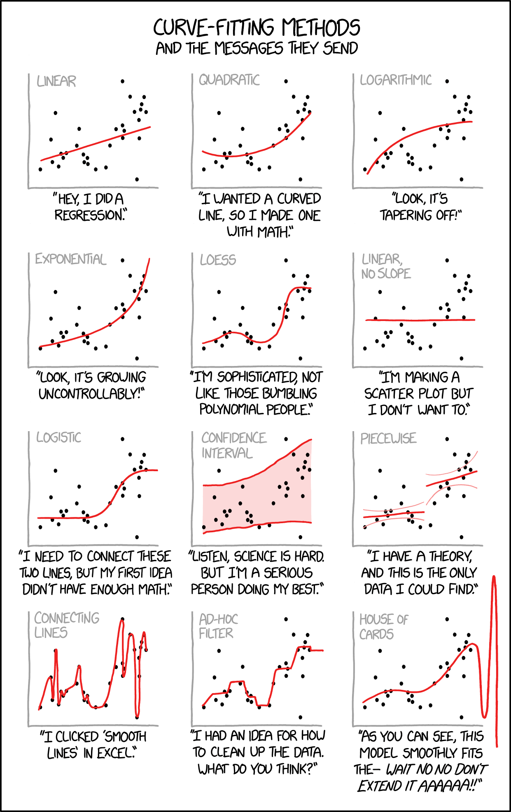
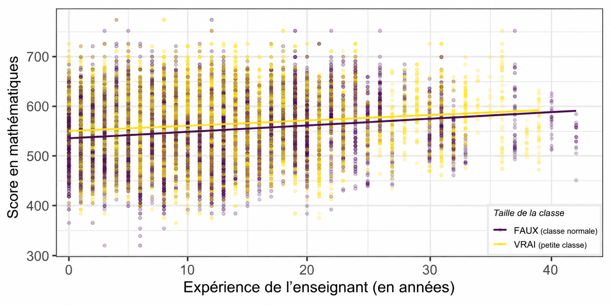
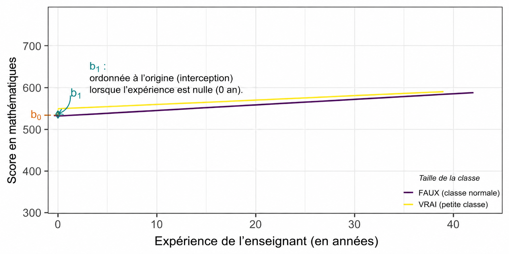
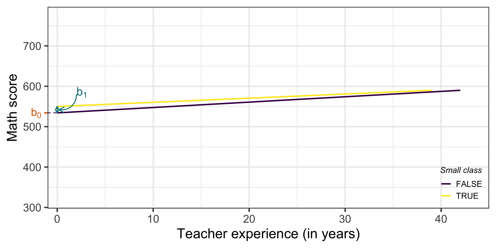
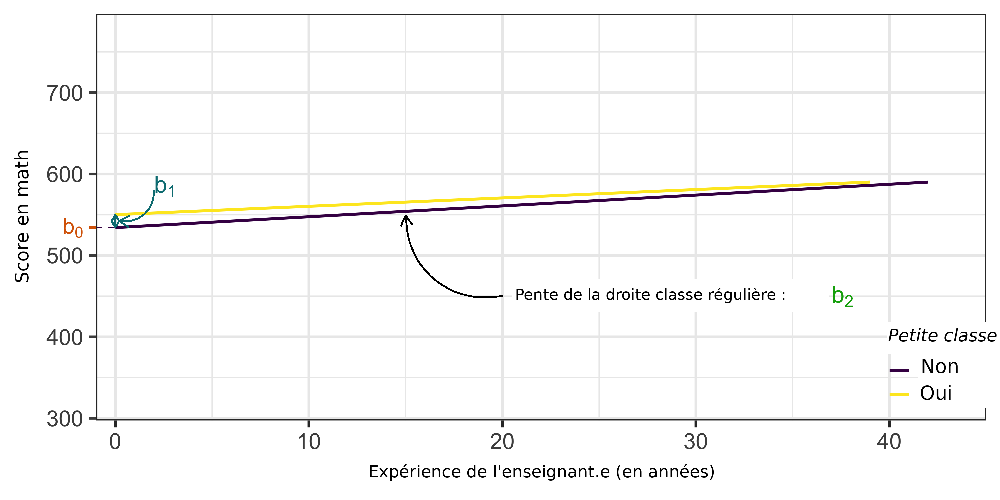
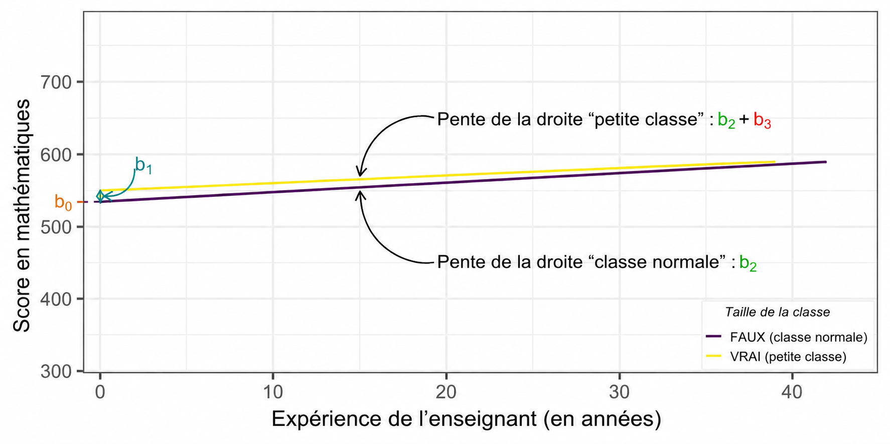
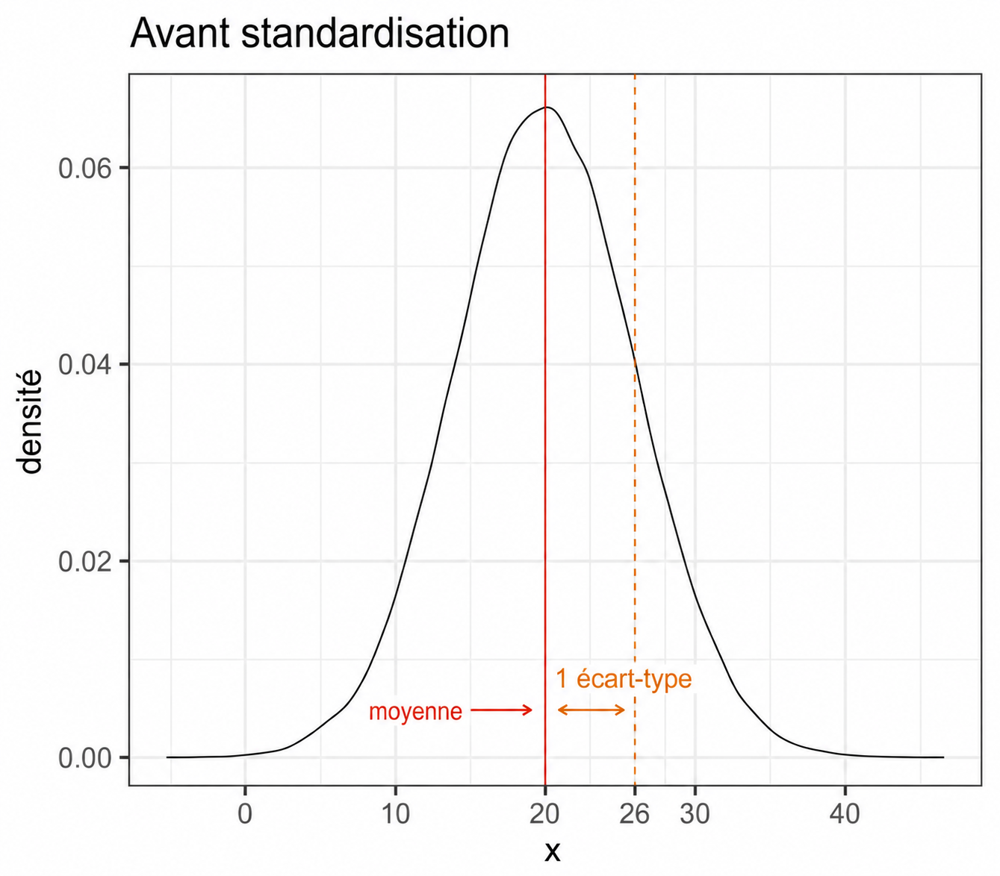
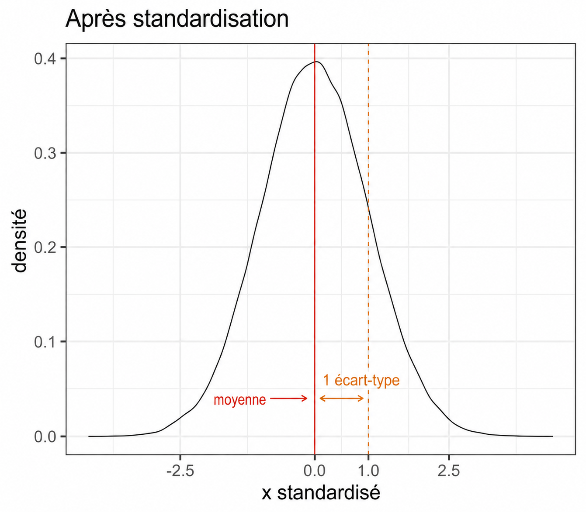

layout: true

<div class="my-footer"></div> 

---

```{r setup, include=FALSE,warning=FALSE,message=FALSE}
options(htmltools.dir.version = FALSE)
knitr::opts_chunk$set(
  message = FALSE,
  warning = FALSE,
  dev = "svg",
  cache = TRUE,
  fig.align = "center"
  #fig.width = 11,
  #fig.height = 5
)

# define vars
om = par("mar")
lowtop = c(om[1],om[2],0.1,om[4])
library(magrittr)
library(plotly)
library(reshape2)
library(haven)
library(tidyverse)
library(AER)
library(gtools)
library(countdown)

# countdown style
countdown(
  color_border              = "forestgreen",
  color_text                = "black",
  color_running_background  = "forestgreen",
  color_running_text        = "white",
  color_finished_background = "white",
  color_finished_text       = "forestgreen",
  color_finished_border     = "forestgreen"
)
```


# Aujourd'hui - Extensions du modèle de régression linéaire

Selon les données et les relations entre les variables d'intérêt, il peut être nécessaire de s'éloigner du modèle de base.

--

Nous allons nous concentrer sur 3 variations importantes :
  
  1. ***Relations non-linéaires*** : modèles logarithmiques et polynomiaux
  
  1. ***Interactions*** entre variables

  1. Régression ***standardisée***

--

Dans chaque cas, la façon dont on estime ces coefficients ne change pas (i.e. OLS).

--

Applications empiriques :

  (i) *frais de scolarité* et *potentiel de revenu*,
  (ii) *salaire*, *éducation* et *genre*,
  (iii) *taille de classe* et *performance des élèves*

---

layout: false
class: title-slide-section-red, middle

# Relations Non-Linéaires

---

layout: true

<div class="my-footer"></div> 

---

# Prendre en compte les relations non-linéaires

Il existe deux "méthodes" principales :

--

1. Modèles ***log***

--

1. Modèles ***polynomiaux***

---


# Modèles logarithmiques

* Les modèles vus jusqu'à présent peuvent être appelés spécifications ***niveau-niveau***. La variable dépendante et la variable indépendante sont toutes deux mesurées en niveau.

--

  * Ce *niveau* peut être : des euros, des années, un nombre d'élèves, un %
  
--

* Prendre le logarithme *naturel* de la variable dépendante et/ou de la (des) variable(s) indépendante(s) nous amène à définir 3 autres types de régressions (abus de notation : $ln(x) = \log_{e}(x)=\log(x)$) :

  * ***Log - niveau*** :   $$\log(y_i) = \beta_0 + \beta_1 x_{1,i} + ... + e_i$$

  * ***Niveau - log*** :   $$\textrm{y}_i = \beta_0 + \beta_1 \log(x_{1,i}) + ... + e_i$$

  * ***Log - log*** :   $$\log(y_i) = \beta_0 + \beta_1 \log(x_{1,i}) + ... + e_i$$
  
---

# La fonction logarithme (naturel) : une introduction `r emo::ji("winking_face")`

```{r, echo = FALSE, fig.height = 5, fig.width = 10}
data <- data.frame(x = seq(0, 10000, .1))

data %>%
  ggplot(aes(x = x, y = log(x))) +
  geom_line() +
  theme_bw(base_size = 20)
```

---

# La fonction logarithme (naturel) : une introduction `r emo::ji("winking_face")`

La [fonction logarithme naturel](https://fr.wikipedia.org/wiki/Logarithme_n%C3%A9p%C3%A9rien) est la fonction inverse de la fonction exponentielle, i.e. $log(\exp(x))=x$

--

$\rightarrow$ puisque pour tout $x$, $\exp(x)>0 \implies$ la fonction logarithme naturel n'est définie que pour des ***valeurs strictement positives*** ! (Elle n'est pas définie en 0 !)

--

`r emo::ji("warning")` Vous ne pouvez logger vos variables que si elles ne prennent pas de valeurs nulles ou négatives ! Pensez-y toujours avant de prendre le log de votre variable dépendante ou indépendante(s)

---

# La fonction logarithme (naturel) : une introduction `r emo::ji("winking_face")`

Si vous avez des distributions très ***asymétriques***, prendre le log la rendra plus proche d'une ***distribution normale***

--

.pull-left[
```{r, echo = FALSE, fig.height = 6}
data <- data.frame(x = rlnorm(1000, meanlog = log(100), sdlog = log(5)))

data %>%
  ggplot(aes(x = x)) +
  geom_density() +
  scale_x_continuous(labels = scales::comma) +
  theme_bw(base_size = 20)
```
]

--

.pull-right[
```{r, echo = FALSE, fig.height = 6}
data %>%
  ggplot(aes(x = log(x))) +
  geom_density() +
  scale_x_continuous(labels = scales::comma) +
  theme_bw(base_size = 20)
```
]


---

# Modèles logarithmiques : interprétations simplifiées

|    Spécification           | Modèle  |  Interprétation de $\beta_1$            |
|--------------------|:---------:|:-----------------------------------:|
| Niveau - Niveau | $y = \beta_0 + \beta_1 x + e$ | .small[Une augmentation d'**une unité** de ] $x$ .small[ est associée, en moyenne, à un ] $\beta_1$ .small[**changement d'une unité** de y]  |
| Log - Niveau | $\log(y) = \beta_0 + \beta_1 x + e$ | .small[Une augmentation d'**une unité** de ] $x$ .small[ est associée, en moyenne, à un] $\beta_1 \times 100$ .small[ **changement en pourcentage** de y]  |
| Niveau - Log | $y = \beta_0 + \beta_1 \log(x)  + e$ | .small[Une augmentation d'**un pourcent** de ] $x$ .small[ est associée, en moyenne, à un ] $\beta_1 / 100$  .small[**changement d'une unité** de y] |
| Log - Log  |  $\log(y) = \beta_0 + \beta_1 \log(x) + e$ | .small[Une augmentation d'**un pourcent** de ] $x$ .small[ est associée, en moyenne, à un] $\beta_1$ .small[**changement en pourcentage** de y]  |

--

* Cela peut ressembler à des recettes de cuisine mais bien sûr, cela peut être [dérivé avec des mathématiques relativement simples](https://stats.idre.ucla.edu/other/mult-pkg/faq/general/faqhow-do-i-interpret-a-regression-model-when-some-variables-are-log-transformed/).

--

* `r emo::ji("warning")` ces interprétations ne sont vraies que pour de ***petits*** changements de $x$ et/ou un petit $\beta_1$. Que se passe-t-il si l'on veut connaître le changement de $y$ pour de grands changements de $x$ ou lorsque $\beta_1$ est grand ?

---
name: gen_log

# Modèles logarithmiques : interprétations générales

Pour ***toute augmentation de $x$, $\Delta x,$ et tout $\beta_1$*** $(\Delta x = 5\% = 0.05 \implies 1 + \Delta x = 1.05)$ :

|    Spécification           | Modèle  |  Interprétation de $\beta_1$            |
|--------------------|:---------:|:-----------------------------------:|
| Niveau - Niveau | $y = \beta_0 + \beta_1 x + e$ | .small[Une augmentation d'**une unité** de ] $x$ .small[ est associée, en moyenne, à un ] $\beta_1$ .small[**changement d'une unité** de y]  |
| Log - Niveau | $\log(y) = \beta_0 + \beta_1 x + e$ | .small[Une augmentation d'**une unité** de ] $x$ .small[ est associée, en moyenne, à un] $(e^{\beta_1} - 1) \times 100$ .small[ **changement en pourcentage** de y]  |
| Niveau - Log | $y = \beta_0 + \beta_1 \log(x)  + e$ | .small[Une  ] ** $\Delta x$** .small[augmentation en **pourcentage** de ] $x$ .small[ est associée, en moyenne, à un ] $\beta_1 \times \log(1 + \Delta x)$  .small[**changement d'une unité** de y] |
| Log - Log  |  $\log(y) = \beta_0 + \beta_1 \log(x) + e$ | .small[Une  ] ** $\Delta x$** .small[augmentation en **pourcentage** de ] $x$ .small[ est associée, en moyenne, à un] $((1 + \Delta x)^{\beta_1} - 1) \times 100$ .small[**changement en pourcentage** de y]  |


([*Annexe :*](#log_approx) Pourquoi les approximations montrées précédemment sont-elles vraies ?)


---

# Quand utiliser des modèles logarithmiques ?

1. Si la relation entre $x$ et $y$ ressemble à une fonction logarithmique ou exponentielle. 

--

.pull-left[
```{r, echo = FALSE, fig.height = 6}
gapminder <- dslabs::gapminder

gapminder %>%
    filter(year == 2011) %>%
    ggplot(aes(x = gdp, y = life_expectancy)) +
    geom_point() +
    geom_smooth(method = "lm", se = FALSE) +
    scale_y_continuous(lim = c(40,100)) +
    labs(x = "PIB",
         y = "Espérance de vie",
         title = "Relation entre l'espérance de vie et le PIB en 2011",
         caption = "Données gapminder du package dslabs.") +
    theme_bw(base_size = 20) +
  theme(plot.title = element_text(size = 15))
```
]

--

.pull-right[
```{r, echo = FALSE, fig.height = 6}
gapminder %>%
    filter(year == 2011) %>%
    ggplot(aes(x = log(gdp), y = life_expectancy)) +
    geom_point() +
    geom_smooth(method = "lm", se = FALSE) +
    scale_y_continuous(lim = c(40,100)) +
    labs(x = "Log PIB",
         y = "Espérance de vie",
         title = "Relation entre l'espérance de vie et le log du PIB en 2011",
         caption = "Données gapminder du package dslabs.") +
    theme_bw(base_size = 20) +
  theme(plot.title = element_text(size = 15))
```
]

---

# Quand utiliser des modèles logarithmiques ?

1. Si la relation entre $x$ et $y$ ressemble à une fonction logarithmique ou exponentielle. 

.pull-left[
```{r, echo = FALSE, fig.height = 6}
gapminder <- dslabs::gapminder

gapminder %>%
    filter(year == 2011) %>%
    ggplot(aes(x = fertility, y = gdp)) +
    geom_point() +
    geom_smooth(method = "lm", se = FALSE) +
    scale_x_continuous(lim = c(0,8)) +
    labs(x = "Taux de fécondité",
         y = "PIB",
         title = "Relation entre le PIB et la fécondité en 2011",
         caption = "Données gapminder du package dslabs.") +
    theme_bw(base_size = 20) +
  theme(plot.title = element_text(size = 15))
```
]

--

.pull-right[
```{r, echo = FALSE, fig.height = 6}
gapminder %>%
    filter(year == 2011) %>%
    ggplot(aes(x = fertility, y = log(gdp))) +
    geom_point() +
    geom_smooth(method = "lm", se = FALSE) +
    scale_x_continuous(lim = c(0,8)) +
    labs(x = "Taux de fécondité",
         y = "PIB",
         title = "Relation entre le log du PIB et la fécondité en 2011",
         caption = "Données gapminder du package dslabs.") +
    theme_bw(base_size = 20) +
  theme(plot.title = element_text(size = 15))
```
]

---

# Quand utiliser des modèles logarithmiques ?

1. Si la relation entre $x$ et $y$ ressemble à une fonction logarithmique ou exponentielle. 

1. Pour interpréter facilement les coefficients comme des <a href="https://fr.wikipedia.org/wiki/%C3%89lasticit%C3%A9_(%C3%A9conomie)">***élasticités***</a>, qui jouent un rôle central en théorie économique.

***Élasticité de $y$ par rapport à $x$ :*** changement en pourcentage de $y$ suite à une augmentation de 1% de $x$.

---

# Prendre en compte d'autres types de relations non-linéaires

Que se passe-t-il si la relation entre $x$ et $y$ n'est pas exponentielle/logarithmique ?

--

$\rightarrow$ régressions ***polynomiales*** : il suffit de prendre une fonction polynomiale du régresseur !

---

# Polynomial Wut ? `r emo::ji("worried_face")`

.pull-left[
```{r, echo = FALSE, fig.height=6}
x <- runif(10000, min = -20, max = 20)
y = 2 + 3*x + 5*x^2

data <- data.frame(x = x, y = y)

data %>%
    ggplot(aes(x,y)) +
    geom_line() +
    annotate("text", x = 0, y = 1850, label = "y == 2 + 3 * x + 5 * x^2", parse = TRUE, size = 8) +
    labs(title = "Polynôme de second degré") +
    theme_bw(base_size = 20)
```
]

--

.pull-right[
```{r, echo = FALSE, fig.height=6}
x <- runif(10000, min = -20, max = 20)
y = 2 + 3*x - 10*x^2 - 5*x^3

data <- data.frame(x = x, y = y)

data %>%
    ggplot(aes(x,y)) +
    geom_line() +
    scale_y_continuous(labels = scales::comma) +
    annotate("text", x = 0, y = 28000, label = "y == 2 + 3 * x  - 10 * x^2 - 5 * x^3", parse = TRUE, size = 8) +
  labs(title = "Polynôme de troisième degré") +
    theme_bw(base_size = 20)
```
]

---

# Régressions polynomiales

Qu'est-ce que cela signifie en pratique ?

--

$\rightarrow$ ajouter un ordre plus élevé du régresseur à la régression, selon la relation visuelle (ou attendue)

--

Plusieurs façons de le faire en `R` :

.pull-left[
```{r, eval = F}
lm(y ~ x + I(x^2) + I(x^3), data)
```
]

--

.pull-right[
```{r, eval = F}
lm(y ~ poly(x, 3, raw = TRUE), data)
```
]

--

`r emo::ji("warning")` Pour que la forme fonctionnelle soit véritablement polynomiale, les coefficients associés à tous les termes doivent être statistiquement différents de zéro. Nous verrons plus loin comment vérifier cette condition.

---

# Régressions polynomiales


.pull-left[

***2ème ordre :***

```{r, echo = FALSE, fig.height = 6}
gapminder <- dslabs::gapminder

gapminder %>%
    filter(year == 2011) %>%
    ggplot(aes(x = fertility, y = log(gdp))) +
    geom_point() +
    geom_smooth(method = "lm", se = FALSE, formula = y ~ poly(x, 2, raw = TRUE)) +
    scale_x_continuous(lim = c(0,8)) +
    labs(x = "Taux de fécondité",
         y = "PIB",
         title = "Relation entre le PIB et la fécondité en 2011",
         caption = "Données gapminder du package dslabs.") +
    theme_bw(base_size = 20) +
  theme(plot.title = element_text(size = 15))
```
]

--

.pull-left[

***3ème ordre :***

```{r, echo = FALSE, fig.height = 6}
gapminder %>%
    filter(year == 2011) %>%
    mutate(log_gdp = log(gdp)) %>%
    ggplot(aes(x = log_gdp, y = life_expectancy)) +
    geom_point() +
    geom_smooth(method = "lm", se = FALSE, formula = y ~ poly(x, 3, raw = T)) +
    scale_y_continuous(lim = c(40,100)) +
    labs(x = "Log PIB",
         y = "Espérance de vie",
         title = "Relation entre l'espérance de vie et le log du PIB en 2011",
         caption = "Données gapminder du package dslabs.") +
    theme_bw(base_size = 20) +
  theme(plot.title = element_text(size = 15))
```
]

---
# Rappel : trouver l'extremum d'une reg. quadratique

Considérons le modèle estimé :

$$y = \beta_0 + \beta_1 x + \beta_2 x^2 + e$$

L'effet marginal de \(X\) sur \(Y\) est obtenu en dérivant le modèle :

$$\frac{\partial y}{\partial x} = \beta_1 + 2\beta_2x$$

--

Le **point de retournement** correspond au point où la pente est nulle :

\begin{aligned} 
\beta_1 + 2\beta_2x^* & = 0 \\
x^* & = -\frac{\beta_1}{2\beta_2}
\end{aligned}


Interprétation

- Si \(\beta_2 > 0\) : la courbe est en **U** donc \(x^*\) est un **minimum**.
- Si \(\beta_2 < 0\) : la courbe est en **U inversé** donc \(x^*\) est un **maximum**.


---

```{r, echo = F, out.height = "600px", out.width = "378px"}
 
```

---

class:inverse

# Tâche 1 : Relations non-linéaires

`r countdown(minutes = 10, top = 0)`

1. Chargez les données [ici](https://www.dropbox.com/s/2v5mb04nzw2u7bd/college_tuition_income.csv?dl=1). Ce jeu de données contient des informations sur les frais de scolarité et les revenus estimés des diplômés d'universités américaines. Plus de détails [ici](https://github.com/rfordatascience/tidytuesday/blob/master/data/2020/2020-03-10/readme.md).

2. Créez un nuage de points du revenu médian en milieu de carrière estimé (`mid_career_pay`) $(axe-y)$ en fonction des frais de scolarité hors état (`out_of_state_tuition`) $(axe-x)$. Diriez-vous que la relation est globalement linéaire ou plutôt non-linéaire ? Utilisez `geom_smooth(method = "lm", se = F) + geom_smooth(method = "lm", se = F, formula = y ~ poly(x, 2, raw= T))` pour ajuster à la fois une droite de régression linéaire et une régression de second ordre. Laquelle semble la plus appropriée cette fois-ci ?

3. Créez une variable égale aux frais de scolarité hors état divisés par 1000. Régressez le revenu médian en milieu de carrière sur les frais de scolarité hors état divisés par 1000. Interprétez le coefficient.

4. Régressez le revenu médian en milieu de carrière sur les frais de scolarité hors état divisés par 1000 et son carré. *Indice :* vous pouvez utiliser soit `poly(x, 2, raw = T)` soit `x + I(x^2)`, où x est votre régresseur. Que signifie le signe positif du terme au carré ?

---

layout: false
class: title-slide-section-red, middle

# Termes d'Interaction

---

layout: true

<div class="my-footer"></div> 

---

# Interagir des régresseurs

* On interagit deux régresseurs lorsque l'on pense que ***l'effet de l'un dépend de la valeur de l'autre***. 

  * *Exemple :* Le rendement de l'éducation sur le salaire varie selon le genre.
  
--
  
* En pratique, si l'on interagit $x_1$ et $x_2$, on écrirait notre modèle ainsi : 

$$y_i =  \beta_0 + \beta_1 x_{1,i} + \beta_2 x_{2,i} + \beta_3x_{1,i} \times x_{2,i} + ... + e_i$$

--

* L'interprétation de $\beta_1$, $\beta_2$, et $\beta_3$ dépendra du type de $x_1$ et $x_2$.

--
  
* Concentrons-nous sur les cas où un régresseur est une variable ***binaire/catégorielle*** et l'autre est ***continue***.

* Cela vous donnera l'intuition pour les autres cas :

  * Les deux régresseurs sont des variables binaires/catégorielles,

  * Les deux régresseurs sont des variables continues.
  
---

# Interagir des régresseurs : Exemple


Nous allons utiliser les données de l'expérience [*STAR*](#star) qui étudie l'effet des petites classes sur l'apprentissage des élèves aux Etats-Unis.

--

Comment l'effet d'être dans une petite classe vs une classe régulière varie-t-il avec l'expérience de l'enseignant.e ?

--

Notre modèle de régression devient :

$$ \textrm{score}_i = \color{#d96502}{\beta_0} + \color{#027D83}{\beta_1} \textrm{small}_i + \color{#02AB0D}{\beta_2} \textrm{experience}_i + \color{#d90502}{\beta_3} \textrm{small}_i \times \textrm{experience}_i + e_i$$ 

--

Effet d'être en petite classe avec un.e enseignant.e ayant 10 ans d'expérience ?

--

$\mathbb{E}[\textrm{score}_i | \textrm{small}_i = 1 \textrm{ & experience}_i = 10] = \color{#d96502}{\beta_0} + \color{#027D83}{\beta_1} + \color{#02AB0D}{\beta_2}*10 + \color{#d90502}{\beta_3}*10$

--

$\mathbb{E}[\textrm{score}_i | \textrm{small}_i = 0 \textrm{ & experience}_i = 10] = \color{#d96502}{\beta_0} + \color{#02AB0D}{\beta_2}*10$

--

$\begin{split} \mathbb{E}[\textrm{score}_i &| \textrm{small}_i = 1 \textrm{ & experience}_i = 10] - \mathbb{E}[\textrm{score}_i | \textrm{small}_i = 0 \textrm{ & experience}_i = 10] \\ &= \color{#d96502}{\beta_0} + \color{#027D83}{\beta_1} + \color{#02AB0D}{\beta_2}*10 + \color{#d90502}{\beta_3}*10 - (\color{#d96502}{\beta_0} + \color{#02AB0D}{\beta_2}*10) \\ &= \color{#027D83}{\beta_1} + \color{#d90502}{\beta_3}*10 \end{split}$

---

# Interagir des régresseurs

En exécutant la régression pour le score en `math` (pour tous les niveaux), on obtient :

```{r, echo = FALSE}
star_df = read.csv("https://www.dropbox.com/s/bf1fog8yasw3wjj/star_data.csv?dl=1")
star_df = star_df %>%filter(star != "regular+aide")
star_df$small = star_df$star == "small"
star_df = star_df[complete.cases(star_df),]
```


```{r}
lm(math ~ small+ experience + small*experience, star_df)
```

***Interprétation :***

--

* Le terme d'interaction permet à l'impact d'être dans une petite classe de varier avec l'expérience de l'enseignant.e. 
  
--
  
* En particulier, on observe toujours un ***impact positif d'être dans une petite classe*** sur le score en math,
  
* mais cet ***effet diminue avec l'expérience de l'enseignant.e***.
  
---

# Interagir des régresseurs : graphiquement

$$ \textrm{score}_i = \color{#d96502}{\beta_0} + \color{#027D83}{\beta_1} \textrm{small}_i + \color{#02AB0D}{\beta_2} \textrm{experience}_i + \color{#d90502}{\beta_3} \textrm{small}_i * \textrm{experience}_i + e_i$$ 

```{r, echo = F, out.width = "90%"}
knitr::include_graphics("chapter_regext_files/figure-html/graph_base.png") 
```

---

# Interagir des régresseurs : graphiquement

$$ \textrm{score}_i = \color{#d96502}{\beta_0} + \color{#027D83}{\beta_1} \textrm{small}_i + \color{#02AB0D}{\beta_2} \textrm{experience}_i + \color{#d90502}{\beta_3} \textrm{small}_i * \textrm{experience}_i + e_i$$ 

```{r, echo = F, out.width = "90%"}
 
```

---

# Interagir des régresseurs : graphiquement

$$ \textrm{score}_i = \color{#d96502}{\beta_0} + \color{#027D83}{\beta_1} \textrm{small}_i + \color{#02AB0D}{\beta_2} \textrm{experience}_i + \color{#d90502}{\beta_3} \textrm{small}_i * \textrm{experience}_i + e_i$$ 

```{r, echo = F, out.width = "90%"}
 
```

---

# Interagir des régresseurs : graphiquement

$$ \textrm{score}_i = \color{#d96502}{\beta_0} + \color{#027D83}{\beta_1} \textrm{small}_i + \color{#02AB0D}{\beta_2} \textrm{experience}_i + \color{#d90502}{\beta_3} \textrm{small}_i * \textrm{experience}_i + e_i$$ 

```{r, echo = F, out.width = "90%"}
 
```

---

# Interagir des régresseurs : graphiquement

$$ \textrm{score}_i = \color{#d96502}{\beta_0} + \color{#027D83}{\beta_1} \textrm{small}_i + \color{#02AB0D}{\beta_2} \textrm{experience}_i + \color{#d90502}{\beta_3} \textrm{small}_i * \textrm{experience}_i + e_i$$ 

```{r, echo = F, out.width = "90%"}
 
```

---

# Interagir des régresseurs : graphiquement

$$ \textrm{score}_i = \color{#d96502}{\beta_0} + \color{#027D83}{\beta_1} \textrm{small}_i + \color{#02AB0D}{\beta_2} \textrm{experience}_i + \color{#d90502}{\beta_3} \textrm{small}_i * \textrm{experience}_i + e_i$$ 

```{r, echo = F, out.width = "90%"}
 
```

---

class:inverse

# Tâche 2 : Salaires, éducation et genre en 1985

`r countdown(minutes = 10, top = 0)`

1. Chargez les données `CPS1985` du package `AER`.

1. Consultez l'`aide` pour obtenir la définition de chaque variable : `?CPS1985`

1. Nous ne savons pas si les personnes travaillent à temps partiel ou à temps plein, est-ce que cela a de l'importance ici ?

1. Créez la variable `log_wage` égale au log de `wage`.

1. Régressez `log_wage` sur `gender` et `education`, et sauvegardez le résultat sous `reg1`. Interprétez chaque coefficient.

1. Régressez `log_wage` sur `gender`, `education` et leur interaction `gender*education`, sauvegardez le résultat sous `reg2`. Interprétez chaque coefficient. L'écart salarial entre genres diminue-t-il avec l'éducation ?

1. Créez un graphique montrant cette interaction. (*Indice :* utilisez l'argument `color = gender` dans `aes` et `geom_smooth(method = "lm", se = F)` pour obtenir une droite de régression par genre.)

---

layout: false
class: title-slide-section-red, middle

# Régression Standardisée

---

layout: true

<div class="my-footer"></div> 

---

# Régression standardisée

Définissons ce que signifie *standardiser* une variable.

--

> ***Standardiser*** une variable $x$ signifie *centrer* la variable et diviser la valeur centrée par son propre écart-type (i.e., centrer-réduire) :

$$ x_i^{stand} = \frac{x_i - \bar x}{\sigma(x)}$$ 
où $\bar x$ est la moyenne de $x$ et $\sigma(x)$ est l'écart-type de $x$, i.e. $\sigma(x) = \sqrt{\textrm{Var}(x)}$.

--

$x^{stand}$ a maintenant une moyenne de 0 et un écart-type de 1, i.e. $\overline{x^{stand}} = 0$ et $\sigma(x^{stand}) = 1$

--

Intuitivement, standardiser ***met les variables à la même échelle*** afin de pouvoir les comparer.
  
Dans notre exemple sur la taille de classe et la performance des élèves, cela aidera à interpréter : 

  * La **magnitude** des effets,
  * L'**importance relative de chaque variable**.

---

# Régression standardisée : graphiquement

.pull-left[
```{r, echo = F}

```
]

--

.pull-right[
```{r, echo = F}

```
]

---

# Régression standardisée : interprétation

Si la variable ***dépendante*** $y$ est standardisée,  le modèle est $\color{#d90502}{y^{stand}} = \beta_0 + \sum_{k=1}^K\beta_kx_k +e$ :

--

* Par définition, $\beta_k$ mesure le changement prédit de ** $y^{stand}$ ** associé à une augmentation d'une unité de $x_k$.
  
* Si $y^{stand}$ augmente de un, cela signifie que $y$ augmente d'un écart-type. Donc $\beta_k$ mesure le changement de $y$ **en tant que part de l'écart-type de $y$**.
  
--

Si le ***régresseur*** $x_k$ est standardisé, i.e. le modèle est $y = \beta_0 + \sum_{k=1}^K\beta_k\color{#d90502}{x_k^{stand}} +e$ :

--

* Par définition, $\beta_k$ mesure le changement prédit de $y$ associé à une augmentation d'une unité de ** $x_k^{stand}$ **. 
  
* Si $x_k^{stand}$ augmente d'une unité, cela signifie que $x_k$ augmente d'un écart-type. Donc $\beta_k$ mesure le changement prédit de $y$ **associé à une augmentation de $x_k$ d'un écart-type**. 
  
---

class:inverse

# Tâche 3 : Régression standardisée

`r countdown(minutes = 7, top = 0)`

Revenons à notre jeu de données [grades](https://www.dropbox.com/s/wwp2cs9f0dubmhr/grade5.dta?dl=1). Rappelez-vous que pour charger les données, vous devez utiliser la fonction `read_dta()` du package `haven`. Voici les estimations obtenues en régressant le score moyen en mathématiques sur l'ensemble complet des régresseurs.

```{r echo = FALSE}
grades = read_dta(file = "https://www.dropbox.com/s/wwp2cs9f0dubmhr/grade5.dta?dl=1")

reg_full <- lm(avgverb ~ classize + disadvantaged + school_enrollment + female + religious, grades)
reg_full$coefficients
```

1. Créez une nouvelle variable `avgmath_stand` égale au score de math standardisé. Vous pouvez utiliser la fonction `scale()` (combinée avec `mutate`) ou le faire manuellement avec `R` de base.

1. Effectuez la régression complète en utilisant le score de math standardisé comme variable dépendante. Interprétez les coefficients et leur magnitude.

1. Créez les variables standardisées pour chaque régresseur *continu* sous le nom `<régresseur>_stand`.
  * Aurait-il un sens de standardiser la variable `religious` ?

1. Régressez `avgmath_stand` sur l'ensemble complet des régresseurs standardisés et `religious`. Discutez de l'influence relative des régresseurs.

---

# Aperçu des 3 prochains cours

* Vous avez peut-être remarqué que depuis le début, nous travaillons toujours avec des **échantillons** tirés de la population globale.

--

* À chaque fois, imaginez que l'on pourrait tirer un autre échantillon de la population :

  * Obtiendrait-on les mêmes résultats ? 
  
  * Autrement dit, à quel point peut-on être confiant que nos estimations (signe, magnitude) ne sont pas simplement dues au hasard ?
  
--

* Nous répondrons à ce type de questions :

  * Nous présenterons la notion d'**échantillonnage**, et
  
  * Comprendrons ce qu'est **l'inférence statistique** et comment la réaliser. 


---


class: title-slide-final, middle
background-image: url(../img/logo/namur-logo.png)
background-size: 250px
background-position: 9% 19%

# BONNE JOURNÉE !


|                                                                                                            |                                   |
| :--------------------------------------------------------------------------------------------------------- | :-------------------------------- |
| <a href="mailto:jeremy.donascimento@unamur.be">.Namurgreen[<i class="fa fa-paper-plane fa-fw"></i>]               | jeremy.donascimento@unamur.be       |
| <a href="https://discord.gg/RcdCRFBcc">.Namurgreen <i class="fab fa-link fa-fw"></i></a> | Discord |
| <a href="https://github.com/jdnmiguel/econometric_ECGEB352">.Namurgreen[<i class="fa fa-link fa-fw"></i>] | Slides |


---
name: log_approx
# Modèles logarithmiques : approximations

Pourquoi les approximations montrées précédemment sont-elles vraies ?

--

***Log-Niveau***

*Interprétation générale :* Une augmentation d'**une unité** de $x$ est associée, en moyenne, à un $(e^{\beta_1} - 1) \times 100$ **changement en pourcentage** de y.

*Interprétation simplifiée :* Une augmentation d'**une unité** de $x$ est associée, en moyenne, à un $\beta_1 \times 100$ **changement en pourcentage** de y.

--

Ceci est dû au fait que, pour un petit $\beta_1$, $e^{\beta_1} \approx 1+ \beta_1 \iff \beta_1 \approx e^{\beta_1} - 1$

--

$\rightarrow$ pour $\beta_1 = \color{#d90502}{0.04}$, $e^{\beta_1} - 1 = e^{0.04} - 1 = `r round(exp(0.04) - 1,4)`$ 

--

$\rightarrow$ pour $\beta_1 =

---
name: start_project
# L'expérience STAR (Student/Teacher Achievement Ratio)

Expérience du Tennessee sur le **S**tudent/**T**eacher **A**chievement **R**atio (voir [Krueger (1999)](http://piketty.pse.ens.fr/files/Krueger1999.pdf))

* Financée par la législature du Tennessee pour un coût total d'environ **12 millions de dollars**.

* L'expérience a débuté durant l'année scolaire **1985-1986** et s'est déroulée sur **quatre ans**.

--

* **11 600 élèves** et leurs enseignants ont été **assignés aléatoirement** à l'un des **trois groupes** suivants, de la maternelle (*kindergarten*) jusqu'à la troisième année du primaire (*third grade*) :

  1. ***Petite classe*** : 13 à 17 élèves par enseignant,
  
  2. ***Classe ordinaire*** : 22 à 25 élèves,
  
  3. ***Classe ordinaire avec assistant pédagogique*** : 22 à 25 élèves avec un enseignant et un **assistant pédagogique** à temps plein.

--

* La randomisation a été réalisée **au sein de chaque école**.

* Les compétences des élèves en **mathématiques** et en **lecture** ont été évaluées vers le mois de **mars** de chaque année.

--

* Il existait un problème d'***attrition non aléatoire***, mais nous l'ignorerons dans la suite.