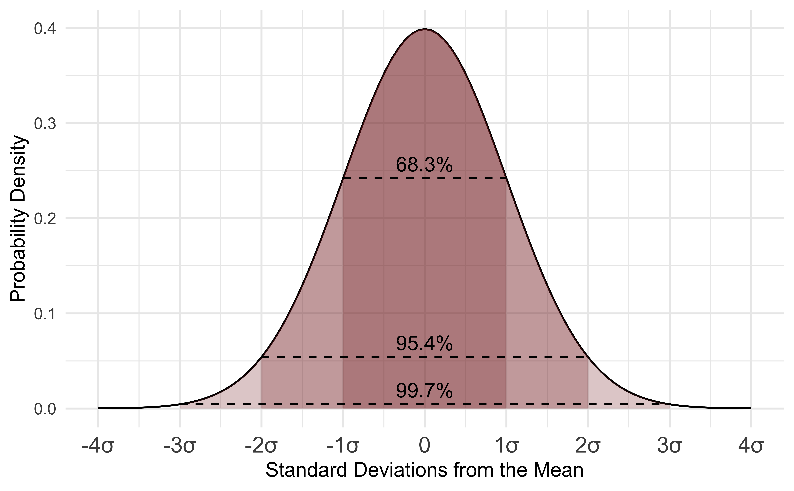

layout: true

<div class="my-footer"></div> 

---

```{r setup, include=FALSE,warning=FALSE,message=FALSE}
options(htmltools.dir.version = FALSE)

def.chunk.hook  <- knitr::knit_hooks$get("chunk")


knitr::opts_chunk$set(
  message = FALSE,
  warning = FALSE,
  dev = "svg",
  cache = TRUE,
  fig.align = "center"
  #fig.width = 11,
  #fig.height = 5
)

knitr::knit_hooks$set(chunk = function(x, options) {
  x <- def.chunk.hook(x, options)
  ifelse(options$size != "normalsize", paste0("\n \\", options$size,"\n\n", x, "\n\n \\normalsize"), x)
})

# define vars
om = par("mar")
lowtop = c(om[1],om[2],0.1,om[4])

overwrite = FALSE

library(fixest)
library(countdown)
# countdown style
countdown(
  color_border              = "forestgreen",
  color_text                = "black",
  color_running_background  = "forestgreen",
  color_running_text        = "white",
  color_finished_background = "white",
  color_finished_text       = "forestgreen",
  color_finished_border     = "forestgreen"
)

library(jtools)
```

layout: true

<div class="my-footer"></div> 

---

# Aujourd'hui - Inférence statistique en économétrie

* Intepréter une ***table de régression*** 

* Comparer l'inférence  ***basée sur la théorie*** et la ***simulation*** 

* Hypothèses du ***Modèle de régression classique***  

* Application empiriques :

  * Taille de la classe et performance
  * Returns to education by gender

---

# Retour à la taille de la classe et performances

* Revenons aux données du programme ***STAR***, et concentrons nous sur : 

  * les *petites* classes et les *classiques* ,
  * *Maternelle*

--

* On considère le modèle de régression suivant que l'on estime par OLS :

$$ \text{math score}_i = \beta_0 + \beta_1 \text{small}_i + u_i$$ 

--
.pull-left[
```{r, echo = TRUE}
library(tidyverse)

star_df = read.csv("https://www.dropbox.com/s/bf1fog8yasw3wjj/star_data.csv?dl=1")
star_df = star_df[complete.cases(star_df),]
star_df = star_df %>%
  filter(star %in% c("small","regular") &
           grade == "k") %>% 
  mutate(small = (star == "small"))
```
]

--

.pull-right[
```{r, echo = TRUE}
reg_star = lm(math ~ small, star_df)
reg_star
```
]

--

* Que se passerait-il si l'on tirerait un autre échantillon aléatoire d'écoles, trouverait-on une valeur différente de pour $\beta_1$?

--

* *Oui*, mais dans quelle mesure l'estimation sera différente ? 

---


# Inférence : $\hat{\beta_k}$ vs $\beta_k$ 
* $\hat{\beta_0}, \hat{\beta_1}$ sont des ***estimations ponctuelles*** calculées à partir de notre échantillon.
  
  * Tout comme la proportion d'échantillon $\hat{p}$ dans notre exemple des pâtes !

--

.pull-left[
* En fait, la prédiction de notre modèle...
    $$\hat{y} = \hat{\beta_0} + \hat{\beta_1} x_1$$
]

--

.pull-right[
... est une ***estimation*** d'une **véritable droite de population** inconnue
$$y = \beta_0 + \beta_1 x_1$$
]

où $\beta_0, \beta_1$ sont les ***paramètres de population*** qui nous intéressent.

--

* Vous rencontrerez souvent $\hat{\beta_k}$ pour désigner l'estimation d'échantillon de $\beta_k$.

--

* Mobilisons ce que nous savons sur les ***intervalles de confiance***, les ***tests d'hypothèses*** et les ***erreurs types*** pour étudier ces $\hat{\beta_k}$ !

---
# Comprendre une table de régression

Voici notre régression en utilisant le package `fixest` :
```{r}
library(fixest)
feols(math ~ small, star_df)
```

```{r echo=FALSE}
reg_summary_star_df = round(summary(reg_star)$coefficients,2)
coeff_star = coef(reg_star)
```


* Il y a 3 nouvelles colonnes : `Std error`, `t value`, `Pr(>|t|)`.

--

Entrée | Signification
------------------------------- | -------------------------------
`Std. error`                    |  Erreur type de $\beta_k$
`t value`                       |  Test statistique observé associé à $H_0:\beta_k = 0,H_A:\beta_k \neq 0$
`Pr(>|t|)`                      |  Valeur-p associée à $H_0:\beta_k = 0,H_A:\beta_k \neq 0$

--

* Regardons le coefficient `small` et faisons sens de chaque valeur

---

# Erreur type de $\beta_k$

> ***Erreur type de $\hat{\beta_k}$ :*** écart-type de la distribution d'échantillonnage de $\hat{\beta_k}$.

--

Imaginons que nous puissions refaire l'expérience 1000 fois sur 1000 échantillons différents :

* Nous ferions tourner 1000 régressions et obtiendrions 1000 estimations de $\beta_k$, $\hat{\beta_k}$.

--

* L'erreur type de $\hat{\beta_k}$ quantifie la variation attendue de $\hat{\beta_k}$ à travers (*une infinité d'*) échantillons.

---
# Erreur type de $\hat{\beta}_\textrm{small}$

* À partir du tableau, on obtient $\hat{\textrm{SE}}(\hat{\beta}_\textrm{small}) = `r reg_summary_star_df[2,2]`$
  
  * Remarquez que l'on écrit $\hat{\textrm{SE}}$ et non ${\textrm{SE}}$ car `r reg_summary_star_df[2,2]` est une estimation de la véritable erreur type de $\hat{\beta}_\textrm{small}$ obtenue à partir de notre échantillon.

  * Nous aimerions connaître la véritable erreur type ${\textrm{SE}}$, mais nous n'avons qu'un seul échantillon !

--

* Simulons la distribution d'échantillonnage de $\hat{\beta}_\textrm{small}$ pour voir d'où elle provient.

---

class:inverse

# Task 1

`r countdown(minutes = 7, top = 0)`

Comme nous l'avons fait pour la distribution d'échantillonnage de la proportion de *pâtes vertes*, nous voulons générer la distribution bootstrap de $\hat{\beta}_\textrm{small}$. 

1. Copiez le code de chargement et de nettoyage de la diapositive 3 et exécutez-le.

1. Générez la distribution bootstrap de $\hat{\beta}_\textrm{small}$ à partir de 1000 échantillons tirés de `star_df`. Vous pouvez le faire avec le code suivant

```{r, eval=FALSE}
bootstrap_distrib <- star_df %>% 
    mutate(small=as.numeric(small)) %>% 
    specify(response = math, explanatory = small) %>%
    generate(reps = 1000, type = "bootstrap") %>%
    calculate(stat = "slope")
```

3. Représentez graphiquement cette distribution d'échantillonnage simulée et calculez la moyenne et l'erreur type de $\hat{\beta}_\textrm{small}$.

---

# Distribution Bootstrap

```{r, echo=FALSE, fig.height = 4.25, fig.width = 8}
library(infer)
bootstrap_distrib = star_df %>% 
    mutate(small=as.numeric(small)) %>% 
    specify(formula = math ~ small) %>%
    generate(reps = 1000, type = "bootstrap") %>%
    calculate(stat = "slope")
se_simul = round(sd(bootstrap_distrib$stat),3)

bootstrap_distrib %>%
    ggplot(aes(x = stat)) +
    geom_histogram(boundary = 9, binwidth = 0.5, col = "white", fill = "forestgreen") +
    labs(
        x = "Estimation de la pente de l'échantillon Bootstrap ",
        y = "Effectif"
    ) +
    theme_bw(base_size = 14)
```

--

***Erreur type:*** `r round(se_simul,2)` $\rightarrow$ très proche de celle dans le tableau (`r reg_summary_star_df[2,2]`)!

Pas exactement égal, car on utilise le bootstrap à la place de l'approche théorique utilisée par `R`.

---

# Revenons à nos moutons

```{r}
library(fixest)
feols(math ~ small, star_df)
```

  * On sait ce que la colonne `Std. Error` veut dire.

  * Les 2 suivantes sont `t value` et `Pr(>|t|)`

  * Cela ne vous dit rien ? 
  
  * A quelle hypothèse cela correspond ?

---

# Tester $\beta_k = 0$ vs $\beta_k \neq 0$

Par défaut, le résultat de la régression vous fournira les résultats des tests suivants : 

$$\begin{align}H_0:& \beta_k = 0\\H_A:& \beta_k \neq 0\end{align}$$

--

* Cela permet de tester statistiquement si il y a une relation entre nos variables dépendante et indépendante. 

--

* Si on ne rejette pas $H_0$, alors il **n'y a pas** de relation entre elles. 

  * Dans ce cas observer  $\beta_1 \neq 0$ était de la chance.

--

* Si on rejette $H_0$, alors **il y a ** une relation entre elles. 

--

* ***Attention:*** C'est un ***test bilatéral*** !

---

# t-statistique  et valeur-p

* Comme nous l'avons vu au cours précédent, pour mener un tel test nous devons :

--

  * Dériver la distribution d'échantillonnage de notre ***t-statistique*** (`statistic`) en supposant que $H_0$ est vraie, c.-à-d. la *distribution nulle*.
  
--

  * Quantifier à quel point la ***statistique de test observée*** est extrême dans ce monde hypothétique.

--
* Notre *t-statistique  observée* (`statistic`) est égale à $t_\widehat{\beta}\frac{\hat{\beta}}{\hat{SE}(\hat{\beta})}$.

--

.pull-left[
```{r}
observed_stat = reg_star$coefficients[2]/sd(bootstrap_distrib$stat)
round(observed_stat,2)
```
]
--
.pull-right[

* Assez proche de la statistique de test observée obtenue dans le tableau : `statistic` = `r reg_summary_star_df[2,3]`.
]

--

* La ***valeur-p*** (`Pr(>|t|)`) mesure l'aire à l'extérieur de $\pm$ *la t statistique de test observée* sous la *distribution nulle*.

--

* Enfin, nous vérifions si nous pouvons rejeter $H_0$ aux ***niveaux de signification*** usuels : $\alpha$ = 0,1, 0,05, 0,01.

---

# Tester $\beta_\textrm{small} = 0$ contre $\beta_\textrm{small} \neq 0$

* Nous allons approximer la distribution nulle de $\frac{\hat{\beta}_\textrm{small}}{\hat{SE}(\hat{\beta}_\textrm{small})}$ à travers un exercice de simulation. 

--

* S'il n'y a aucune relation entre le score en maths et la taille de la classe, c.-à-d. si $H_0$ est vraie et $\beta_\textrm{small} = 0$, alors *remélanger* / *permuter* les valeurs de `small` entre les étudiants ne devrait jouer aucun rôle.

--
.pull-left[

* Générons 1000 échantillons permutés et calculons $\hat{\beta}_\textrm{small}$ pour chacun.

```{r}
null_distribution <- star_df %>% 
  mutate(small=as.numeric(small)) %>% 
  specify(formula = math ~ small) %>%
  hypothesize(null = "independence") %>% 
  generate(reps = 1000, type = "permute") %>% 
  calculate(stat = "slope")
```
]

--

.pull-right[

* Nous pouvons calculer la distribution de notre statistique de test $\frac{\hat{\beta}_\textrm{small}}{\hat{SE}(\hat{\beta}_\textrm{small})}$ sous l'hypothèse nulle :

```{r}
null_distribution <- null_distribution %>%
  mutate(test_stat = stat/sd(bootstrap_distrib$stat))
```

* Rappelez-vous que nous avons obtenu $\hat{SE}(\hat{\beta}_\textrm{small})$ = `r round(sd(bootstrap_distrib$stat),2)` à partir de notre distribution bootstrap.

]

---

# Tester $\beta_\textrm{small} = 0$ contre $\beta_\textrm{small} \neq 0$


```{r echo=FALSE, fig.height = 4.75, fig.width = 8}
plot_null_distrib = null_distribution %>%
  ggplot(aes(x = test_stat)) +
  geom_histogram(binwidth = 0.2, col = "white", fill = "forestgreen") +
  labs(x = "T-statistique sous H0",
       y = "Effectif",
       title = "Distribution nulle simulée") +
  theme_bw(base_size = 14)
plot_null_distrib
```

---

# Tester $\beta_\textrm{small} = 0$ contre $\beta_\textrm{small} \neq 0$


```{r echo=FALSE, fig.height = 4.75, fig.width = 8}
plot_null_distrib +
  geom_vline(xintercept = observed_stat, size = 1.25) +
  annotate("text", x = 4.1, y = 75, label = "t-statistique observée", size = 4)

```

--

Très improbable d'obtenir $\beta_\textrm{small}$ = `r coeff_star[2]` lorsque $H_0$ est vraie.

---


# Tester $\beta_\textrm{small} = 0$ contre $\beta_\textrm{small} \neq 0$

* Pour décider si l'on rejette $H_0$, nous devons implémenter un **test bilatéral** avec ici : *plus extrême* signifiant inférieur à `r round(-observed_stat,2)` **ou** supérieur  `r round(observed_stat,2)`. 


* La *valeur p* égale à :

```{r}
p_value = mean(abs(null_distribution$test_stat) >= observed_stat)
p_value
```

--

* Même valeur que dans le tableau de régression.

--

* ***Question :*** Est-ce qu'on peut rejeter l'hypothèse nulle au seuil de 5% ?

---

# Tester $\beta_\textrm{small} = 0$ contre $\beta_\textrm{small} \neq 0$

* Pour décider si l'on rejette $H_0$, nous devons implémenter un **test bilatéral** avec ici : *plus extrême* signifiant inférieur à `r round(-observed_stat,2)` **ou** supérieur  `r round(observed_stat,2)`. 

* La *valeur p* égale à :

```{r}
p_value = mean(abs(null_distribution$test_stat) >= observed_stat)
p_value
```

* Même valeur que dans le tableau de régression.

* ***Réponse :***

  * Puisque la *valeur p* est égale à 0, cela signifie que l'on peut rejeter  $H_0$ à n'importe quel seuil de confiance : elle sera toujours inférieur à $\alpha$.
  * En d'autres termes, on peut dire que  $\beta_\textrm{small}$ est **statistiquement différent de 0** à tout seuil de confiance.
  * On dit ausi que $\beta_\textrm{small}$ est *significatif statistiquement* (à tout seuil de confiance).


---
# D'un modèle linéaire uni à multivarié 

* Jusqu'à présent, notre modèle n'expliquait le score en maths que par la ***taille de la classe*** (`small`).

--

* Mais on pourrait aussi se demander : le ***genre*** de l'élève joue-t-il un rôle sur le score en maths ?

--

* Ajoutons la variable `gender` à notre régression :

```{r}
library(fixest)
reg_1var <- feols(math ~ small + gender, data = star_df)
reg_1var
```

--

* Nous avons maintenant ***deux*** coefficients à interpréter : $\hat{\beta}_\textrm{small}$ et $\hat{\beta}_\textrm{gender}$.

---

# Que voulons-nous tester, intuitivement ?

* On voudrait savoir : ***le genre a-t-il un effet sur le score en maths, une fois que l'on contrôle pour la taille de la classe ?***

--

* C'est exactement le même raisonnement que pour `small` : 

  * $H_0: \beta_\textrm{gender} = 0$ (le genre n'a ***aucun effet***)
  * $H_A: \beta_\textrm{gender} \neq 0$ (le genre a ***un effet***)

--

* On se demande : *si en réalité le genre n'avait aucun effet sur le score, quelle est la probabilité d'observer un coefficient aussi grand (en valeur absolue) que $\hat{\beta}_\textrm{gender}$ par pur hasard d'échantillonnage ?*

--

* La logique est identique à celle de `small` : on compare la ***statistique de test observée*** $\frac{\hat{\beta}_\textrm{gender}}{\hat{SE}(\hat{\beta}_\textrm{gender})}$ à sa ***distribution nulle***.

--

* Mais une nouvelle question se pose : et si on voulait tester ***plusieurs coefficients à la fois*** ?

---

# Test de restriction linéaire multiple : le F-test?

* Imaginons que l'on se demande : ***`small` et `gender` ont-ils, ensemble, un pouvoir explicatif sur le score en maths ?***

--

* Intuitivement, c'est différent de tester chaque variable séparément !

--

* On pourrait très bien avoir :
  * $\hat{\beta}_\textrm{small}$ pas significatif individuellement,
  * $\hat{\beta}_\textrm{gender}$ pas significatif individuellement,
  * mais les deux ***ensemble*** apportent quand même de l'information sur `math`.

--

* Pour répondre à cette question, on a besoin d'un test ***conjoint*** : le ***test de Fisher (F-test)***.

---

# Intuition du F-test

* L'idée : on compare ***deux modèles*** :

  * Le modèle ***complet*** : $\text{score math}_i= \beta_0 + \beta_1\text{small}_i + \beta_2 \text{gender}_i + u_i$ 
  * Le modèle ***restreint*** (sous $H_0$) : $\text{score math}_i= \beta_0 + u_i$ 

--

* ***Hypothèses*** du test :

$$\begin{align}H_0&: \beta_\textrm{small} = \beta_\textrm{gender} = 0\\H_A&: \text{au moins un des deux } \beta_k \neq 0\end{align}$$

--

* Intuition : si le modèle complet n'explique ***pas mieux*** `math` que le modèle restreint (sans variables), alors les deux variables ***n'apportent rien*** ensemble.

--

* Le F-test compare la ***réduction de la variance résiduelle*** obtenue en ajoutant nos variables, par rapport à ce que l'on attendrait ***par hasard***.

--

* Plus la statistique F est ***grande***, plus il est improbable d'observer un tel gain d'ajustement ***si $H_0$ était vraie***.


---

# Le F-test en pratique

```{r}
fitstat(reg_1var, type = "f")
```

--

* ***Décision*** : si la valeur-p est ***inférieure*** à notre seuil $\alpha$ (par exemple 0.05), on ***rejette $H_0$***.

--

  * Cela signifie que `small` et `gender`, ***pris ensemble***, ont un pouvoir explicatif ***statistiquement significatif*** sur le score en maths.

--

* `r emo::ji("warning")`  : rejeter $H_0$ dans un F-test ***ne nous dit pas laquelle*** des deux variables est responsable de cet effet, pour cela, il faut revenir aux tests individuels ($t$-tests) vus précédemment !

$$
F = \dfrac{(R^2_{c} - R^2_{r})/q}{R^2_{c}/(n-k-1)}
$$
avec $q$ = nombres de restrictions; $n-k-1$ : degrés de liberté dans modèle complet (c)

---

# Et si on voulait comparer deux coefficients entre eux ?

* Une autre question intéressante : est-ce que l'effet de `small` sur `math` est du même ***ordre de grandeur*** que celui de `gender` : $\beta_\textrm{small} = \beta_\textrm{gender}$ ?

--

* `r emo::ji("warning")` Ce n'est ***pas la même chose*** que de tester si chacun est égal à zéro séparément !

  * On pourrait très bien avoir $\hat{\beta}_\textrm{small}$ et $\hat{\beta}_\textrm{gender}$ tous les deux ***significativement différents de zéro***, mais ***très proches l'un de l'autre*** (donc $\beta_\textrm{small} = \beta_\textrm{gender}$ plausible).

--

  * Ou inversement, tous les deux significatifs, mais ***très différents*** l'un de l'autre.

--

* ***Hypothèses*** de ce nouveau test :

$$\begin{align}H_0&: \beta_\textrm{small} - \beta_\textrm{gender} = 0\\H_A&: \beta_\textrm{small} - \beta_\textrm{gender} \neq 0\end{align}$$

---

# Intuition : tester une combinaison linéaire de coefficients

* On ne teste plus un seul coefficient, mais une ***différence*** entre deux coefficients.

--

* Idée : on construit une nouvelle ***statistique de test*** basée sur $\hat{\beta}_\textrm{small} - \hat{\beta}_\textrm{gender}$.

--

* Comme toujours, il nous faut une ***erreur type*** pour cette différence, mais ce n'est ***pas simplement*** $\hat{SE}(\hat{\beta}_\textrm{small}) - \hat{SE}(\hat{\beta}_\textrm{gender})$ !

--

  * $\hat{\beta}_\textrm{small}$ et $\hat{\beta}_\textrm{gender}$ sont estimés ***simultanément*** dans le même modèle, ils peuvent être ***corrélés*** entre eux.

--

  * L'erreur type correcte doit tenir compte de cette ***covariance*** entre les deux estimateurs.

--

* Heureusement, `R` calcule cela automatiquement pour nous !

---

# Tester $\beta_\textrm{small} = \beta_\textrm{gender}$ en pratique

```{r}
library(car)
linearHypothesis(reg_1var, "smallTRUE = gendermale")
```

--

* On retrouve une structure familière : une ***statistique de test*** (ici un F, car ce test peut aussi être vu comme un cas particulier de F-test à ***une seule contrainte***) et une ***valeur-p***.

--

* ***Décision*** : si la valeur-p est ***inférieure*** à $\alpha$, on ***rejette*** $H_0$, c'est-à-dire que l'on conclut que les effets de `small` et `gender` sur `math` sont ***statistiquement différents***.

--

* Sinon, on ***ne peut pas rejeter*** l'hypothèse que ces deux effets sont ***du même ordre de grandeur***.

--

* `r emo::ji("bulb")` Ce test est un exemple de ***test de restriction linéaire*** : on peut tester n'importe quelle combinaison linéaire de coefficients de cette façon (par exemple $\beta_\textrm{small} + \beta_\textrm{gender} = 1$, etc.) !

---

# Des tests aux intervalles de confiance

* Rappelez-vous : un test d'hypothèse et un intervalle de confiance sont ***deux faces d'une même pièce***.

--

* Plutôt que de se demander *"est-ce que $\beta_\textrm{gender} = 0$ ?"*, on peut se demander : ***"quelle est la plage de valeurs plausibles pour $\beta_\textrm{gender}$ ?"***


--

* Un ***intervalle de confiance à 95%*** pour $\beta_k$ répond à la question :

> *Si l'on répétait l'échantillonnage un grand nombre de fois, dans 95% des cas, l'intervalle obtenu contiendrait la vraie valeur de $\beta_k$.*

--

* Lien avec le test d'hypothèse : si $0$ ***n'est pas*** dans l'intervalle de confiance à 95% de $\beta_k$, alors on ***rejette*** $H_0: \beta_k = 0$ au seuil de 5%.

---

# Intervalles de confiance en pratique

```{r}
confint(reg_1var)
```

--

* Pour chaque coefficient, on obtient une borne ***inférieure*** et une borne ***supérieure***.

--

* ***Interprétation*** : on est "confiant à 95%" que la vraie valeur de $\beta_\textrm{small}$ (respectivement $\beta_\textrm{gender}$) se situe dans cet intervalle.

--

* ***Question*** : est-ce que $0$ est contenu dans l'intervalle de confiance de `gender` ? Qu'est-ce que cela implique pour notre test d'hypothèse ?


---

# Ajouter des variables améliore-t-il toujours le modèle ?

* Le $R^2$ mesure la part de variance de `math` expliquée par le modèle.

--

* ***Problème*** : le $R^2$ ***augmente mécaniquement*** à chaque fois que l'on ajoute une variable, même si elle n'a ***aucun lien réel*** avec `math` !

--

* On a donc besoin d'une mesure qui ***pénalise*** l'ajout de variables inutiles : le ***$R^2$ ajusté***.

--

$$\bar{R}^2 = 1 - (1 - R^2) \times \frac{n-1}{n-k-1}$$

où $n$ est le nombre d'observations et $k$ le nombre de variables explicatives.

--

* ***Intuition*** : le $R^2$ ajusté n'augmente que si la ***nouvelle variable*** améliore l'ajustement ***plus*** que ce que l'on attendrait par pur hasard.

--

* ***Règle pratique*** : pour comparer deux modèles avec un nombre de variables différent, on préfère toujours regarder le $R^2$ ***ajusté*** plutôt que le $R^2$ brut.


---

layout: false
class: title-slide-section-red, middle

# Inférence en Régression: Théorie

---

layout: true

<div class="my-footer"></div> 

---

# Inférence en régression : la théorie

* Jusqu'à présent, nous avons présenté l'inférence basée sur la ***simulation***.

--

* Les valeurs rapportées par les packages statistiques dans `R` sont en réalité obtenues à partir de la ***théorie***.

--

* L'inférence basée sur la théorie repose sur des ***approximations en grand échantillon***.
  * On peut montrer que les distributions d'échantillonnage ***convergent*** vers des distributions adéquates $\rightarrow$ ***théorème central limite***
  
--
  
* Regardons brièvement l'approche théorique.

---
# Inférence en régression : la théorie

* Repose sur : la distribution d'échantillonnage de la statistique $\frac{\hat{\beta} - \beta}{\hat{\textrm{SE}}(\hat{\beta})}$ ***converge*** vers une ***distribution normale centrée réduite*** à mesure que la taille de l'échantillon augmente.

  * $\hat{\textrm{SE}}(\hat{\beta})$ est l'estimation d'échantillon de l'écart-type de $\hat{\beta}$.

  * Elle est elle aussi obtenue par une formule théorique ([voir ici](https://scpoecon.github.io/ScPoEconometrics/std-errors.html#se-theory)) mais nous la laisserons de côté.

--

* Une ***distribution normale centrée réduite*** est une *distribution normale* de *moyenne* 0 et d'***écart-type*** 1.

--

* Nous  dérivons de la théorie la distribution d'échantillonnage et l'utilisons pour construire des IC ou mener des tests d'hypothèses.

--

* Notez que si $\frac{\hat{\beta} - \beta}{\hat{\textrm{SE}}(\hat{\beta})}$ ***converge*** vers une ***distribution normale centrée réduite***, alors $\hat{\beta}$ converge vers une ***distribution normale*** de moyenne $\beta$ et d'écart-type $\hat{\textrm{SE}}(\hat{\beta})$.

---

# Distribution Normal : Rappel

.center[
```{r, echo = FALSE, out.width = "850px"}

```
]

---

# Inférence basée sur la théorie : intervalle de confiance


* Prenons l'exemple d'un intervalle de confiance à 95%.

--

* Puisque la distribution d'échantillonnage de $\hat{\beta}$ est supposée avoir une forme normale, nous pouvons utiliser la ***règle empirique des 95%*** relative aux distributions normales.

--

* Nous savons en effet que 95% des valeurs d'une distribution normale se situent à environ 2 écarts-types de la moyenne (exactement 1,96).

--

* On peut donc calculer un IC à 95% pour $\beta$ comme : $\textrm{CI}_{95\%} = [ \hat{\beta} \pm 1{,}96*\hat{\textrm{SE}}(\hat{\beta})]$

---

# IC à 95% : théorie vs bootstrap

.pull-left[
```{r}
tidy(lm(math ~ small, star_df),
     conf.int = TRUE, conf.level = 0.95) %>%
  filter(term == "smallTRUE") %>%
  select(term, conf.low, conf.high)
```
]

--

.pull-right[
```{r}
bootstrap_distrib %>%
  summarise(
    lower_bound = 8.895 - 1.96*sd(stat),
    upper_bound = 8.895 + 1.96*sd(stat))
```
]

--

* Généralisable pour tout seuil de confiance en prenant le quantile correspondant de la distribution normale. 

---

class:inverse

# Task 2

`r countdown(minutes = 5, top = 0)`

1. En uilisant la distribution bottstrap générée au 1er exercise, calculer les IC à 95% en utilisant la *méthode des percentiles*.

1. Dans quelle mesure ces IC sont proches de ceux de la diapo précédente  ?

---

# Intervalle de Confiance : Visuellement

```{r, echo = FALSE, fig.width = 10, fig.height = 5.5}
ci_pctile = bootstrap_distrib %>%
    summarise(
        lower = quantile(stat, 0.025),
        upper = quantile(stat, 0.975)
    )

ci_stderror <- bootstrap_distrib %>%
  summarise(
    lower = 8.895 - 1.96*sd(stat),
    upper = 8.895 + 1.96*sd(stat))

ci_theory <- tidy(lm(math ~ small, star_df),
     conf.int = TRUE, conf.level = 0.95) %>%
  filter(term == "smallTRUE") %>%
  select(term, conf.low, conf.high)

bootstrap_distrib %>%
    ggplot(aes(x = stat)) +
    geom_histogram(boundary = 9, binwidth = 0.5, col = "white", fill = "forestgreen") +
    labs(
        x = "Estimation de la pente de l'échantillon bootstrap",
        y = "Fréquence",
        title = "Intervalle de confiance à 95% calculé selon différentes méthodes",
        subtitle = "percentile (tirets), erreur type (tirets longs) et théorie (trait plein)"
    ) +
  geom_vline(xintercept = c(ci_pctile$lower, ci_pctile$upper), linetype = "dashed", show.legend = TRUE) +
  geom_vline(xintercept = c(ci_stderror$lower, ci_stderror$upper), linetype = "longdash", show.legend = TRUE) +
  geom_vline(xintercept = c(ci_theory$conf.low, ci_theory$conf.high)) +
  theme_bw(base_size = 14)
```

---

# Inférence basée sur la théorie : test d'hypothèse

* La théorie nous dit que $\frac{\hat{\beta} - \beta_k}{\hat{\textrm{SE}}(\hat{\beta})}$ converge vers une distribution normale centrée réduite

* Comme nous l'avons déjà mentionné, le test par défaut effectué par tout logiciel statistique est :
$$\begin{align}H_0:& \beta_k = 0\\H_A:& \beta_k \neq 0\end{align}$$

--

* Ainsi, ***sous l'hypothèse nulle***, $\beta_k=0$, et la théorie nous disent que la distribution d'échantillonnage de $\frac{\hat{\beta}}{\hat{\textrm{SE}}(\hat{\beta})}$ sera une distribution normale centrée réduite.

--

* La ***distribution normale centrée réduite*** est donc la ***distribution nulle*** de notre statistique de test. 

--

* La ***valeur-p*** associée à notre test est alors égale à l'aire de la *distribution normale centrée réduite* à l'extérieur de $\pm$ la valeur observée de $\frac{\hat{\beta}}{\hat{\textrm{SE}}(\hat{\beta})}$.

--

* Règle empirique courante : si l'***estimation*** vaut ***environ deux fois la taille de l'erreur type***, alors elle est significative au seuil de 5%. Pourquoi ?

---

# Mise en forme d'un tableau de régression

* Maintenant que nous avons vu tous les éléments d'un tableau de régression, apprenons enfin à en créer et en lire un !

```{r, eval=F}
library(fixest)
reg_simple_math <- feols(math ~ small, data = star_df)
reg_gender_math <- feols(math ~ small + gender, data = star_df)
reg_simple_read <- feols(read ~ small, data = star_df)
reg_gender_read <- feols(read ~ small + gender, data = star_df)

etable(reg_simple_math, reg_gender_math, reg_simple_read,reg_gender_read,
  headers = c("Math score", "Math score",
              "Reading score", "Reading score"),
  dict = c(
    "(Intercept)" = "Intercept",
    "smallTRUE"   = "Small class",
    "gendermale"  = "Male gender"
  ),
  keep = c("Intercept", "Small class", "Male gender"),
  fitstat = ~n + r2,
  digits = 2,
  fixef_sizes = FALSE,
  se.below = TRUE,
  depvar = FALSE,
  tex = FALSE
)
```


---
# Mise en forme d'un tableau de régression (HTML)

```{r, echo=FALSE, results='asis'}
library(fixest)
reg_simple_math <- feols(math ~ small, data = star_df)
reg_gender_math <- feols(math ~ small + gender, data = star_df)
reg_simple_read <- feols(read ~ small, data = star_df)
reg_gender_read <- feols(read ~ small + gender, data = star_df)


library(kableExtra)

tab <- etable(
  reg_simple_math, reg_gender_math, reg_simple_read, reg_gender_read,
  headers = c("Math score", "Math score", "Reading score", "Reading score"),
  dict = c(
    "(Intercept)" = "Intercept",
    "smallTRUE"   = "Small class",
    "gendermale"  = "Male gender"
  ),
  keep = c("Intercept", "Small class", "Male gender"),
  fitstat = ~n + r2,
  digits = 2,
  fixef_sizes = FALSE,
  se.below = TRUE,
  depvar = FALSE
)

as.data.frame(tab) %>%
  kbl(align = "c", col.names = NULL) %>%
  kable_styling(full_width = FALSE, position = "center")
```

---

# Reading a regression table

.center[
```{r, echo=FALSE, results='asis'}
library(fixest)
reg_simple_math <- feols(math ~ small, data = star_df)
reg_gender_math <- feols(math ~ small + gender, data = star_df)
reg_simple_read <- feols(read ~ small, data = star_df)
reg_gender_read <- feols(read ~ small + gender, data = star_df)


library(kableExtra)

tab <- etable(
  reg_simple_math, reg_gender_math, reg_simple_read, reg_gender_read,
  headers = c("Math score", "Math score", "Reading score", "Reading score"),
  dict = c(
    "(Intercept)" = "Intercept",
    "smallTRUE"   = "Small class",
    "gendermale"  = "Male gender"
  ),
  keep = c("Intercept", "Small class", "Male gender"),
  fitstat = ~n + r2,
  digits = 2,
  fixef_sizes = FALSE,
  se.below = TRUE,
  depvar = FALSE
)

df <- as.data.frame(tab)


# Encadré BLEU : en-tête "Math score" (1re colonne de résultats)
df[1, 2] <- cell_spec(df[1, 2], escape = FALSE,
                       extra_css = "border: 2px solid #2F528F; padding: 3px; display:inline-block;")

# Encadré VERT : coefficient de Small class
df[5, 2] <- cell_spec(df[5, 2], escape = FALSE,
                       extra_css = "border: 2px solid #70AD47; padding: 3px; display:inline-block;")

# Encadré ORANGE : erreur type de Small class
df[6, 2] <- cell_spec(df[6, 2], escape = FALSE,
                       extra_css = "border: 2px solid #FFC000; padding: 3px; display:inline-block;")

# Encadré VIOLET : nombre d'observations
df[11, 2] <- cell_spec(df[11, 2], escape = FALSE,
                        extra_css = "border: 2px solid #7030A0; padding: 3px; display:inline-block;")

# Encadré ROUGE : R2
df[12, 2] <- cell_spec(df[12, 2], escape = FALSE,
                        extra_css = "border: 2px solid #C00000; padding: 3px; display:inline-block;")

df %>%
  kbl(align = "c", col.names = NULL, escape = FALSE) %>%
  kable_styling(full_width = FALSE, position = "center", font_size = 10) %>%
  footnote(
    general = "*** p < 0.001; ** p < 0.01; * p < 0.05",
    general_title = "",
    footnote_as_chunk = TRUE
  )
```
]

* Each column corresponds to a regression. For the first regression we have: 
    * the **name of the outcome variable** in <span style="color: #2F528F;">blue</span>
    * the **estimated coefficient associated to being in a small class** $\hat{\beta_\textrm{small}}$ in <span style="color: #70AD47;">green</span>
    * its **estimated standard error** in <span style="color: #FFC000;">yellow</span>
    * the **number of observations** in <span style="color: #7030A0;">purple</span>
    * the **R-squared** in <span style="color: #C00000;">red</span>
    * interpretation of the stars at the bottom


---

layout: false
class: title-slide-section-red, middle

# Modèle de régression classique

---

# Modèle de régression classique

* Que l'inférence soit basée sur la théorie ou sur des simulations, certaines hypothèses doivent être respectées pour que cette inférence soit valide.

* L'ensemble des hypothèses nécessaires définit le *Modèle de Régression Classique* (MRC).

--


  * Nous avons déjà mentionné la distinction entre l'estimation d'échantillon $\hat{\beta_k}$ et le paramètre de population $\beta_k$.

--

  * De la même manière, nous distinguons $u$, l'erreur d'échantillon (*résidu*), de $\varepsilon$, le terme d'erreur du véritable modèle de population :
  
  $$y_i = \beta_0 + \beta_1 x_{1,i} + ... + \beta_k x_{k,i} + \varepsilon_i$$
--

  * Le modèle de régression classique s'applique aux **régressions linéaires correctement spécifiées** : le modèle doit être linéaire en paramètres, inclure toutes les variables pertinentes, et les variables ne doivent pas être colinéaires.


---


# Hypothèses du MRC

1. ***Indépendance en moyenne :*** la moyenne des résidus conditionnelle à $x$ doit être nulle, $E[\varepsilon|x] = 0$. Remarquez que cela implique également que $Cov(\varepsilon,x) = 0$, c'est-à-dire que les erreurs et notre/nos variable(s) explicative(s) doivent être *non corrélées*.

--

* Violer cette hypothèse conduira à des estimations **biaisées** de $\beta_k$.


---

# Indépendance en moyenne de l'erreur : E[u | small] = ?

```{r, echo = FALSE, warning = FALSE, message = FALSE,fig.width=8,fig.height=5}
library(ggridges)
library(ggthemes)
library(viridis)

# Data work ------------------------------------------------------------------------------
# Set seed
set.seed(555)
# Sample size
n <- 1e5
# Exogenous
e_good <- tibble(
    x = runif(n = n, min = -1, max = 1),
    e = rnorm(n)
) %>% mutate(x = if_else(x < 0, FALSE, TRUE))
# Endogenous
e_bad <- tibble(
    x = runif(n = n, min = -1, max = 1),
    e = rnorm(n) + 2.5 * x
) %>% mutate(x = if_else(x < 0, FALSE, TRUE))

# Figures: Joint densities ---------------------------------------------------------------
# The joint plot: good
joint_good <- ggplot(data = e_good, aes(x = e)) +
    geom_density() +
    theme_pander()
# The joint plot: bad
joint_bad <- ggplot(data = e_bad, aes(x = e)) +
    geom_density() +
    theme_pander()

# Figures: Conditional densities ---------------------------------------------------------
cond_good <- ggplot(data = e_good, aes(x = e, y = as.factor(x))) +
    geom_density_ridges_gradient(
        aes(fill = ..x..),
        color = "white",
        scale = 2.5,
        size = 0.2
    ) +
    # geom_vline(xintercept = 0, alpha = 0.3) +
    scale_fill_viridis(option = "magma") +
    scale_x_continuous(breaks = c(-4,4),limits = c(-6,6)) +
    xlab("u") +
    ylab("petite classe ?") +
    theme_bw() +
    ggtitle("E[u | small] = 0") +
    theme(
        legend.position = "none"
    )
cond_bad <- ggplot(data = e_bad, aes(x = e, y = as.factor(x))) +
    geom_density_ridges_gradient(
        aes(fill = ..x..),
        color = "white",
        scale = 2.5,
        size = 0.2
    ) +
    # geom_vline(xintercept = 0, alpha = 0.3) +
    scale_fill_viridis(option = "magma") +
    scale_x_continuous(breaks = c(-4,4),limits = c(-6,6)) +
    xlab("u") +
    ylab("petite classe ?") +
    ggtitle("E[u | small] != E[u | not small] != 0") +
    theme_bw() +
    theme(
        legend.position = "none"
    )

cond_good
```


---

# Indépendance en moyenne de l'erreur : E[u | small] = ?

```{r, echo = FALSE,fig.width=8,fig.height=5}
cond_bad
```

---

# Hypothèse d'exogénéité

L'hypothèse #1 du MRC est aussi connue sous le nom d'**hypothèse d'exogénéité** (stricte).

* Lorsque cette hypothèse est violée, notre estimation $b$ sera une estimation ***biaisée*** de $\beta$, c.-à-d. $\mathop{\mathbb{E}}[b] \neq \beta$

--

* Par exemple, imaginez que vous vous intéressiez à l'effet de l'éducation sur le salaire

    $$\text{salaire}_i = \beta_0 + \beta_1 \text{éducation}_i + \varepsilon_i$$
  
  * Sous l'hypothèse d'exogénéité, $\beta_1$ désigne l'effet causal de l'éducation dans la population.

--

* Supposons qu'il existe une capacité *non observée* $a_i$.
  * Une capacité élevée signifie un salaire plus élevé.
  * Cela signifie *aussi* que l'école est plus facile, et donc que $i$ choisit de faire plus d'études.

---

# Hypothèse d'exogénéité

* Étant donné que la capacité est *non observée*, $a_i$ se retrouve dans l'erreur $\varepsilon_i$

--

* Notre hypothèse *ceteris paribus* (toutes choses égales par ailleurs) n'est plus respectée.

--

* En régressant alors le salaire sur l'éducation, nous attribuerons à `education` une partie de l'effet sur les salaires qui est en réalité *causée* par la capacité $a_i$ !

--

  * Rappelez-vous la formule du **biais de variable omise** :
  
  $$\text{Bias} = \text{coef de la régression multiple sur la VO} \times \frac{Cov(x,z)}{Var(x)}$$

--

  * Ainsi, nous avons :
  
  $$ \mathbb{E}(b_1) = \beta_1 + \text{Biais de variable omise} > \beta_1$$ 

* *Interprétation* : en prenant des échantillons répétés de la population et en calculant $\widehat{\beta}_1$ à chaque fois, nous ***surestimerions systématiquement*** l'effet de l'éducation sur le salaire.


---

# Hypothèses du MRC

1\. ***Indépendance en moyenne :*** la moyenne des résidus conditionnelle à $x$ doit être nulle, $E[\varepsilon|x] = 0$. Remarquez que cela implique également que $Cov(\varepsilon,x) = 0$, c'est-à-dire que les erreurs et notre/nos variable(s) explicative(s) doivent être *non corrélées*.


* Violer cette hypothèse conduira à des estimations **biaisées** de $\beta_k$.

--

2\. ***Indépendamment et identiquement distribuées :*** les données sont tirées d'un **échantillon aléatoire** de taille $n$ : l'observation $(x_i,y_i)$ provient exactement de la même distribution, et est **indépendante** de l'observation $(x_j,y_j)$, pour tout $i\neq j$.

--

* Violer cette hypothèse rendrait votre échantillon moins représentatif de la population sous-jacente. Cela conduira à des estimations **biaisées** de $\beta_k$.

---

# Hypothèses du MRC

3\. ***Homoscédasticité :*** la variance du terme d'erreur $\varepsilon$ est la même pour chaque valeur de $x$ : $Var(\varepsilon|x) = \sigma^2$.

--

* Si cette hypothèse est violée, vous pouvez tout de même obtenir des estimations non biaisées de $\beta_k$. Cependant, votre estimation de $\hat{\textrm{SE}}(b_k)$ sera biaisée, ce qui affectera votre statistique de test et votre valeur-p.

--

4\. ***Erreurs normalement distribuées :*** le terme d'erreur est distribué normalement, c.-à-d. $\varepsilon \sim \mathcal{N}(0,\sigma^2)$

--

* Pas strictement nécessaire, mais rend l'inférence possible même avec de petits échantillons.
 
--


`r emo::ji("point_right")` À retenir : **si les hypothèses sont violées, l'inférence n'est pas valide !**

---

class:inverse

# Exercice 3.1

`r countdown(minutes = 10, top = 0)`

Revenons à notre question des retours à l'éducation et du genre 

1. Télécharger les données `CPS1985` du package `AER` et regarder le fichier `help` pour avoir les définitions : `?CPS1985`

1. Créer la variable `log_wage` qui est le log du `wage`.

1. Regresser `log_wage` sur le `gender` et `education`, et sauvegarder le comme  `reg1`. 

  * Interpréter chaque  coefficient.
  
  * Sont ils statistiquement significatifs ? A quel seuil  ? 

1. Régresser le `log_wage` sur le `gender`, `education` et leur intéraction `gender*education`, sauvegarder la dans `reg2`. 

  * Interprétation du coeffcient associé à $female*education$?
  
  * Est ce que l'on peut rejet l'hypothèse nulle de ce coefficient au seuil de 5% level ?  10%?  
  
---

class:inverse

# Exercice 3.2

`r countdown(minutes = 10, top = 0)`

1. Faites un nuage de points de la relatio nentre `log wage` et `education`

1. Ajouter la *droite de régression* avec `geom_smooth`. Qu'est-ce qu'elle représente ?


---

class: title-slide-final, middle
background-image: url(../img/logo/namur-logo.png)
background-size: 250px
background-position: 9% 19%

# Bonne journée!


|                                                                                                            |                                   |
| :--------------------------------------------------------------------------------------------------------- | :-------------------------------- |
| <a href="mailto:jeremy.donascimento@unamur.be">.ScPored[<i class="fa fa-paper-plane fa-fw"></i>]               | jeremy.donascimento@unamur.be       |
| <a href="https://discord.gg/RcdCRFBcc">.ScPored[<i class="fab fa-link fa-fw"></i>] | Discord |
| <a href="https://github.com/ScPoEcon/ScPoEconometrics-Slides">.ScPored[<i class="fa fa-link fa-fw"></i>] | Slides |
| <a href="http://github.com/ScPoEcon">.ScPored[<i class="fa fa-github fa-fw"></i>]                          | @ScPoEcon                       |
