layout: true

<div class="my-footer"></div> 

---

```{r setup, include=FALSE,warning=FALSE,message=FALSE}
options(htmltools.dir.version = FALSE)
knitr::opts_chunk$set(
  message = FALSE,
  warning = FALSE,
  dev = "svg",
  cache = TRUE,
  fig.align = "center"
  #fig.width = 11,
  #fig.height = 5
)

library(tidyverse)
library(tweenr)
library(ggforce)
library(gganimate)
library(countdown)

# countdown style
countdown(
  color_border              = "forestgreen",
  color_text                = "black",
  color_running_background  = "forestgreen",
  color_running_text        = "white",
  color_finished_background = "white",
  color_finished_text       = "forestgreen",
  color_finished_border     = "forestgreen"
)

set.seed(1234)
```

# Aujourd'hui - Sampling<sup>1</sup>

.footnote[
[1]: Ce chapitre est basé en partie sur le [chapitre d'échantillonnage](https://moderndive.com/7-sampling.html) de [ModernDive](https://moderndive.com/)]

* Découvrir ce qu'est l'échantillonnage, sa variation, et sa distribution.

* Lexique : population, échantillon, paramètre de population, point d'estimation, etc. 

* Rappel d'un ***estimateur non biaisé***.

* Découverte d'un théorème statistique essentiel : ***Théorème central limite***.

---

# Quelle est la proportion de pâtes vertes ? 

.center[
```{r, echo = FALSE, out.width = "600px"}
knitr::include_graphics("../img/photos/pasta/pasta_bowl.JPG")
```
]

--

On pourrait tout compter, mais cela serait long et fastidieux ! `r emo::ji("weary")` Quelles alternatives avons-nous ?

---

# Echantillonnage

.pull-left[
* Prenons un échantillon de 20 pâtes.

* Que l'on sélectionne de manière **aléatoire**.

* Voici ce que l'on trouve .

Color | Count | Proportion
:------:|:------:|:--------:
Green   |  14        |  `r format(signif(14/20,2), nsmall = 2)`
Red   |  5     |   `r format(round(5/20,2), nsmall = 2)`
Yellow   |  1    |     `r format(round(1/20,2), nsmall = 2)`

* `r format(signif(14/20,2), nsmall = 2)` peut être pensé comme notre estimation de la proportion de pâtes vertes dans le bol. 
]

.pull-right[
<div>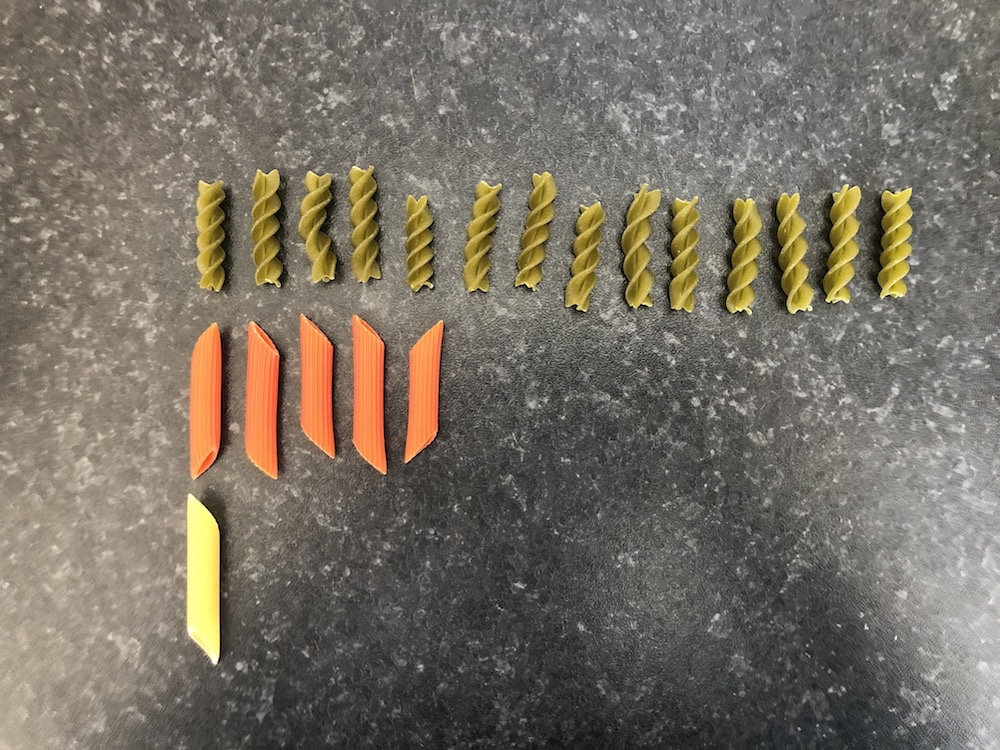</div>
]

---

# Variation d'échantillonnage


* Que se passerait-il si nous prenions un *nouvel* échantillon (en remettant les 20 pâtes précédentes dans le bol) ? Obtiendrions-nous aussi 14 *vertes* comme avant ?

--

* Que se passerait-il si nous répétions cette activité plusieurs fois ?

--

* Probablement pas. Les échantillons varieront d'un tirage à l'autre.

--

* Élément clé de cette observation : il s'agit d'échantillons tirés *aléatoirement*.

---
# Prélèvement de 18 échantillons (un par étudiant)

* Comme nous n'avons pas de pâtes avec nous en classe, nous avons tiré 18 échantillons de 20 pâtes (avec remise) à la maison.
--

* Voici le résultat :

 | 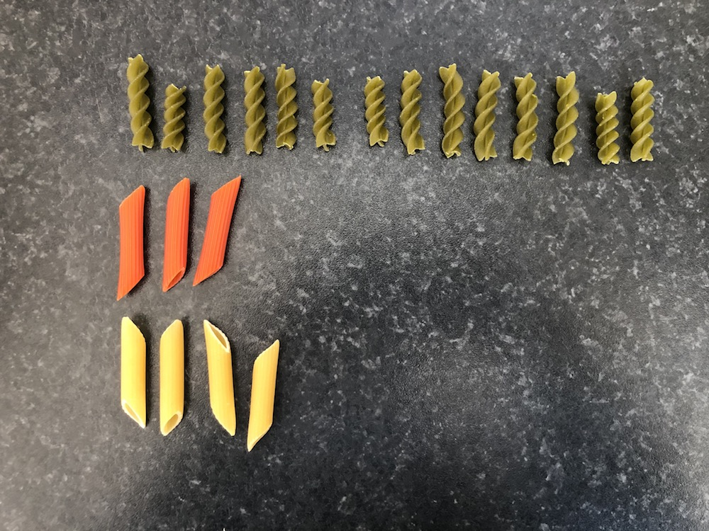 | 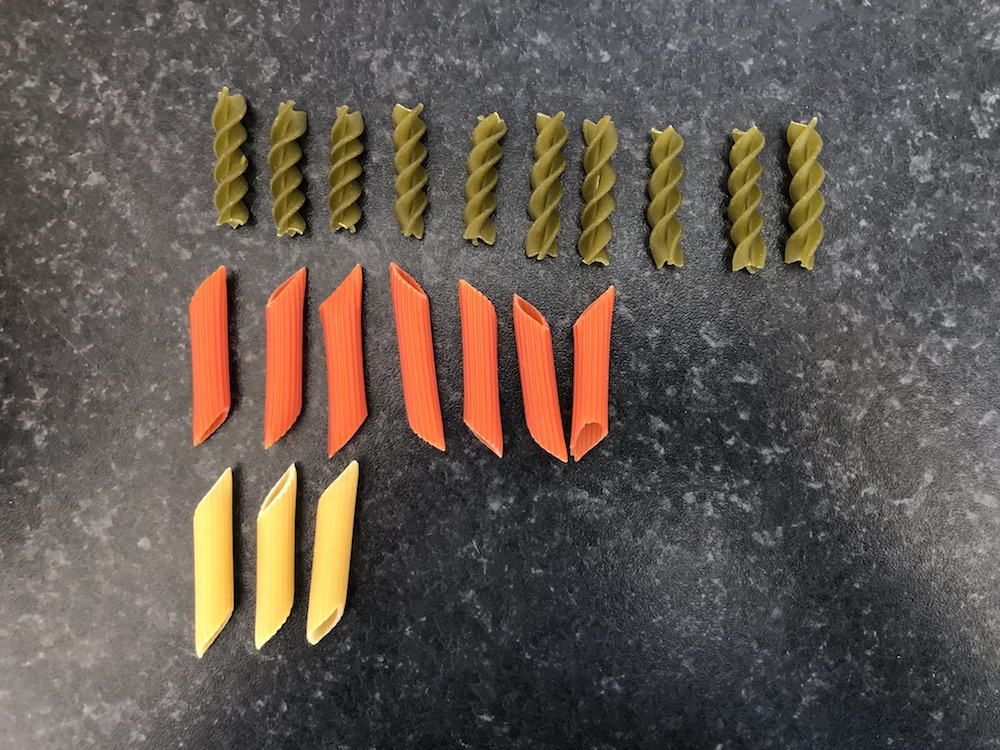 | 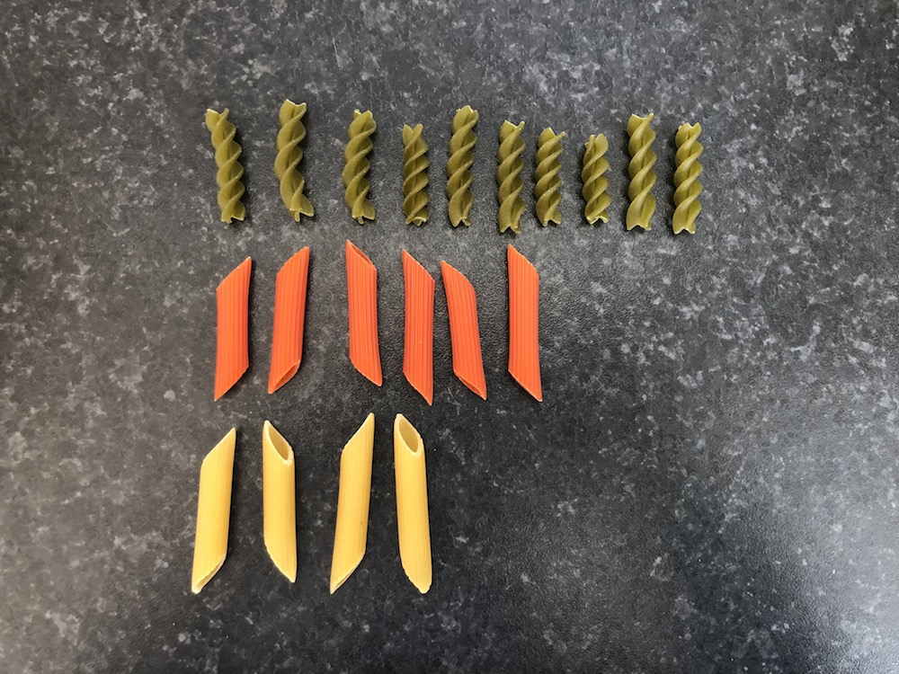 | 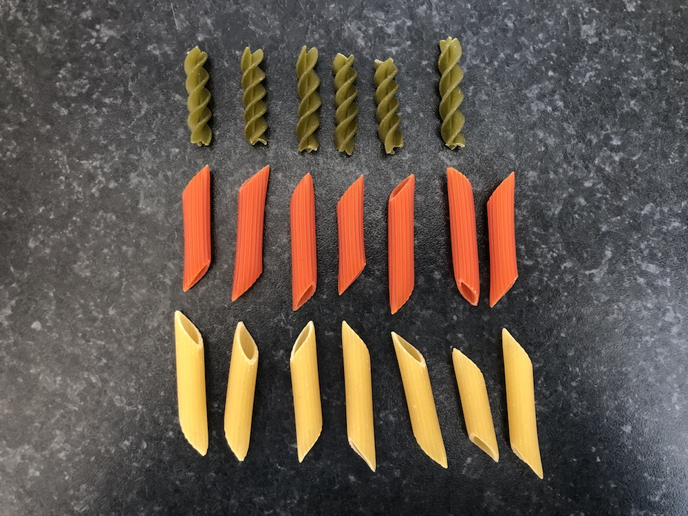 | 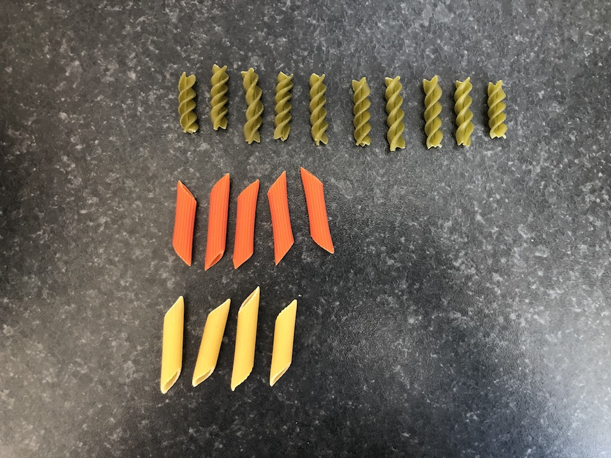
:------:|:------:|:--------:|:--------:|:--------:|:--------:
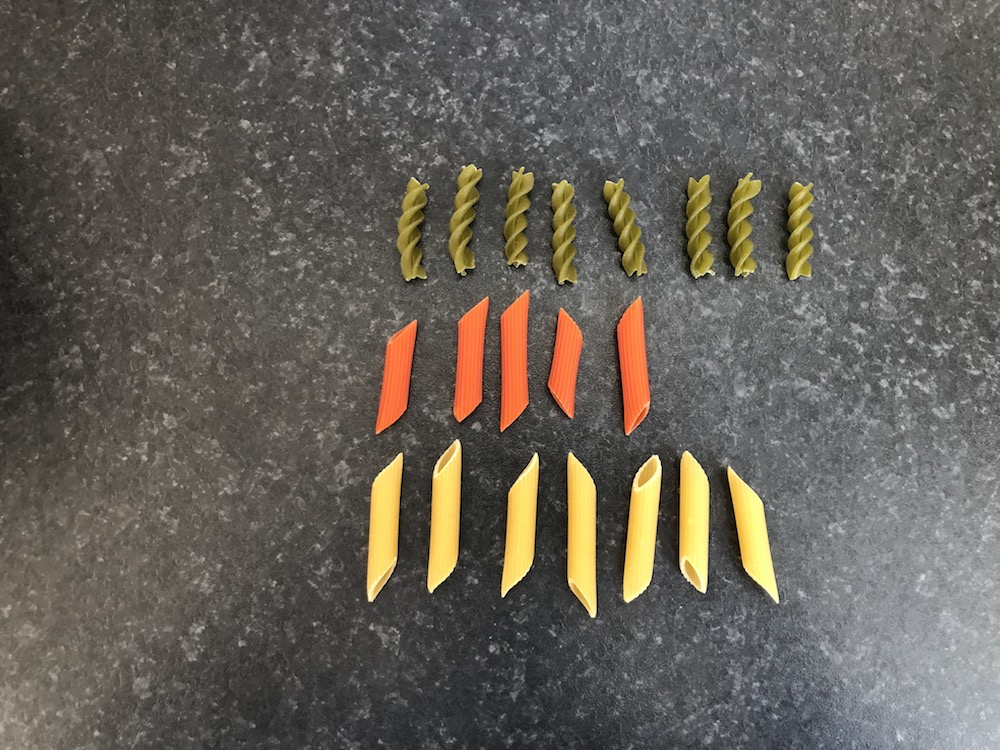 | 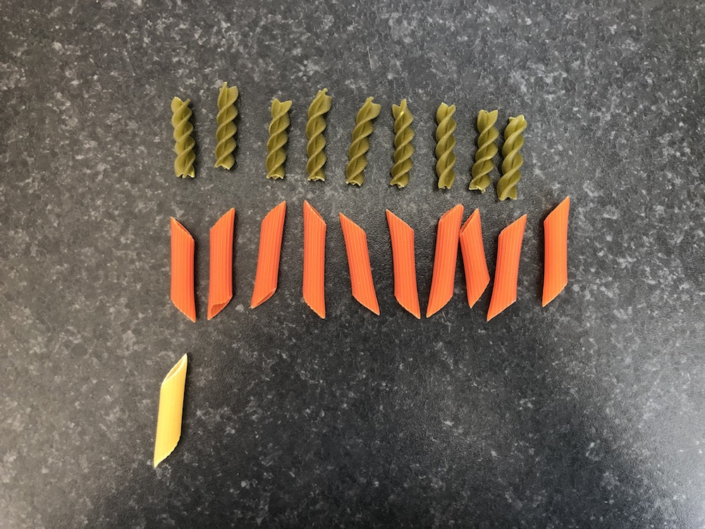 | 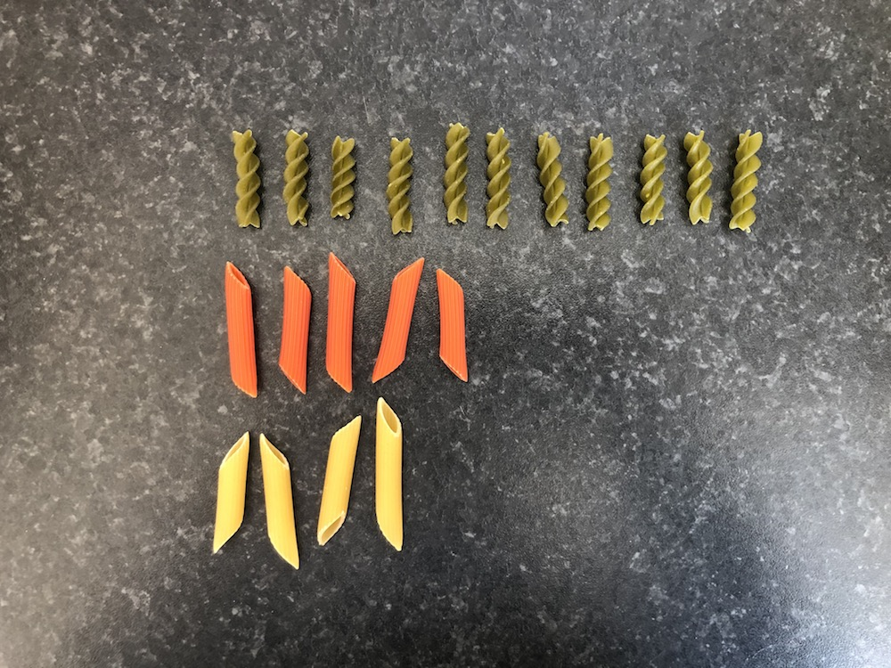 |  |  | 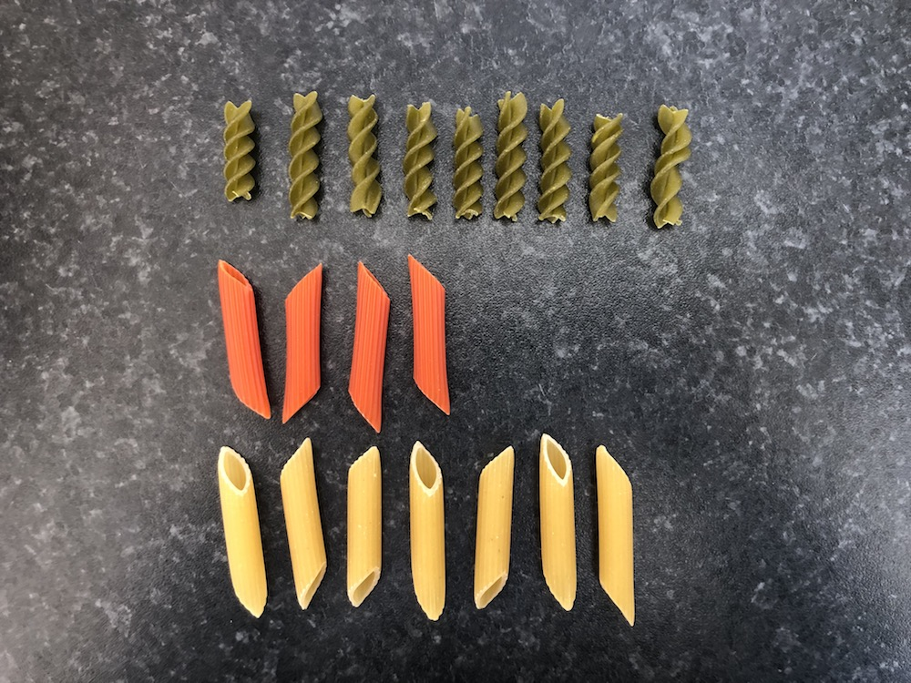
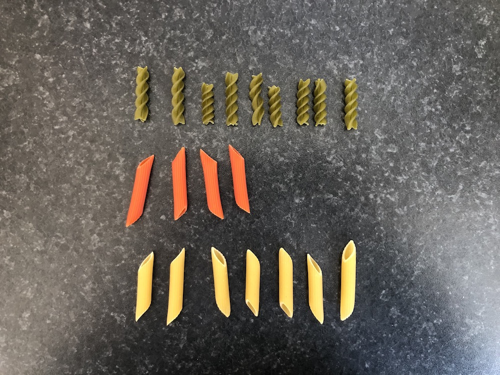 |  |  |  |  | 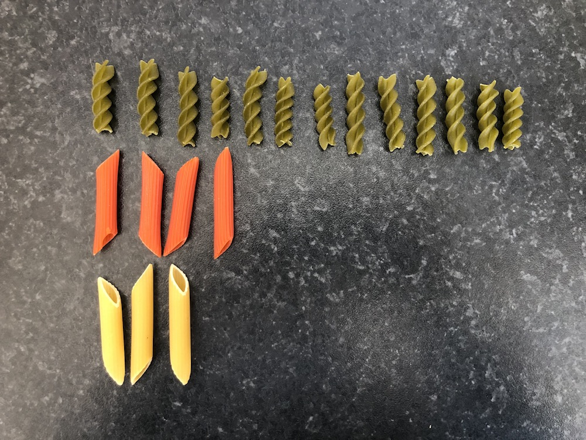

---

# Tiré 18 échantillions (One per Student)

* Comme nous n'avons pas de pâtes avec nous en classe, nous avons tiré 18 échantillons de 20 pâtes (avec remise) à la maison.

* Pour chaque échantillon, nous pouvons caculer la proportion de pâtes vertes. 

.pull-left[
Sample # | Count | Proportion
:------:|:------:|:--------:
1 | 14 | `r format(round(14/20,2), nsmall = 2)`
2 | 14 | `r format(round(14/20,2), nsmall = 2)`
3 | 10 | `r format(round(10/20,2), nsmall = 2)`
4 | 10 | `r format(round(10/20,2), nsmall = 2)`
5 | 6 | `r format(round(6/20,2), nsmall = 2)`
6 | 10 | `r format(round(10/20,2), nsmall = 2)`
7 | 8 | `r format(round(8/20,2), nsmall = 2)`
8 | 9 | `r format(round(9/20,2), nsmall = 2)`
9 | 11 | `r format(round(11/20,2), nsmall = 2)`
]

.pull-right[
Sample # | Count | Proportion
:------:|:------:|:--------:
10 | 8 | `r format(round(8/20,2), nsmall = 2)`
11 | 7 | `r format(round(7/20,2), nsmall = 2)`
12 | 9 | `r format(round(9/20,2), nsmall = 2)`
13 | 9 | `r format(round(9/20,2), nsmall = 2)`
14 | 14 | `r format(round(14/20,2), nsmall = 2)`
15 | 11 | `r format(round(11/20,2), nsmall = 2)`
16 | 10 | `r format(round(10/20,2), nsmall = 2)`
17 | 7 | `r format(round(7/20,2), nsmall = 2)`
18 | 13 | `r format(round(13/20,2), nsmall = 2)`
]

---

class: inverse

# Task 1

`r countdown(minutes = 5, top = 0)`

1. Créez un data.frame contenant les proportions de pâtes vertes de la diapositive précédente. Nommez-le `pasta` et nommez la variable contenant les proportions `prop_green`. (Indice : pour créer un data.frame, vous devez utiliser la fonction `data.frame()`.) Les proportions sont les suivantes : `(0.7,0.7,0.5,0.5,0.3,0.5,0.4,0.45,0.55,0.4,0.35,0.45,0.45,0.7,0.55,0.5,0.35,0.65)`

1. Créez un histogramme de ces proportions à l'aide de `ggplot2`. Utilisez ces paramètres dans `geom_histogram()` : `boundary = 0.325, binwidth = 0.05`.

1. Qu'observez-vous ?

---

# Distribution d'échantillon : Histogramme

.pull-left[
```{r, echo=FALSE, eval = TRUE, fig.height=8}
pasta_samples <- data.frame(replicate = 1:18, prop_green = c(0.7,0.7,0.5,0.5,0.3,0.5,0.4,0.45,0.55,0.4,0.35,0.45,0.45,0.7,0.55,0.5,0.35,0.65))

# set.seed(2)
# x = pasta_samples[,2]
# 
# df <- data.frame(x = x, y = 15)
# dfs <- list(df)
# for(i in seq_len(nrow(df))) {
#     dftemp <- tail(dfs, 1)
#     dftemp[[1]]$y[i] <- sum(dftemp[[1]]$x[seq_len(i)] == dftemp[[1]]$x[i])
#     dfs <- append(dfs, dftemp)
# }
# dfs <- append(dfs, dfs[rep(length(dfs), 3)])
# dft <- tween_states(dfs, 10, 1, 'cubic-in', 200)
# dft$y <- dft$y - 0.5
# dft <- dft[dft$y != 14.5, ]
# dft$type <- 'Animate'
# 
# p <- ggplot(dft) +
#   geom_point(aes(x, y), shape = 21, colour = "black", fill = "darkgreen", size = 12.5, stroke = 1) +
#   labs(
#     x = "Proportion of green pasta",
#     y = "Frequency"
#   ) +
#   xlim(0.25, 0.75) +
#   scale_y_continuous(breaks = seq(0,12, 2)) +
#   theme_bw(base_size = 14) +
#   transition_manual(.frame)
# p
# anim_save(filename = "img/photos/hist_building.gif", animation = p)

knitr::include_graphics("../img/photos/hist_building.gif")
```
]

--

.pull-right[
```{r, echo=FALSE, eval = TRUE, fig.height=7}
pasta_samples %>%
  ggplot(aes(x = prop_green)) +
  geom_histogram(boundary = 0.325, binwidth = 0.05, col = "white", fill = "darkgreen") +
  labs(
    x = "Proportion of green pasta",
    y = "Frequency"
  ) +
  xlim(0.25, 0.75) +
  theme_bw(base_size = 20)
```
]

---

# Qu'avons-nous fait ?

--

* Démontrer le concept statistique d'***échantillonnage***.

--

* *Objectif* : connaître la proportion de pâtes vertes

--

* *Méthodes* :
  1. **Recensement** : prend beaucoup de temps (et dans de nombreux cas très coûteux) ;
  
--
  
  1. **Échantillonnage** : extraire un *échantillon* de 20 pâtes du bol pour obtenir une ***estimation***.  
  Notre première ***estimation*** de la proportion de pâtes vertes était de 0,70, mais elle était en réalité supérieure à la plupart des autres ***estimations***.
  
--

* *Important* : chaque *échantillon* a été tiré de façon ***aléatoire*** $\rightarrow$ les échantillons sont différents les uns des autres ! $\rightarrow$ des proportions différentes `r emo::ji("point_right")` ***variation d'échantillonnage***

---

# Prenons des échantillons virtuels 

.pull-left[
* Nous avons compté le nombre exact de pâtes vertes, rouges, et jaunes dans le bol `r emo::ji("monocle")` 

* Toutes les pâtes sont sauvegardés dans ce fichier csv  [here](https://www.dropbox.com/s/qpjsk0rfgc0gx80/pasta.csv?dl=1).

```{r, echo = TRUE}
bowl <- read.csv("https://www.dropbox.com/s/qpjsk0rfgc0gx80/pasta.csv?dl=1")

head(bowl)
```
]

--

.pull-right[
* `pasta_ID`: identifiant des pâtes

* `color` : couleur des pâtes

```{r, echo = TRUE}
nrow(bowl)
```

* Au lieu de sélectionner les pâtes avec nos mains, nous faisons des échantillons *virtuels* depuis le bol.

* Utilisons la *pelle virtuelle* pour prendre un échantillon de 50 pâtes depuis notre bol.
]

---

# Utilisons une pelle virtuelle une fois 

* Prenons un premier échantillon de taille 50, en utilisant la fonction `rep_sample_n` du package `moderndive`.

--

```{r}
#Lancer le package moderndive
library(moderndive)

virtual_shovel <- bowl %>% #  les fonctions de moderndive peuvent être "pipper"
  rep_sample_n(size = 50) # échantillon de 50 pâtes 
```

.pull-left[
```{r, echo = TRUE}
# montre les 6ères lignes
head(virtual_shovel)
```

* La colonne `replicate` nous dit l'ID de l'échantillon. Ici : `1`.
]

--

.pull-right[
```{r, echo = TRUE}
# nombre d'observations dans l'échantillon 
nrow(virtual_shovel)
```
]

---

# % de pâtes vertes

.pull-left[
```{r}
sample_1 <- virtual_shovel %>% 
  summarize(
    # nombre de pâtes vertes dans l'échantillon
    num_green = sum(color == "green"),
    # nombre d'observations dans l'échantillon
    sample_n = n()) %>% 
  mutate(
    # % de pâtes vertes dans l'échantillon
    prop_green = num_green / sample_n)
sample_1
```
]

.pull-right[
1. Calcule :
  * somme des pâtes vertes dans l'échantillon,
  * nombre d'obs dans l'échantillon (i.e., 50 ici)

1. Calcule la % de pâtes vertes

`r emo::ji("point_right")` `r sample_1$prop_green` sont vertes ! C'est une ***estimation*** de la proportion de pâtes vertes dans le bol. Que se passe-t-il si on essaie encore ?

Et si on essaie encore de nombreuses fois, comme 50 ?
]

---

# Utilisons la pelle virtuelle 50 fois

.pull-left[

50 échantillon (*répliques*) de taille 50.

```{r}
virtual_samples <- bowl %>%
  # obtenir 50 échantillons de taille 50
  rep_sample_n(size = 50, reps = 50)
virtual_samples
```
]

--

.pull-right[

Calculons la proportion de pâtes vertes 

```{r}
virtual_prop_green <- virtual_samples %>% 
  group_by(replicate) %>% # calcule la stat par échantillon 
  summarize(
    num_green = sum(color == "green"),
    sample_n = n()) %>% 
  mutate(prop_green = num_green / sample_n)
virtual_prop_green
```
]


---

# Variation d'échantillonnage (virtuelle)

.pull-left[
* Comme en réalité, l'échantillonnage virtuelle crée aussi des échantillons aléatoires.

* La colonne `prop_green` dans le data.frame `virtual_prop_green` est différent entre les échantillons.

* On peut encore visualiser la ***distribution d'échantillonnage***:

```{r,eval=FALSE}
ggplot(virtual_prop_green, aes(x = prop_green)) +
  geom_histogram(binwidth = 0.02, 
                 boundary = 0.51,
                 color = "white",
                 fill = "darkgreen") +
  scale_y_continuous(breaks = seq(0, 12, by = 2)) +
  labs(x = "% des 50 pâtes qui étaient vertes",
       y = "Fréquence",
       title = "Distribution des 50 échantillons de taille 50") +
  theme_bw(base_size = 20)
```
]

--

.pull-right[
```{r,echo = FALSE,fig.height=6}
ggplot(virtual_prop_green, aes(x = prop_green)) +
  geom_histogram(binwidth = 0.02, 
                 boundary = 0.51,
                 color = "white",
                 fill = "darkgreen") +
  scale_y_continuous(breaks = seq(0, 12, by = 2)) +
  labs(x = "% des 50 pâtes qui étaient vertes",
       y = "Fréquence",
       title = "Distribution des 50 échantillons de taille 50") +
  theme_bw(base_size = 20)
```
]

---

class: inverse

# Task 2

`r countdown(minutes = 10, top = 0)`

Au lieu de 33 échantillons, prenons en ***1000*** !

1. Pourquoi ne pas prendre les 1000 "à la mainby hand"?

1. Télécharger les [données](https://www.dropbox.com/s/qpjsk0rfgc0gx80/pasta.csv?dl=1) dans un objet `pasta`.

1. Obtenez 1000 échantillons de taille 50 en utilisant la fonction `rep_sample_n()`du package `moderndive.

1. Calculez la proportion de pâtes vertes dans chaque échantillon.

1. Faîtes un histogramme de la proportion de pâtes vertes dans chaque échantillon.

1. Qu'observez vous ? Quelles proportions est la plus fréquente ? Comment la forme de l'histogramme est par rapport à celle avec 33 échantillons ?

1. Quelle est la probabilité d'échantillonner 50 pâtes dont moins de 20 % sont vertes ?

---

# Distribution d'échantillonnage de 1000 échantillon

```{r, echo = FALSE, eval = TRUE, fig.height = 4.5, fig.width = 7.75}
virtual_samples <- bowl %>% 
  rep_sample_n(size = 50, reps = 1000)

virtual_prop_green <- virtual_samples %>% 
  group_by(replicate) %>% 
  summarize(
    num_green = sum(color == "green"),
    sample_n = n()) %>% 
  mutate(prop_green = num_green / sample_n)

virtual_prop_green %>% ggplot(
  aes(x = prop_green)) +
  geom_histogram(
    binwidth = 0.02,
    boundary = 0.41,
    color = "white",
    fill = "darkgreen") +
 labs(x = "% des 50 pâtes qui étaient vertes",
       y = "Fréquence",
       title = "Distribution des 1000 échantillons de taille 50") +
  theme_bw(base_size = 14)
```

--

Ressemble remarquablement à une ***distribution normale*** $\rightarrow$ plus nous prenons d'échantillons, plus leur ***distribution d'échantillonnage*** ressemblera à une ***distribution normale***.

---
# Rôle de la taille de l'échantillon
Imaginez que vous puissiez changer la taille de vos échantillons et que vous ayez le choix entre les tailles suivantes : 25, 50 et 100.

Si votre objectif est toujours d'estimer la proportion de pâtes vertes dans le bol, quelle pelle choisiriez-vous ?

---
# Rôle de la taille de l'échantillon

* Répétons ce que nous avons fait précédemment mais pour différentes tailles d'échantillon.

* Prenons 1000 échantillons chacun pour $n=25, n=50, n=100$.

--

* Nous utiliserons à nouveau `rep_sample_n()`.
--

.pull-left[

Générons des échantillons de tailles différentes

```{r}
# Taille : 25
virtual_samples_25 <- bowl %>% 
  rep_sample_n(size = 25, reps = 1000)

# Taille : 50
virtual_samples_50 <- bowl %>% 
  rep_sample_n(size = 50, reps = 1000)

# Taille : 100
virtual_samples_100 <- bowl %>% 
  rep_sample_n(size = 100, reps = 1000)
```
]

--

.pull-right[

Calculons la proportion de pâtes vertes

```{r}
# Taille échantillon : 25
# Même côde pour les autres tailles
virtual_prop_green_25 <- virtual_samples_25 %>% 
  group_by(replicate) %>% 
  summarize(
    num_green = sum(color == "green"),
    sample_n = n()) %>% 
  mutate(prop_green = num_green / sample_n)
```
]

---

# Rôle de la taille de l'échantillon

```{r, echo = FALSE, fig.height=5, fig.width=10}

# Taille échantillon : 50
virtual_prop_green_50 <- virtual_samples_50 %>% 
  group_by(replicate) %>% 
  summarize(
    num_green = sum(color == "green"),
    sample_n = n()) %>% 
  mutate(prop_green = num_green / sample_n)

# Taille échantillon : 100
virtual_prop_green_100 <- virtual_samples_100 %>% 
  group_by(replicate) %>% 
  summarize(
    num_green = sum(color == "green"),
    sample_n = n()) %>% 
  mutate(prop_green = num_green / sample_n)

df = rbind(virtual_prop_green_25,virtual_prop_green_50,virtual_prop_green_100)

df %>% 
  ggplot(aes(x = prop_green)) +
    geom_histogram(data = df %>% filter(sample_n == 25), binwidth = 0.04, boundary = 0.42, color = "white", fill = "darkgreen") +
  geom_histogram(data = df %>% filter(sample_n == 50), binwidth = 0.02, boundary = 0.41, color = "white", fill = "darkgreen") +
  geom_histogram(data = df %>% filter(sample_n == 100), binwidth = 0.01, boundary = 0.405, color = "white", fill = "darkgreen") +
  scale_x_continuous(breaks = round(seq(0, 1, by = 0.2),1), limits = c(0.2,0.8)) +
  labs(
    x = "% des 50 pâtes qui étaient vertes",
    y = "Fréquence",
    title = "Comparaison de la distrubtion de la % de pâtes vertes dans des échantillons de tailles différentes"
  ) +
    facet_wrap(~sample_n, scales = "free_y", labeller = as_labeller(
        c(`25` = "1000 échantillons de taille 25",
          `50` = "1000 échantillons de taille 50",
          `100` = "1000 échantillons de taille 100"))) +
    theme_bw(base_size = 14)
```

---


# Taille de l'échantillon et distrubtion de l'échantillon

* Plus la taille de l'échantillon est grande, plus la ***distribution d'échantillonnage*** résultante est *étroite*.

--

* En d'autres termes, il y a moins de différences dues à la ***variation d'échantillonnage***.

--

* En maintenant constant le nombre de réplications (1000 dans notre cas), des ***échantillons plus grands*** produiront des *distributions normales* avec des ***écarts-types plus petits***.

--

```{r, echo = FALSE}
# n = 25
sd25 = virtual_prop_green_25 %>% 
  summarize(sd = sd(prop_green))

# n = 50
sd50 = virtual_prop_green_50 %>% 
  summarize(sd = sd(prop_green))

# n = 100
sd100 = virtual_prop_green_100 %>% 
  summarize(sd = sd(prop_green))
```

Sample Size | Standard Deviation
:---------:|:--------------:
25          | `r format(round(sd25$sd,2), nsmall = 2)`
50          | `r format(round(sd50$sd,2), nsmall = 2)`
100         |`r format(round(sd100$sd,2), nsmall = 2)`

--

* Rappelez vous que l'***erreur standard*** measure la *dispertion* d'une variable autour de sa moyenne.

--

* Donc à mesure que la taille de l'échantillon augmente, nos ***estimations*** de la proporiton **réelle* de pâtes vertes dans le bol devient *précise*.

---

# Résumé sur l'échantillonnage

* Nous avons utilisé l'échantillonnage dans un but d'***estimation***.

--

* Nous avons extrait des échantillons afin d'***estimer*** la proportion de pâtes vertes dans le bol.

--
* 2 concepts clés liés à l'échantillonnage à des fins d'estimation :

  1. L'effet de la ***variation d'échantillonnage*** sur nos estimations : des échantillons différents donnent des estimations différentes. 
  
  1. L'effet de la taille de l'échantillon sur la ***variation d'échantillonnage*** : plus la taille de notre échantillon est grande, plus notre estimation devrait être proche de la valeur réelle.
  
---
# Sampling Glossary `r emo::ji("book")`

.pull-left[
***Population :*** ensemble des individus ou observations qui nous intéressent.  
$N = 713$ pâtes.

***Paramètre de population :*** quantité numérique résumant la population, qui est inconnue mais que nous souhaitons connaître.  
*Exemples :* moyenne de la population $(\mu)$, proportion de pâtes vertes $(p)$.

***Recensement :*** énumération ou dénombrement exhaustif de tous les $N$ individus ou observations de la population afin de calculer *exactement* la valeur du paramètre de population.

***Échantillonnage :*** collecte d'échantillon(s) de taille $n$ à partir de la population de taille $N$.
]
--
.pull-right[
* ***Estimation ponctuelle*** ou ***Statistique d'échantillon :*** statistique résumée calculée à partir d'un échantillon qui estime un paramètre de population inconnu.  
*Exemple :* la *proportion d'échantillon* de pâtes vertes $(\hat{p})$. Le « chapeau » au-dessus du $p$ indique qu'il s'agit d'une *estimation* de la proportion de population $p$.

* ***Échantillonnage représentatif :*** l'échantillon *ressemble-t-il* à la population ?

* ***Échantillonnage biaisé :*** toutes les pâtes avaient-elles une chance égale d'être incluses dans un échantillon ?

* ***Échantillonnage aléatoire :*** échantillonnage aléatoire réalisé de façon non biaisée.
]

---

# Définition statistique

* Nous avons estimer  $\hat{p}$ tout au long du cours.

--

* On a montré graphiquement *la distribution de l'échantillon* pour mettre en évidence la *variation d'échantillonnage* de la *proportion de l'échantillon* $\hat{p}$.

--

* Nous avons calculé l'*écart-type* de la *distribution d'échantillonnage* de $\hat{p}$. Cet écart-type porte un nom particulier : ***erreur type*** de l'*estimation ponctuelle* $\hat{p}$.

--

* Reproduisons le tableau récapitulatif avec les libellés appropriés :
Taille d'échantillon $(n)$ | Erreur type de $\hat{p}$

Sample Size $(n)$ | Standard Error of $\hat{p}$
:---------:|:--------------:
25          | `r format(round(sd25$sd,2), nsmall = 2)`
50          | `r format(round(sd50$sd,2), nsmall = 2)`
100         |`r format(round(sd100$sd,2), nsmall = 2)`

* Point clé à retenir : à mesure que la *taille de l'échantillon* $n$ augmente, l'erreur ''typique'' de votre *estimation ponctuelle* diminue, telle que quantifiée par l'*erreur type*.

---

# Tout mettre ensemble

* Les ***estimations ponctuelles*** issues d'***échantillons aléatoires*** fournissent une *bonne estimation* du véritable ***paramètre de population*** inconnu.

--

* À quel point est-elle bonne ? Parfois $\hat{p}$ sera loin de $p$, parfois proche. Il y a de la ***variation d'échantillonnage***.

--

* ***En moyenne***, nos estimations seront correctes. C'est grâce à l'échantillonnage aléatoire. On dit que : 
> ### $\hat{p}$ est un ***estimateur sans biais*** de $p$, c.-à-d. $\mathop{\mathbb{E}}[\hat{p}] = p$

--

* Quelle est la véritable proportion de population $p$ de pâtes vertes dans la population de $N=713$ pâtes ?

--

```{r}
sum(bowl$color == "green")/nrow(bowl)
```

--

* Insérons la ***véritable proportion de population*** $p=`r round(sum(bowl$color == "green")/nrow(bowl), 2)`$ dans nos graphiques précédents !

---

# Visualiser l'absence de biais et la variation d'échantillonnage

```{r,echo = FALSE,fig.width=10,fig.height=5}
p <- bowl %>% 
  summarize(p = mean(color == "green")) %>% 
  pull(p)

dat_text <- data.frame(
  sample_n   = c(25, 50, 100),
  # x     = c(0.655, 0.655, 0.655),
  # y     = c(175, 95, 45),
  label = rep("True population proportion", 3)
)

df %>% 
  ggplot(aes(x = prop_green)) +
    geom_histogram(data = df %>% filter(sample_n == 25), binwidth = 0.04, boundary = 0.42, color = "white", fill = "darkgreen") +
  geom_histogram(data = df %>% filter(sample_n == 50), binwidth = 0.02, boundary = 0.41, color = "white", fill = "darkgreen") +
  geom_histogram(data = df %>% filter(sample_n == 100), binwidth = 0.01, boundary = 0.405, color = "white", fill = "darkgreen") +
  scale_x_continuous(breaks = round(seq(0, 1, by = 0.2),1), limits = c(0.2,0.8)) +
  labs(
    x = "Proportion de pâtes vertes dans l'échantillon",
    y = "Quantité",
    title = "Comparaison de la distribution de pâtes vertes dans des échantillons de différentes tailles"
  ) +
    facet_wrap(~sample_n, scales = "free_y", labeller = as_labeller(
        c(`25` = "1000 ech. de taille 25",
          `50` = "1000 ech. de taille 50",
          `100` = "1000 ech. de taille 100"))) +
    theme_bw(base_size = 14) +
  geom_vline(xintercept = p, col = "black", size = 0.75) +
  geom_text(data = dat_text, mapping = aes(x = 0.662, y = Inf, label = label), vjust = 2, size = 3)
```

---
# Quelques scénarios d'échantillonnage
Scénario | Paramètre de population | Notation | Estimation ponctuelle | Symbole(s)
:--: | :--: | :--: |:--: | :--:
1 | Proportion de population | $p$ | Proportion d'échantillon | $\widehat{p}$
2 | Moyenne de population | $\mu$ | Moyenne d'échantillon | $\overline{x}$ ou $\widehat{\mu}$
3 | Différence de proportions de population | $p_1 - p_2$ | Différence de proportions d'échantillon | $\widehat{p}_1 - \widehat{p}_2$
4 | Différence de moyennes de population | $\mu_1 - \mu_2$ | Différence de moyennes d'échantillon | $\overline{x}_1 - \overline{x}_2$
5 | Pente de régression de population | $\beta_1$ | Pente de régression ajustée | $b_1$ ou $\widehat{\beta}_1$
6 | Ordonnée à l'origine de régression de population | $\beta_0$ | Ordonnée à l'origine de régression ajustée | $b_0$ ou $\widehat{\beta}_0$
---

# The Central Limit Theorem (CLT)

# Le théorème central limite (TCL)
* Le fait que nos statistiques d'échantillon ***convergent*** vers une *limite centrale* est bien connu en statistique.


--

* C'est le résultat d'un résultat connu sous le nom de ***théorème centrale limite***.

--

> ### *Théorème central limite :* quelle que soit l'allure de la distribution de population sous-jacente, **lorsque les *moyennes* d'échantillon sont basées sur des tailles d'échantillon de plus en plus grandes, la distribution d'échantillonnage de ces *moyennes* d'échantillon devient à la fois de plus en plus normale et de plus en plus étroite**.
--

* En d'autres termes, leur distribution d'échantillonnage suit de plus en plus une ***distribution normale*** et la *variation de ces distributions d'échantillonnage diminue*, telle que quantifiée par leurs ***erreurs types***.

---

# Théorème centrale limite - La statistique expliquée à mon chat

.center[
<iframe width="684" height="464" src="https://www.youtube.com/watch?v=vWTKVMf5HQI" frameborder="0" allow="accelerometer; autoplay; encrypted-media; gyroscope; picture-in-picture" allowfullscreen></iframe>
]

---

# On the way to causality [chapter sampling]

`r emo::ji("white heavy check mark")` How to manage data? Read it, tidy it, visualise it!

`r emo::ji("white heavy check mark")`  How to summarise relationships between variables? Simple and multiple linear regression, non-linear regressions, interactions...

`r emo::ji("white heavy check mark")` What is causality?

`r emo::ji("white heavy check mark")` **What if we don't observe an entire population?** Sampling!

`r emo::ji("cross mark")`  Are our findings just due to randomness?

`r emo::ji("cross mark")` How to find exogeneity in practice?


---

class: title-slide-final, middle
background-image: url(../img/logo/namur-logo.png)
background-size: 250px
background-position: 9% 19%

# BONNE JOURNÉE !


|                                                                                                            |                                   |
| :--------------------------------------------------------------------------------------------------------- | :-------------------------------- |
| <a href="mailto:jeremy.donascimento@unamur.be">.ScPored[<i class="fa fa-paper-plane fa-fw"></i>]               | jeremy.donascimento@unamur.be       |
| <a href="https://discord.gg/RcdCRFBcc">.ScPored <i class="fab fa-link fa-fw"></i></a> | Discord |
| <a href="https://github.com/ScPoEcon/ScPoEconometrics-Slides">.ScPored[<i class="fa fa-link fa-fw"></i>] | Slides |
| <a href="http://github.com/ScPoEcon">.ScPored[<i class="fa fa-github fa-fw"></i>]                          | @ScPoEcon                       |

---                    |

